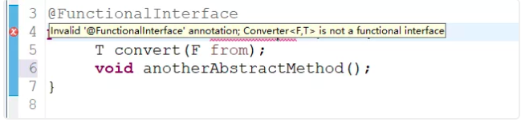

>[原创： SnailClimb  JavaGuide](https://mp.weixin.qq.com/s/5m55MSUUjR04DDqfGg8oBQ)

### 目录：

+ 接口的默认方法(Default Methods for Interfaces)
+ Lambda表达式(Lambda expressions)
+ 函数式接口(Functional Interfaces)
+ 方法和构造函数引用(Method and Constructor References)
+ Lamda 表达式作用域(Lambda Scopes)
  + 访问局部变量
  + 访问字段和静态变量
  + 访问默认接口方法
+ 内置函数式接口(Built-in Functional Interfaces)
  + Predicates
  + Functions
  + Suppliers
  + Consumers
  + Comparators
+ Optionals
+ Streams(流)
  + Filter(过滤)
  + Sorted(排序)
  + Map(映射)
  + Match(匹配)
  + Count(计数)
  + Reduce(规约)
+ Parallel Streams(并行流)
  + Sequential Sort(串行排序)
  + Parallel Sort(并行排序)
+ Maps
+ Data API(日期相关API)
  + Clock
  + Timezones(时区)
  + LocalTime(本地时间)
  + LocalDate(本地日期)
  + LocalDateTime(本地日期时间)
+ Annotations(注解)
+ Whete to go from here?

### Java 8 Tutorial

欢迎阅读我对Java 8的介绍。本教程将逐步指导您完成所有新语言功能。 在简短的代码示例的基础上，您将学习如何使用默认接口方法，lambda表达式，方法引用和可重复注解。 在本文的最后，您将熟悉最新的 API 更改，如流，函数式接口(Functional Interfaces)，Map 类的扩展和新的 Date API。 没有大段枯燥的文字，只有一堆注释的代码片段。

#### 接口的默认方法(Default Methods for Interfaces)

Java 8使我们能够通过使用 default 关键字向接口添加非抽象方法实现。 此功能也称为虚拟扩展方法。

第一个例子：

```java
 Interface Formula{
   double calculalte(int a);

   default double sqrt(int a ){
     return Math.sqrt(a);
   }
 }
```
Formula 接口中除了抽象方法计算接口公式还定义了默认方法 sqrt。 实现该接口的类只需要实现抽象方法 calculate。 默认方法 sqrt 可以直接使用。当然你也可以直接通过接口创建对象，然后实现接口中的默认方法就可以了，我们通过代码演示一下这种方式。

```java
public class Main{
  public static void main(String[] args){
    Formula Formula = new Formula(){
      @Override
      public double calculate(int a){
        return sqrt(a*100);
      }
    };
    System.out.println(formula.calculate(100)); // 100.0
    System.out.println(formula.calculate(16)); // 4.0
  }
}
````
formula 是作为匿名对象实现的。该代码非常容易理解，6行代码实现了计算 sqrt(a*100)。在下一节中，我们将会看到在 Java 8 中实现单个方法对象有一种更好更方便的方法。

译者注： 不管是抽象类还是接口，都可以通过匿名内部类的方式访问。不能通过抽象类或者接口直接创建对象。对于上面通过匿名内部类方式访问接口，我们可以这样理解：一个内部类实现了接口里的抽象方法并且返回一个内部类对象，之后我们让接口的引用来指向这个对象。


#### Lambda表达式(Lambda expressions)

首先看看在老版本的Java中是如何排列字符串的：
```java
List<String> names = Arrays.asList("peter","anna","mike","xenia");
Collections.sort(names,new Comparator<String>(){
  @Override
  public int compare(String a,String b){
    return b.compareTo(a);
  }
};
```
只需要给静态方法 Collections.sort 传入一个 List 对象以及一个比较器来按指定顺序排列。通常做法都是创建一个匿名的比较器对象然后将其传递给 sort 方法。

在Java 8 中你就没必要使用这种传统的匿名对象的方式了，Java 8提供了更简洁的语法，lambda表达式：

```java
Collections.sort(names,(String a,String b) -> {
    return b.compareTo(a);
});
```

可以看出，代码变得更段且更具有可读性，但是实际上还可以写得更短：

```java
Collections.sort(names,(String a,String b) -> b.compareTo(a));
```

对于函数体只有一行代码的，你可以去掉大括号{}以及return关键字，但是你还可以写得更短点：

```java
names.sort((a,b)->b.compareTo(a));
```
List 类本身就有一个 sort 方法。并且Java编译器可以自动推导出参数类型，所以你可以不用再写一次类型。接下来我们看看lambda表达式还有什么其他用法。


#### 函数式接口(Functional Interfaces)

译者注：原文对这部分解释不太清楚，故做了修改！

Java 语言设计者们投入了大量精力来思考如何使现有的函数友好地支持Lambda。最终采取的方法是：增加函数式接口的概念。“函数式接口”是指仅仅只包含一个抽象方法,但是可以有多个非抽象方法(也就是上面提到的默认方法)的接口。 像这样的接口，可以被隐式转换为lambda表达式。 java.lang.Runnable 与 java.util.concurrent.Callable是函数式接口最典型的两个例子。Java 8增加了一种特殊的注解 @FunctionalInterface,但是这个注解通常不是必须的(某些情况建议使用)，只要接口只包含一个抽象方法，虚拟机会自动判断该接口为函数式接口。一般建议在接口上使用 @FunctionalInterface 注解进行声明，这样的话，编译器如果发现你标注了这个注解的接口有多于一个抽象方法的时候会报错的，如下图所示



示例：
```java
@FunctionalInterface
public interface Converter<F,T>{
  T convert(F from);
}

//  TODO 将数字字符串转换为整数类型
Convert<String,Integer> converter = (from) -> Integer.valueOf(from);
Integer converted = converter.convert("123");
System.out.println(converted.getClass());  // class java.lang.Integer
```
译者注：大部分函数式接口都不用我们自己写，Java8都给我们实现好了，这些接口都在java.util.function包里。

#### 方法和构造函数引用(Method and Constructor References)

前一节中的代码还可以通过静态方法引用来表示：

```java
Converter<String,Integer> converter = Integer::valueOf;
Integer converted = converter.convert("123");
System.out.println(converted.getClass()); // class java.lang.Integer
```
Java 8允许您通过 ::关键字传递方法或构造函数的引用。 上面的示例显示了如何引用静态方法。 但我们也可以引用对象方法：

```java
class Something{
  String startsWith(String s){
    return String.valueOf(s.charAt(0));
  }
}

Something something = new Something();
Converter<String,String> converter = something::startsWith;
String converted = converter.convert("Java");
System.out.println(converted); // "J"
```
接下来看看构造函数是如何使用 ::关键字来引用的，首先我们定义一个包含多个构造函数的简单类：

```java
class Person{
  String firstName;
  String lastName;

  Person(){}

  Person(String firstName,String lastName){
    this.firstName = firstName;
    this.lastName = lastName;
  }
}
```

接下来我们指定一个用来创建Person对象的对象工厂接口：

```java
interface PersonFactory<P extends Person>{
  P create(String firstName,String lastName);
}
```

这里我们使用构造函数引用来将他们关联起来，而不是手动实现一个完整的工厂：

```java
PersonFactory<Person> personFactory = Person:new;
Person person = personFactory.create("Peter","Parker");
```
我们只需要使用 Person::new 来获取Person类构造函数的引用，Java编译器会自动根据 PersonFactory.create方法的参数类型来选择合适的构造函数

#### Lamda 表达式作用域(Lambda Scopes)

**访问局部变量**

我们可以直接在 lambda 表达式中访问外部的局部变量：

```java
final int num = 1;
Converter<Integer,String> stringConverter = (from) -> String.valueOf(from + num);
stringConverter.convert(2); //3
```
但是和匿名对象不同的是，这里的变量num可以不用声明为final，该代码同样正确：

```java
int num = 1;
Converter<Integer,String> stringConverter = (from) -> String.valueOf(from + num);
stringConverter.convert(2); //3
```
不过这里的 num 必须不可被后面的代码修改（即隐性的具有final的语义），例如下面的就无法编译：

```java
int num = 1;
Converter<Integer,String> stringConverter = (from) -> String.valueOf(from + num);
num = 3; //在lambda表达式中试图修改num同样是不允许的
```
**访问字段和静态变量**

与局部变量相比，我们对lambda表达式中的实例字段和静态变量都有读写访问权限。 该行为和匿名对象是一致的。

```java
class lambda4{
  static int outerStaticNum;
  int outerNum;
  void testScopes(){
    Converter<Integer,String> stringConverter1 = (from) ->{
      outerNum = 23;
      return String.valueOf(from);
    };
    Converter<Integer,String> stringConverter1 = (from) ->{
      outerStaticNum = 72;
      return String.valueOf(from);
    };
  }
}
```
**访问默认接口方法**

还记得第一节中的 formula 示例吗？ Formula 接口定义了一个默认方法 sqrt，可以从包含匿名对象的每个 formula 实例访问该方法。 这不适用于lambda表达式。

无法从 lambda 表达式中访问默认方法,故以下代码无法编译：

```java
Formula formula = (a) -> sqrt(a*100);
```

**内置函数式接口(Built-in Functional Interfaces)**

JDK 1.8 API包含许多内置函数式接口。 其中一些借口在老版本的 Java 中是比较常见的比如： Comparator 或 Runnable，这些接口都增加了 @FunctionalInterface注解以便能用在 lambda 表达式上。

但是 Java 8 API 同样还提供了很多全新的函数式接口来让你的编程工作更加方便，有一些接口是来自 Google Guava 库里的，即便你对这些很熟悉了，还是有必要看看这些是如何扩展到lambda上使用的。


**Predicates**

Predicate 接口是只有一个参数的返回布尔类型值的 断言型 接口。该接口包含多种默认方法来将 Predicate 组合成其他复杂的逻辑（比如：与，或，非）：

译者注：Predicate 接口源码如下

```java
/*
 * Copyright (c) 2010, 2013, Oracle and/or its affiliates. All rights reserved.
 * ORACLE PROPRIETARY/CONFIDENTIAL. Use is subject to license terms.
 */
package java.util.function;

import java.util.Objects;

/**
 * Represents a predicate (boolean-valued function) of one argument.
 *
 * <p>This is a <a href="package-summary.html">functional interface</a>
 * whose functional method is {@link #test(Object)}.
 *
 * @param <T> the type of the input to the predicate
 *
 * @since 1.8
 */
@FunctionalInterface
public interface Predicate<T> {

    /**
     该方法是接受一个传入类型,返回一个布尔值.此方法应用于判断.
     * Evaluates this predicate on the given argument.
     *
     * @param t the input argument
     * @return {@code true} if the input argument matches the predicate,
     * otherwise {@code false}
     */
    boolean test(T t);

    /**
     * Returns a composed predicate that represents a short-circuiting logical
     * AND of this predicate and another.  When evaluating the composed
     * predicate, if this predicate is {@code false}, then the {@code other}
     * predicate is not evaluated.
     *
     * <p>Any exceptions thrown during evaluation of either predicate are relayed
     * to the caller; if evaluation of this predicate throws an exception, the
     * {@code other} predicate will not be evaluated.
     *
     * @param other a predicate that will be logically-ANDed with this
     *              predicate
     * @return a composed predicate that represents the short-circuiting logical
     * AND of this predicate and the {@code other} predicate
     * @throws NullPointerException if other is null
     */

     //and方法与关系型运算符"&&"相似，两边都成立才返回true
    default Predicate<T> and(Predicate<? super T> other) {
        Objects.requireNonNull(other);
        return (t) -> test(t) && other.test(t);
    }

    /**
     * Returns a predicate that represents the logical negation of this
     * predicate.
     *
     * @return a predicate that represents the logical negation of this
     * predicate
     */

     // 与关系运算符"!"相似，对判断进行取反
    default Predicate<T> negate() {
        return (t) -> !test(t);
    }

    /**
     * Returns a composed predicate that represents a short-circuiting logical
     * OR of this predicate and another.  When evaluating the composed
     * predicate, if this predicate is {@code true}, then the {@code other}
     * predicate is not evaluated.
     *
     * <p>Any exceptions thrown during evaluation of either predicate are relayed
     * to the caller; if evaluation of this predicate throws an exception, the
     * {@code other} predicate will not be evaluated.
     *
     * @param other a predicate that will be logically-ORed with this
     *              predicate
     * @return a composed predicate that represents the short-circuiting logical
     * OR of this predicate and the {@code other} predicate
     * @throws NullPointerException if other is null
     */

     //or方法与关系型运算符"||"相似，两边只要有一个成立就返回true
    default Predicate<T> or(Predicate<? super T> other) {
        Objects.requireNonNull(other);
        return (t) -> test(t) || other.test(t);
    }

    /**
     * Returns a predicate that tests if two arguments are equal according
     * to {@link Objects#equals(Object, Object)}.
     *
     * @param <T> the type of arguments to the predicate
     * @param targetRef the object reference with which to compare for equality,
     *               which may be {@code null}
     * @return a predicate that tests if two arguments are equal according
     * to {@link Objects#equals(Object, Object)}
     */
     // 该方法接收一个Object对象,返回一个Predicate类型.此方法用于判断第一个test的方法与第二个test方法相同(equal).
    static <T> Predicate<T> isEqual(Object targetRef) {
        return (null == targetRef)
                ? Objects::isNull
                : object -> targetRef.equals(object);
    }
}

```
示例：

```java
Predicate<String> predicate = (s)-> s.length() > 0;
predicate.test("foo"); // true
predicate.negate().test("foo"); // false

Predicate<Boolean> nonNull = Objects::nonNull;
Predicate<Boolean> isNull = Objects::isNull;
Predicate<String> isEmpty = String::isEmpty;
Predicate<String> isNotEmpty = isEmpty.negate();
```
** Functions**

Function 接口接受一个参数并生成结果。默认方法可用于将多个函数链接在一起（compose, andThen）：

译者注：Function 接口源码如下

````java
/*
 * Copyright (c) 2010, 2013, Oracle and/or its affiliates. All rights reserved.
 * ORACLE PROPRIETARY/CONFIDENTIAL. Use is subject to license terms.
 */
package java.util.function;

import java.util.Objects;

/**
 * Represents a function that accepts one argument and produces a result.
 *
 * <p>This is a <a href="package-summary.html">functional interface</a>
 * whose functional method is {@link #apply(Object)}.
 *
 * @param <T> the type of the input to the function
 * @param <R> the type of the result of the function
 *
 * @since 1.8
 */
@FunctionalInterface
public interface Function<T, R> {

    /**
     * Applies this function to the given argument.
     *
     * @param t the function argument
     * @return the function result
     */

     //将Function对象应用到输入的参数上，然后返回计算结果。
    R apply(T t);

    /**
     * Returns a composed function that first applies the {@code before}
     * function to its input, and then applies this function to the result.
     * If evaluation of either function throws an exception, it is relayed to
     * the caller of the composed function.
     *
     * @param <V> the type of input to the {@code before} function, and to the
     *           composed function
     * @param before the function to apply before this function is applied
     * @return a composed function that first applies the {@code before}
     * function and then applies this function
     * @throws NullPointerException if before is null
     *
     * @see #andThen(Function)
     */

     //将两个Function整合，并返回一个能够执行两个Function对象功能的Function对象。
    default <V> Function<V, R> compose(Function<? super V, ? extends T> before) {
        Objects.requireNonNull(before);
        return (V v) -> apply(before.apply(v));
    }

    /**
     * Returns a composed function that first applies this function to
     * its input, and then applies the {@code after} function to the result.
     * If evaluation of either function throws an exception, it is relayed to
     * the caller of the composed function.
     *
     * @param <V> the type of output of the {@code after} function, and of the
     *           composed function
     * @param after the function to apply after this function is applied
     * @return a composed function that first applies this function and then
     * applies the {@code after} function
     * @throws NullPointerException if after is null
     *
     * @see #compose(Function)
     */
    default <V> Function<T, V> andThen(Function<? super R, ? extends V> after) {
        Objects.requireNonNull(after);
        return (T t) -> after.apply(apply(t));
    }

    /**
     * Returns a function that always returns its input argument.
     *
     * @param <T> the type of the input and output objects to the function
     * @return a function that always returns its input argument
     */
    static <T> Function<T, T> identity() {
        return t -> t;
    }
}

````

```java
Function<String,Integer> toInteger = Integer::valueOf;
Function<String,String> backToString = toInteger.andThen(String::valueOf);
backToString.apply("123");
```
**Suppliers**

Supplier 接口产生给定泛型类型的结果。 与 Function 接口不同，Supplier 接口不接受参数。
```java
Supplier<Person>  personSupplier = Person::new;
personSupplier.get();
// new Person
```
**Consumers**

Consumer 接口表示要对单个输入参数执行的操作。
```java
Consumer<Person> greeter = (p) -> System.out.println("Hello," + p.firstName);
greeter.accept(new Person("Luke","Skywalker"));
```
**Comparators**

Comparator 是老Java中的经典接口， Java 8在此之上添加了多种默认方法：

```java
Comparator<Person> comparator = (p1,p2) -> p1.firstName.compareTo(p2.firstName);
Person p1 = new Person("John","Doe");
Person p2 = new Person("Alice"，"Wonderland");

comparator.compare(p1,p2); // > 0
comparator.reserved().compare(p1,p2); // < 0
```

**Optionals**

Optionals不是函数式接口，而是用于防止 NullPointerException 的漂亮工具。这是下一节的一个重要概念，让我们快速了解一下Optionals的工作原理。

Optional 是一个简单的容器，其值可能是null或者不是null。在Java 8之前一般某个函数应该返回非空对象但是有时却什么也没有返回，而在Java 8中，你应该返回 Optional 而不是 null。

译者注：示例中每个方法的作用已经添加。

```java
// of() : 为非null的值创建一个Optional

Optional<String> optional1 = Optional.of("bam");
// isPresent(): 如果Optional有值则返回true,否则返回false
optional.isPresent(); // true
// get() : 如果Optional有值则将其返回，否则抛出NoSuchElementException
optional.get(); // "bam"
//orElse(): 如果有值则将其返回，否则返回指定的其他值
optional.orElse("fallback"); // "bam"
// ifPresent():如果Optional实例有值则为其调用consumer,否则不做处理
optional.ifPresent((s)-> System.out.printl(s.charAt(0))); // "b"
```

### Streams(流)

java.util.Stream 表示能应用在一组元素上一次执行的操作序列。Stream 操作分为中间操作或者最终操作两种，最终操作返回一特定类型的计算结果，而中间操作返回Stream本身，这样你就可以将多个操作依次串起来。Stream 的创建需要指定一个数据源，比如 java.util.Collection 的子类，List 或者 Set， Map 不支持。Stream 的操作可以串行执行或者并行执行。

首先看看Stream是怎么用，首先创建实例代码的用到的数据List：

```java
List<String> stringCollection = new ArrayList<>();
stringCollection.add("ddd2");
stringCollection.add("aaa2");
stringCollection.add("bbb2");
```
Java 8扩展了集合类，可以通过 Collection.stream() 或者 Collection.parallelStream() 来创建一个Stream。下面几节将详细解释常用的Stream操作：
