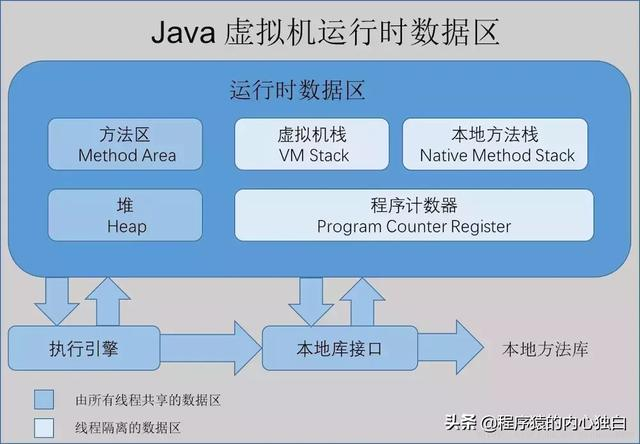
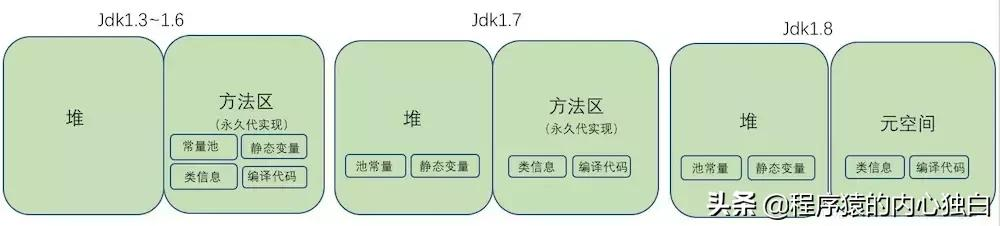
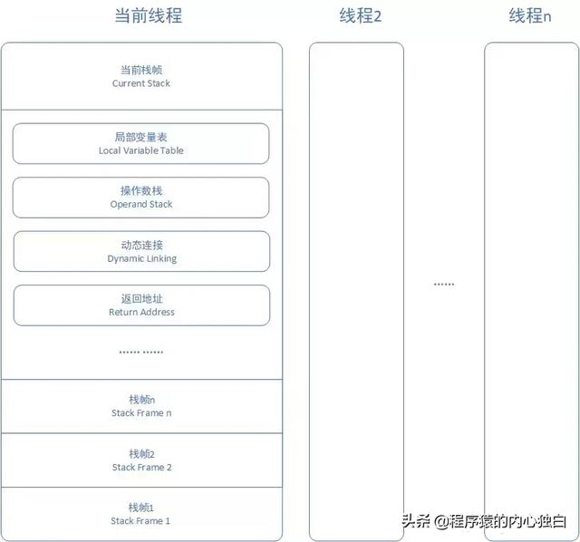
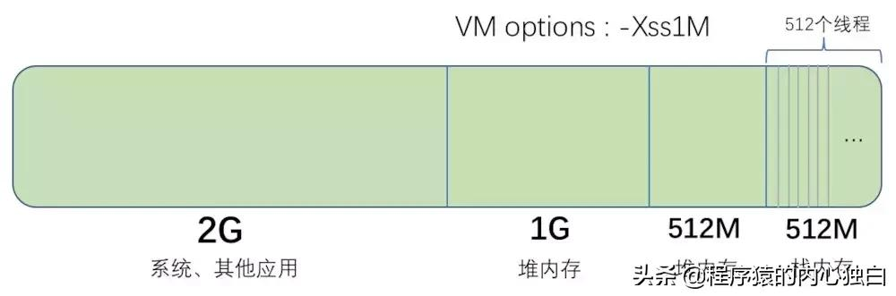

> [转自：今日头条](https://www.toutiao.com/a6680697276114928140/?tt_from=weixin&utm_campaign=client_share&wxshare_count=1&timestamp=1555635093&app=news_article&utm_source=weixin&utm_medium=toutiao_ios&req_id=20190419085132010023039161925C917&group_id=6680697276114928140)

### 前言

在JVM的管控下，Java程序员不再需要管理内存的分配与释放，这和在C和C++的世界是完全不一样的。所以，在JVM的帮助下，Java程序员很少会关注内存泄露和内存溢出的问题。但是，一旦JVM发生这些情况的时候，如果你不清楚JVM内存的内存管理机制是很难定位与解决问题的。

### 一、JVM 内存区域

Java虚拟机在运行时，会把内存空间分为若干个区域，根据《Java虚拟机规范（Java SE 7 版）》的规定，Java虚拟机所管理的内存区域分为如下部分：方法区、堆内存、虚拟机栈、本地方法栈、程序计数器。



1. 方法区

方法区主要用于存储虚拟机加载的类信息、常量、静态变量，以及编译器编译后的代码等数据。在jdk1.7及其之前，方法区是堆的一个“逻辑部分”（一片连续的堆空间），但为了与堆做区分，方法区还有个名字叫“非堆”，也有人用“永久代”（HotSpot对方法区的实现方法）来表示方法区。


从jdk1.7已经开始准备“去永久代”的规划，jdk1.7的HotSpot中，已经把原本放在方法区中的静态变量、字符串常量池等移到堆内存中，（常量池除字符串常量池还有class常量池等），这里只是把字符串常量池移到堆内存中；在jdk1.8中，方法区已经不存在，原方法区中存储的类信息、编译后的代码数据等已经移动到了元空间（MetaSpace）中，元空间并没有处于堆内存上，而是直接占用的本地内存（NativeMemory）。根据网上的资料结合自己的理解对jdk1.3~1.6、jdk1.7、jdk1.8中方法区的变迁画了张图如下（如有不合理的地方希望读者指出）：



**去永久代的原因有：**

+ （1）字符串存在永久代中，容易出现性能问题和内存溢出。

+ （2）类及方法的信息等比较难确定其大小，因此对于永久代的大小指定比较困难，太小容易出现永久代溢出，太大则容易导致老年代溢出。

+ （3）永久代会为 GC 带来不必要的复杂度，并且回收效率偏低。

2. 堆内存

堆内存主要用于存放对象和数组，它是JVM管理的内存中最大的一块区域，堆内存和方法区都被所有线程共享，在虚拟机启动时创建。在垃圾收集的层面上来看，由于现在收集器基本上都采用分代收集算法，因此堆还可以分为新生代（YoungGeneration）和老年代（OldGeneration），新生代还可以分为 Eden、From Survivor、To Survivor。

3. 程序计数器

程序计数器是一块非常小的内存空间，可以看做是当前线程执行字节码的行号指示器，每个线程都有一个独立的程序计数器，因此程序计数器是线程私有的一块空间，此外，程序计数器是Java虚拟机规定的唯一不会发生内存溢出的区域。

4. 虚拟机栈

虚拟机栈也是每个线程私有的一块内存空间，它描述的是方法的内存模型，直接看下图所示：



虚拟机会为每个线程分配一个虚拟机栈，每个虚拟机栈中都有若干个栈帧，每个栈帧中存储了局部变量表、操作数栈、动态链接、返回地址等。一个栈帧就对应 Java 代码中的一个方法，当线程执行到一个方法时，就代表这个方法对应的栈帧已经进入虚拟机栈并且处于栈顶的位置，每一个 Java 方法从被调用到执行结束，就对应了一个栈帧从入栈到出栈的过程。

5. 本地方法栈

本地方法栈与虚拟机栈的区别是，虚拟机栈执行的是 Java 方法，本地方法栈执行的是本地方法（Native Method）,其他基本上一致，在 HotSpot 中直接把本地方法栈和虚拟机栈合二为一，这里暂时不做过多叙述。

6. 元空间

上面说到，jdk1.8 中，已经不存在永久代（方法区），替代它的一块空间叫做 “ 元空间 ”，和永久代类似，都是 JVM 规范对方法区的实现，但是元空间并不在虚拟机中，而是使用本地内存，元空间的大小仅受本地内存限制，但可以通过 -XX:MetaspaceSize 和 -XX:MaxMetaspaceSize 来指定元空间的大小。

### 二、JVM 内存溢出

1. 堆内存溢出

堆内存中主要存放对象、数组等，只要不断地创建这些对象，并且保证 GC Roots 到对象之间有可达路径来避免垃圾收集回收机制清除这些对象，当这些对象所占空间超过最大堆容量时，就会产生 OutOfMemoryError 的异常。堆内存异常示例如下：

```java
/*** 设置最大堆最小堆：-Xms20m -Xmx20m* 运行时，不断在堆中创建OOMObject类的实例对象，且while执行结束之前，GC Roots(代码中的oomObjectList)到对象(每一个OOMObject对象)之间有可达路径，垃圾收集器就无法回收它们，最终导致内存溢出。*/
public class HeapOOM {
  static class OOMObject {}
  public static void main(String[] args) {
    List<OOMObject> oomObjectList = new ArrayList<>();
    while (true) {
      oomObjectList.add(new OOMObject());
    }
  }
}
```

**运行后会报异常，在堆栈信息中可以看到：**

java.lang.OutOfMemoryError: Java heap space 的信息，说明在堆内存空间产生内存溢出的异常。

新产生的对象最初分配在新生代，新生代满后会进行一次 Minor GC，如果 Minor GC 后空间不足会把该对象和新生代满足条件的对象放入老年代，老年代空间不足时会进行 Full GC，之后如果空间还不足以存放新对象则抛出 OutOfMemoryError 异常。

常见原因：内存中加载的数据过多如一次从数据库中取出过多数据；集合对对象引用过多且使用完后没有清空；代码中存在死循环或循环产生过多重复对象；堆内存分配不合理；网络连接问题、数据库问题等。

2. 虚拟机栈/本地方法栈溢出

+ （1）StackOverflowError：当线程请求的栈的深度大于虚拟机所允许的最大深度，则抛出StackOverflowError，简单理解就是虚拟机栈中的栈帧数量过多（一个线程嵌套调用的方法数量过多）时，就会抛出StackOverflowError异常。


** 最常见的场景就是方法无限递归调用，如下：**

```java
/*** 设置每个线程的栈大小：-Xss256k* 运行时，不断调用doSomething()方法，main线程不断创建栈帧并入栈，导致栈的深度越来越大，最终导致栈溢出。*/
public class StackSOF {
  private int stackLength=1;
  public void doSomething(){
    stackLength++;
    doSomething();
  }
  public static void main(String[] args) {
    StackSOF stackSOF=new StackSOF();
    try {
      stackSOF.doSomething();
    }catch (Throwable e){
      //注意捕获的是ThrowableSystem.out.println("栈深度："+stackSOF.stackLength);throw e;
    }
  }
}
```
**上述代码执行后抛出：**

```java
Exception in thread "Thread-0" java.lang.StackOverflowError 的异常。
```

+ （2）OutOfMemoryError：如果虚拟机在扩展栈时无法申请到足够的内存空间，则抛出 OutOfMemoryError。


我们可以这样理解，虚拟机中可以供栈占用的空间≈可用物理内存 - 最大堆内存 - 最大方法区内存，比如一台机器内存为 4G，系统和其他应用占用 2G，虚拟机可用的物理内存为 2G，最大堆内存为 1G，最大方法区内存为 512M，那可供栈占有的内存大约就是 512M，假如我们设置每个线程栈的大小为 1M，那虚拟机中最多可以创建 512个线程，超过 512个线程再创建就没有空间可以给栈了，就报 OutOfMemoryError 异常了。



**栈上能够产生 OutOfMemoryError 的示例如下：**

```java
/*** 设置每个线程的栈大小：-Xss2m* 运行时，不断创建新的线程（且每个线程持续执行），每个线程对一个一个栈，最终没有多余的空间来为新的线程分配，导致OutOfMemoryError*/
public class StackOOM {
  private static int threadNum = 0;
  public void doSomething() {
    try {
      Thread.sleep(100000000);
    } catch (InterruptedException e) {
      e.printStackTrace();
    }
  }

  public static void main(String[] args) {
    final StackOOM stackOOM = new StackOOM();
    try {while (true) {
      threadNum++;
      Thread thread = new Thread(new Runnable() {
        @Override
        public void run() {
          stackOOM.doSomething();
        }
      });
      thread.start();
    }
  } catch (Throwable e) {
    System.out.println("目前活动线程数量：" + threadNum);
    throw e;
  }
}
}

```

上述代码运行后会报异常

```java
在堆栈信息中可以看到java.lang.OutOfMemoryError: unable to create new native thread的信息，无法创建新的线程，说明是在扩展栈的时候产生的内存溢出异常。
```

总结：在线程较少的时候，某个线程请求深度过大，会报 StackOverflow 异常，解决这种问题可以适当加大栈的深度（增加栈空间大小），也就是把 -Xss 的值设置大一些，但一般情况下是代码问题的可能性较大；在虚拟机产生线程时，无法为该线程申请栈空间了。

会报 OutOfMemoryError 异常，解决这种问题可以适当减小栈的深度，也就是把 -Xss 的值设置小一些，每个线程占用的空间小了，总空间一定就能容纳更多的线程，但是操作系统对一个进程的线程数有限制，经验值在 3000~5000 左右。

在 jdk1.5 之前 -Xss 默认是 256k，jdk1.5 之后默认是 1M，这个选项对系统硬性还是蛮大的，设置时要根据实际情况，谨慎操作。

3. 方法区溢出

前面说到，方法区主要用于存储虚拟机加载的类信息、常量、静态变量，以及编译器编译后的代码等数据，所以方法区溢出的原因就是没有足够的内存来存放这些数据。

由于在 jdk1.6 之前字符串常量池是存在于方法区中的，所以基于 jdk1.6 之前的虚拟机，可以通过不断产生不一致的字符串（同时要保证和 GC Roots 之间保证有可达路径）来模拟方法区的 OutOfMemoryError 异常；但方法区还存储加载的类信息，所以基于 jdk1.7 的虚拟机，可以通过动态不断创建大量的类来模拟方法区溢出。

```java
/*** 设置方法区最大、最小空间：-XX:PermSize=10m -XX:MaxPermSize=10m* 运行时，通过cglib不断创建JavaMethodAreaOOM的子类，方法区中类信息越来越多，最终没有可以为新的类分配的内存导致内存溢出*/

public class JavaMethodAreaOOM {
  public static void main(final String[] args){
    try {
      while (true){
        Enhancer enhancer=new Enhancer();
        enhancer.setSuperclass(JavaMethodAreaOOM.class);
        enhancer.setUseCache(false);
        enhancer.setCallback(new MethodInterceptor() {
          @Override
          public Object intercept(Object o, Method method, Object[] objects, MethodProxy methodProxy) throws Throwable {
            return methodProxy.invokeSuper(o,objects);
          }
        });
        enhancer.create();
      }
    }catch (Throwable t){
      t.printStackTrace();
    }
  }
}
```

上述代码运行后会报：

```java
java.lang.OutOfMemoryError: PermGen space 的异常，说明是在方法区出现了内存溢出的错误。
```

4. 本机直接内存溢出

本机直接内存（DirectMemory）并不是虚拟机运行时数据区的一部分，也不是 Java 虚拟机规范中定义的内存区域，但 Java 中用到 NIO 相关操作时（比如 ByteBuffer 的 allocteDirect 方法申请的是本机直接内存），也可能会出现内存溢出的异常。

### 总结

JVM内存区域划分，便于它能够更加高效的管理自身的内存。当程序中出现这种由于JVM造成的内存溢出的情况的时候，需要根据不同的情况做不同的分析与处理。
