> [转自：https://mp.weixin.qq.com/s/_Ah3sjETKInRl25GcgswHg](https://mp.weixin.qq.com/s/_Ah3sjETKInRl25GcgswHg)

如果我们所在公司的业务量比较大，在生产环境经常会出现JVM内存溢出的现象，那我们该如何快速响应，快速定位，快速恢复问题呢？

本文将通过一个线上环境JVM内存溢出的案例向大家介绍一下处理思路与分析方法。

案例：架构组接到某项目组反馈，Zabbix监控上显示JMX不可用，请求协助处理。

**分析思路：**
+ JMX不可用，往往是由于垃圾回收时间停顿时间过长、内存溢出等问题引起的。
+ 线上故障分析的原则是首先要采取措施快速恢复故障对业务的影响，然后才是采集信息、分析定位问题，并最终给出解决办法。

具体分析过程如下。

**如何快速恢复业务**

通常线上的故障会对业务造成重大影响，影响用户体验，故如果线上服务器出现故障，应规避对业务造成影响，但不能简单的重启服务器，因为需要尽可能保留现场，为后续的问题分析打下基础。

那我们如何快速规避对业务的影响，并能保留现场呢？

通常的做法是隔离故障服务器。

通常线上服务器是集群部署，一个好的分布式负载方案会自动剔除故障的机器，从而实现高可用架构，但如果未被剔除，则需要运维人员将故障服务器进行剔除，保留现场进行分析。

发生内存泄露，通常情况下是由于代码的原因造成的，一般无法立即对代码进行修复，很容易会发送连锁反应造成应用服务器一台一台接连宕机，故障面积会慢慢扩大，针对此种情况，应快速定位发生内存泄露的原因，将该服务进行降级，避免对其他服务造成影响。最简单的降级方法是根据F5(Nginx)转发策略，对该功能定向到一个单独的集群，与其他流量进行隔离，确保其他业务不受牵连，给故障排查、解决提供宝贵的缓冲时间。

**分析解决问题**

首先可以通过查看日志，确定是哪种内存溢出，堆内存溢出可发生的地方：Java heap space(堆空间)、perm space(持久代)。

**收集内存溢出Dump文件**

收集Dump文件有两种方式：

+ 设置JVM启动参数 -XX:+HeapDumpOnOutOfMemoryError  -XX:HeapDumpPath=/opt/jvmdump

在每次发生内存溢出时，JVM会自动将堆转储，dump文件存放在-XX:HeapDumpPath指定的路径下。

+ 使用jmap命令收集 通过jmap -dump:live,format=b,file=/opt/jvm/dump.hprof pid。

**分析Dump文件**

在获取Dump文件后，可以使用工具MAT(MemoryAnalyzer)进行分析，该工具大家可以通过百度自行下载。

使用MAT打开Dump文件后，首页截图如下：

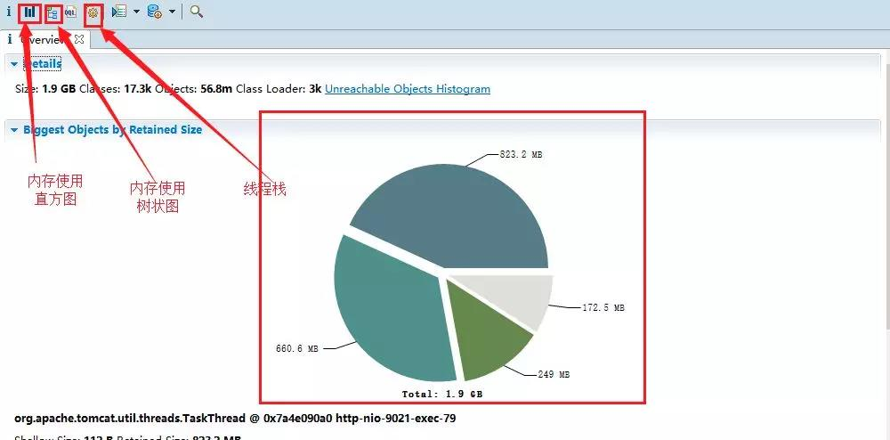

工具按钮介绍：

 : 直方图视图，将堆中所有的内存消耗情况统计出来，其如图所示：

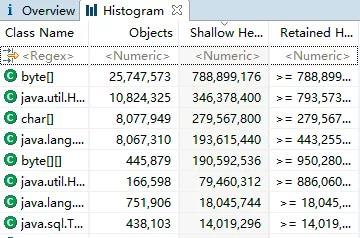

 : 内存使用树状结构，以线程为维度，树状形式展开，如图所示：

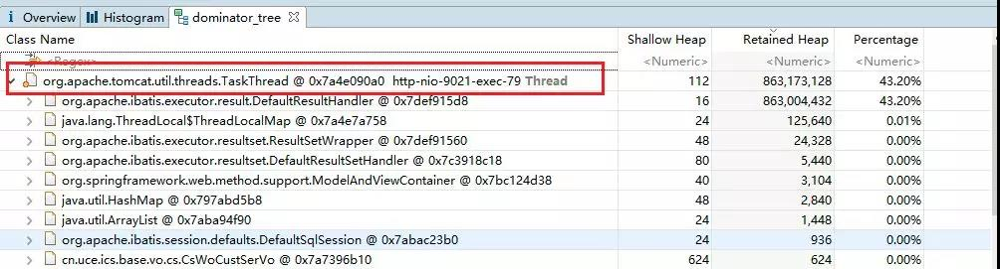

 : 线程栈，其截图如下：

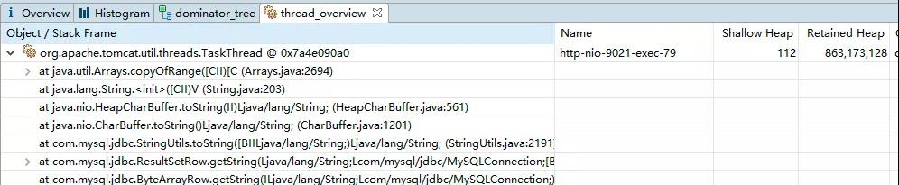

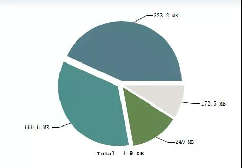

根据该图，可以明确，堆的总大小为1.9G，被4个线程全部占据，导致其他线程无法再申请资源，抛出堆内存溢出错误。

接下来，我通常的做法是直接去看 这个视图(以线程为基本维度，查找线程中占用内存的对象)，为后续定位排查提供必要的依据。

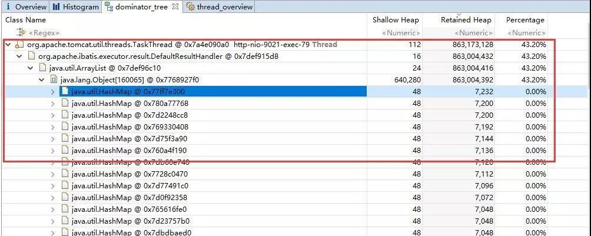

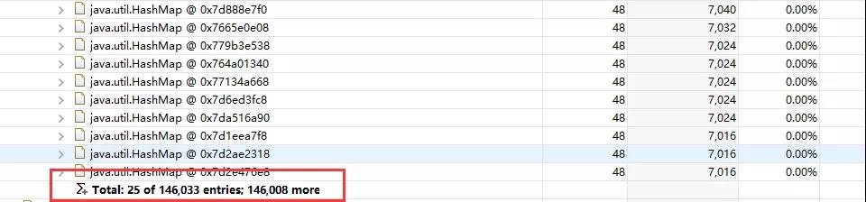

从上面的截图中可以得出如下关键信息点：

+ org.apache.ibatis.executor.result.DefaultResultHandler内部持有一个List，其原始为java.util.HashMap，从这个类基本可以看出是与数据库的查询相关，对数据库返回结果的解码并组织成HashMap。

+ 这个List中的元素总共有146033个，初步可以判断出是在一次查询中从数据库中一次查询出了太多数据，造成了内存溢出。

由于SQL查询代码中，是用HashMap来接收数据库中的返回字段，无法一时间看出是那个查询，那我们能不能精确找到是哪一个查询，哪一行代码，甚至与哪一条SQL语句呢？

答案是可以的，我们可以从视图一探究竟。

温馨提示：

视图使用技巧：展开技巧：沿着使用率最高的项一层一层进行展开，直至发现具体占用内存的对象。

接下来我们从 视图去寻找是哪个方法，哪条SQL语句触发的。

具体方法：首先完全展开一个线程，从展开图的底部向上寻找： 其线程的入口(控制层代码)

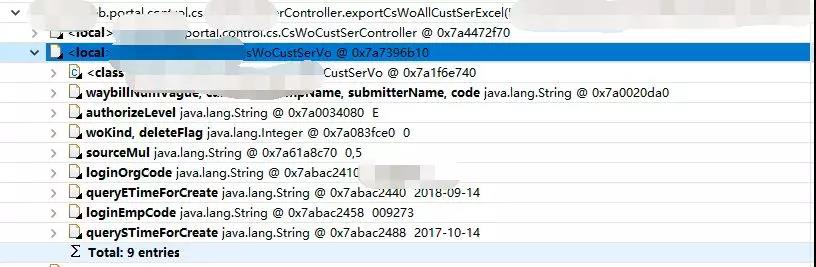

继续往上查找，要找到SQL语句，应该找到Mybatis处理结果集相关的类，如图所示：

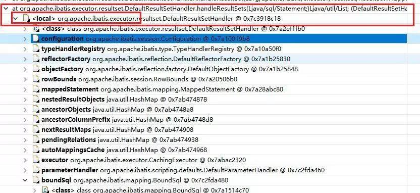

然后展开boundSql即能找到SQL语句：

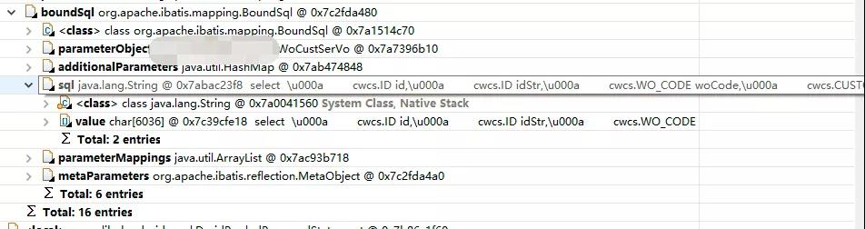

然后鼠标可以放在SQL属性中，右键，可以将SQL语句复制出来。

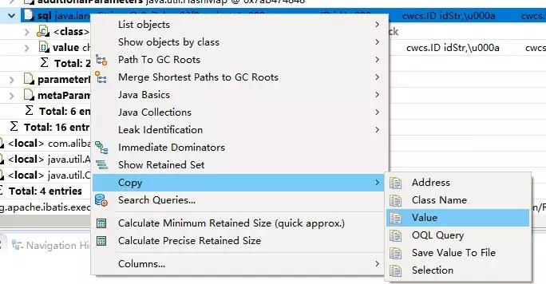

这里根据后面的分析，原来是在做导出功能的时候，没有使用分页对数据进行分页查询，分页写入Excel文件，而是一次将全部数据查询，导致导出功能如果并发数超过4个时，就会将所有内存耗尽。

解决方案：

+ 首先在运维层面将该请求导入到指定的一台服务器上，是导出任务与其他任务进行隔离，避免对其他重要服务造成影响。

+ 项目组对其代码进行修复，可以使用分页查数据，然后分配写入Excel。
