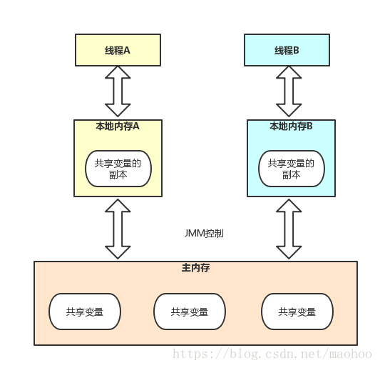

3.1.1 - 3.1.2 Java并发基础与内存模型
-------------------

在并发编程里，需要处理两个问题：线程之间如何通信及线程之间如何同步。通信指的是线程之间以何种机制来交换信息。在命令式编程里中，线程之间的通信机制有两种：共享内存和消息传递。
**Java的并发采用的是共享内存模型。**
Java线程之间的通信由Java内存模型（JMM）控制，JMM决定一个线程对共享变量的写入何时对另一个线程可见。线程之间的**共享变量存储在主内存中**，每个线程都有一个**私有的本地内存**，本地内存中存储了该线程以读、写共享变量的副本。

从图中可以看到，如果线程A和线程B之间要通信的话，必须经历如下的2步：
1）线程A把本地内存A中更新过的共享变量刷新到主内存中去；
2）线程B到主内存中去读取线程A之前已更新过的共享变量；

如图，假设初始时，本地内存A、B以及主内存中X均为0，线程A在执行时，把更新后的x值（假设为1）临时存放在自己的本地内存A中。当线程A和现场B需要通信时，线程A首先会把自己的本次内存中修改的x值刷新到主内存中，此时主内存中的x值变成了1。随后线程B到主内存中去读取线程A更新后的x值，此时线程B的本地内存中的x值也变成了1。

3.1.3 从源代码到指令序列的重排序
-------------------

在执行程序时，为了提高性能，编译器和处理器常常会对指令做重排序。重排序分为以下3种：

1）编译器优化的重排序
2）指令级并行的重排序
3）内存系统的重排序

从Java源代码到最终实际执行的指令序列，会分别经历下面3种重排序，如下图：

3.1.4 并发编程模型的分类
-------------------

 1. 现在的处理器使用写缓冲区**临时保存**向内存写入的数据。
 2. 写缓冲区可以保证指令流水线**持续运行**，它可以避免由于处理器停顿下来等待向内存写入数据而产生的延迟。
 3. 通过以批处理的方式刷新写缓冲区，以及合并写缓冲区中对同一内存地址的多次写，**减少对内存总线的占用**。
 4. 每个处理器上的写缓冲区，**只对它所在的处理器可见**。
 5. 处理器对内存的读、写操作的执行顺序，**不一定与内存实际发生的读写顺序一致**。

为了保证内存可见性，java编译器在生成指令序列的适当位置会插入内存屏障指令来禁止特定类型的处理器重排序。JMM把内存屏障指令分为4类：

 1. LoadLoad Barriers
 2. StoreStore Barriers
 3. LoadStore Barriers
 4. StoreLoad Barriers

3.1.5 happens-before简介
-------------------

如果一个操作执行的结果需要对另一个操作可见，那么这两个操作之间必须要存在happens-before关系。这两个操作可以在同一个线程中，也可以在不同的线程中。

 1. 程序顺序规则：一个线程中的每个操作，happens-before于该线程中的任意后续操作
 2. 监视器锁规则：对一个锁的解锁，happens-before于随后对这个锁的加锁
 3. volatile变量规则：对一个volatile域的写，happens-before于任意后续对这个volatile域的读。
 4. 传递性：如果 A happens-before B，且B happens-before C，则A happens-before C。

**注意：两个操作之间具有happens-before关系，并不意味着前一个操作必须要在后一个操作之前执行！happens-before仅仅要求前一个操作（执行的结果）对后一个操作可见。**
