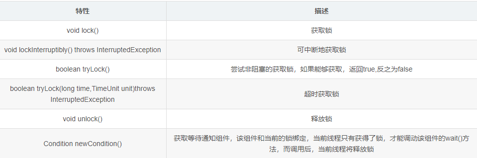

## 5.1 Lock接口
1：Lock接口出现之前，Java主要靠synchronized关键字实现锁功能。它提供了显式地获取和释放锁的便捷性，但是也缺少了synchronized的隐式获取和释放锁的便捷性，程序员可以在不同场景进行选择。
Lock的使用也很简单，示例代码如下：
```java
Lock lock = new ReentrantLock();
lock.lock();
try {
}finally{
	lock.unlock();
}
```
不要将获取锁的代码也放到try块中，因为这样的话，如果在获取锁（**自定义锁的实现**）的过程中，出现了异常，会导致锁无故的释放。

2：Lock 接口提供的synchronized关键字不具备的主要特性


3： Lock是一个接口，它定义的API方法如下：


