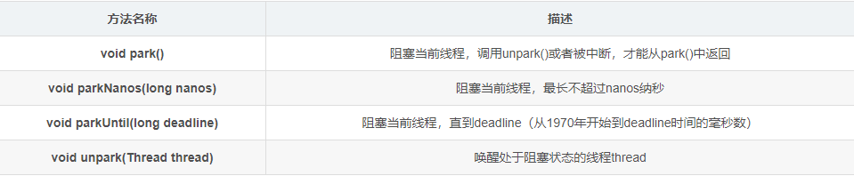

## 5.5 LockSupport工具
作用：阻塞或者唤醒一个线程。

package java.util.concurrent.locks;




## 5.6 Condition接口

对比Object的监视器方法和Condition接口


### 5.6.1 Condition接口与示例


使用方式，代码示例：
```java
Lock lock = new ReentrantLock();
Condition condition = lock.newCondition();
public void conditionWait()throws InterruptedException{
	lock.lock();
	try {
		condition.await();
	} finally {
		lock.unlock();
	}
}
public void conditionSignal()throws InterruptedException{
	lock.lock();
	try {
		condition.signal();
	} finally {
		lock.unlock();
	}
}
```


**示例2：有界队列，当队列为空时，队列的获取操作将会阻塞获取线程，知道队列中有新增元素，当队列已满时，队列的插入操作将会阻塞插入线程，直到队列出现“空位”。**

```java
public class BoundedQueue<T> {
  private Object[] items;
  private int addIndex, removeIndex, count;
  private Lock lock = new ReentrantLock();
  private Condition notEmpty = lock.newCondition();
  private Condition notFull = lock.newCondition();

  public BoundedQueue(int size) {
      items = new Object[size];
  }

  //添加一个元素，如果数组满，则添加线程进入等待状态，直到有空位
  public void add(T t) throws InterruptedException {
      lock.lock();
      try {
          while (count == items.length) {
              notFull.await();
          }
          items[addIndex] = t;
          if (++addIndex == items.length) {
              addIndex = 0;
          }
          ++count;
          notEmpty.signal();
      } finally {
          lock.unlock();

      }
  }

  // 由头部删除一个元素，如果数组为空，则删除线程进入等待状态，直到有新添加元素
  public T remove() throws InterruptedException {
      lock.lock();
      try {
          while (count == 0) {
              notEmpty.await();
          }
          Object x = items[removeIndex];
          if (++removeIndex == items.length) {
              removeIndex = 0;
          }
          --count;
          notFull.signal();
          return (T) x;
      } finally {
          lock.unlock();
      }
  }}
```
当数组数量等于数组长度时，说明数组已经满了，则调用notFull.await(),当前线程随之释放锁并进入等待状态。
当数组数量不等于数组长度时，表示数组未满，则添加元素到数组中，同时通知等待在notEmpty上的线程，数组中已经有新元素可以获取。
