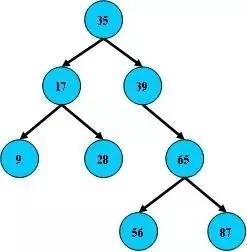
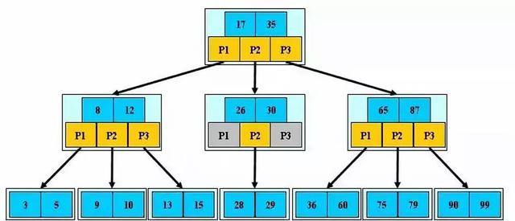
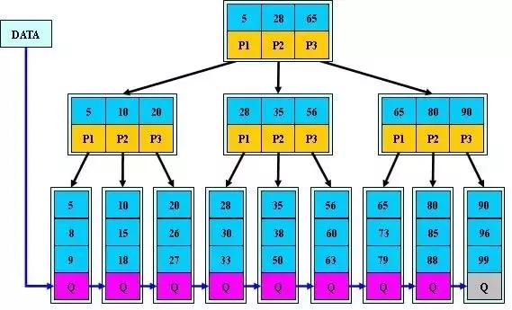
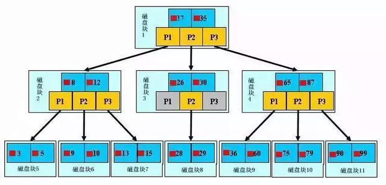

> [转自：今日头条](https://www.toutiao.com/a6681524631871947275/?tt_from=weixin&utm_campaign=client_share&wxshare_count=1&timestamp=1555666560&app=news_article&utm_source=weixin&utm_medium=toutiao_ios&req_id=20190419173600010025090037132A337&group_id=6681524631871947275)

MySQL事实上使用不同的存储引擎也是有很大区别的，下面猿友们可以了解一下。

### 一、存储引擎的比较

特点|Myisam|BDB|Memory|InnoDB|Archive
--|:--|:--|:--|--
存储限制|没有|没有|有|64TB|没有
事务安全||支持||支持|
锁机制|表锁|页锁|表锁|行锁|行锁
B树索引|支持|支持|支持|支持|
哈希索引|||支持|支持|
全文索引|支持||||
集群索引||||支持|
数据缓存|||支持|支持|
索引缓存|支持||支持|支持|
数据可压缩|支持||||支持
空间使用|低|低|N/A|高|非常低
内存使用|低|低|中等|高|低
批量插入的速度|高|高|高|低|非常高
支持外键||||支持|

表头|表头|表头
---|:--:|---
内容|内容|内容
内容|内容|内容

注：上面提到的B树索引并没有指出是B-Tree和B+Tree索引，但是B-树和B+树的定义是有区别的。

在 MySQL 中，主要有四种类型的索引，分别为：B-Tree 索引， Hash 索引， Fulltext 索引和 R-Tree 索引。

B-Tree 索引是 MySQL 数据库中使用最为频繁的索引类型，除了 Archive 存储引擎之外的其他所有的存储引擎都支持 B-Tree 索引。Archive 引擎直到 MySQL 5.1 才支持索引，而且只支持索引单个 AUTO_INCREMENT 列。

不仅仅在 MySQL 中是如此，实际上在其他的很多数据库管理系统中B-Tree 索引也同样是作为最主要的索引类型，这主要是因为 B-Tree 索引的存储结构在数据库的数据检索中有非常优异的表现。MySQL数据库开发的 36 条军规，这个推荐看一下。

一般来说， MySQL 中的 B-Tree 索引的物理文件大多都是以 Balance Tree 的结构来存储的，也就是所有实际需要的数据都存放于 Tree 的 Leaf Node(叶子节点) ，而且到任何一个 Leaf Node 的最短路径的长度都是完全相同的，所以我们大家都称之为 B-Tree 索引。

当然，可能各种数据库（或 MySQL 的各种存储引擎）在存放自己的 B-Tree 索引的时候会对存储结构稍作改造。如 Innodb 存储引擎的 B-Tree 索引实际使用的存储结构实际上是 B+Tree，也就是在 B-Tree 数据结构的基础上做了很小的改造，在每一个Leaf Node 上面出了存放索引键的相关信息之外，还存储了指向与该 Leaf Node 相邻的后一个 LeafNode 的指针信息（增加了顺序访问指针），这主要是为了加快检索多个相邻 Leaf Node 的效率考虑。

InnoDB是Mysql的默认存储引擎(Mysql5.5.5之前是MyISAM）

接下来我们先看看B-树、B+树的概念。弄清楚，为什么加了索引查询速度会加快？

### 二、B-树、B+树概念

**B树**

即二叉搜索树：

1. 所有非叶子结点至多拥有两个儿子（Left和Right）；

2. 所有结点存储一个关键字；

3. 非叶子结点的左指针指向小于其关键字的子树，右指针指向大于其关键字的子树；

如：

**B-树**

是一种多路搜索树（并不是二叉的）：

1. 定义任意非叶子结点最多只有M个儿子；且M>2；

2. 根结点的儿子数为[2, M]；

3. 除根结点以外的非叶子结点的儿子数为[M/2, M]；

4. 每个结点存放至少M/2-1（取上整）和至多M-1个关键字；（至少2个关键字）

5. 非叶子结点的关键字个数=指向儿子的指针个数-1；

6. 非叶子结点的关键字：K[1], K[2], …, K[M-1]；且K[i] < K[i+1]；

7. 非叶子结点的指针：P[1], P[2], …, P[M]；其中P[1]指向关键字小于K[1]的子树，P[M]指向关键字大于K[M-1]的子树，其它P[i]指向关键字属于(K[i-1], K[i])的子树；

8. 所有叶子结点位于同一层；

如：（M=3）

B-树的搜索，从根结点开始，对结点内的关键字（有序）序列进行二分查找，如果命中则结束，否则进入查询关键字所属范围的儿子结点；重复，直到所对应的儿子指针为空，或已经是叶子结点；

**B-树的特性：**

1. 关键字集合分布在整颗树中；

2. 任何一个关键字出现且只出现在一个结点中；

3. 搜索有可能在非叶子结点结束；

4. 其搜索性能等价于在关键字全集内做一次二分查找；

5. 自动层次控制；

由于限制了除根结点以外的非叶子结点，至少含有M/2个儿子，确保了结点的至少利用率。所以B-树的性能总是等价于二分查找（与M值无关），也就没有B树平衡的问题；37 个 MySQL 数据库小技巧，推荐大家看下。

由于M/2的限制，在插入结点时，如果结点已满，需要将结点分裂为两个各占M/2的结点；删除结点时，需将两个不足M/2的兄弟结点合并；

**B+树**

B+树是B-树的变体，也是一种多路搜索树：

1. 其定义基本与B-树同，除了：

2. 非叶子结点的子树指针与关键字个数相同；

3. 非叶子结点的子树指针P[i]，指向关键字值属于[K[i], K[i+1])的子树（B-树是开区间）；

4. 为所有叶子结点增加一个链指针；

5. 所有关键字都在叶子结点出现；

如：（M=3）

B+的搜索与B-树也基本相同，区别是B+树只有达到叶子结点才命中（B-树可以在

非叶子结点命中），其性能也等价于在关键字全集做一次二分查找；

**B+的特性：**

1. 所有关键字都出现在叶子结点的链表中（稠密索引），且链表中的关键字恰好是有序的；

2. 不可能在非叶子结点命中；

3. 非叶子结点相当于是叶子结点的索引（稀疏索引），叶子结点相当于是存储（关键字）数据的数据层；

4. 更适合文件索引系统；

了解B-/B+树的概念之后，我们继续分析B+树提高效率的原理。

### 三、B+树索引原理

如上图，是一颗b+树，关于b+树的定义可以参见B+树，这里只说一些重点，浅蓝色的块我们称之为一个磁盘块，可以看到每个磁盘块包含几个数据项（深蓝色所示）和指针（黄色所示），如磁盘块1包含数据项17和35，包含指针P1、P2、P3，P1表示小于17的磁盘块，P2表示在17和35之间的磁盘块，P3表示大于35的磁盘块。真实的数据存在于叶子节点即3、5、9、10、13、15、28、29、36、60、75、79、90、99。非叶子节点只不存储真实的数据，只存储指引搜索方向的数据项，如17、35并不真实存在于数据表中。

**b+树的查找过程**

如图所示，如果要查找数据项29，那么首先会把磁盘块1由磁盘加载到内存，此时发生一次IO，在内存中用二分查找确定29在17和35之间，锁定磁盘块1的P2指针，内存时间因为非常短（相比磁盘的IO）可以忽略不计，通过磁盘块1的P2指针的磁盘地址把磁盘块3由磁盘加载到内存，发生第二次IO，29在26和30之间，锁定磁盘块3的P2指针，通过指针加载磁盘块8到内存，发生第三次IO，同时内存中做二分查找找到29，结束查询，总计三次IO。真实的情况是，3层的b+树可以表示上百万的数据，如果上百万的数据查找只需要三次IO，性能提高将是巨大的，如果没有索引，每个数据项都要发生一次IO，那么总共需要百万次的IO，显然成本非常非常高。

**b+树性质**

1. 通过上面的分析，我们知道IO次数取决于b+数的高度h，假设当前数据表的数据为N，每个磁盘块的数据项的数量是m，则有h=㏒(m+1)N，当数据量N一定的情况下，m越大，h越小；而m = 磁盘块的大小 / 数据项的大小，磁盘块的大小也就是一个数据页的大小，是固定的，如果数据项占的空间越小，数据项的数量越多，树的高度越低。这就是为什么每个数据项，即索引字段要尽量的小，比如int占4字节，要比bigint8字节少一半。这也是为什么b+树要求把真实的数据放到叶子节点而不是内层节点，一旦放到内层节点，磁盘块的数据项会大幅度下降，导致树增高。当数据项等于1时将会退化成线性表。

2. 当b+树的数据项是复合的数据结构，比如(name,age,sex)的时候，b+数是按照从左到右的顺序来建立搜索树的，比如当(张三,20,F)这样的数据来检索的时候，b+树会优先比较name来确定下一步的所搜方向，如果name相同再依次比较age和sex，最后得到检索的数据；但当(20,F)这样的没有name的数据来的时候，b+树就不知道下一步该查哪个节点，因为建立搜索树的时候name就是第一个比较因子，必须要先根据name来搜索才能知道下一步去哪里查询。比如当(张三,F)这样的数据来检索时，b+树可以用name来指定搜索方向，但下一个字段age的缺失，所以只能把名字等于张三的数据都找到，然后再匹配性别是F的数据了， 这个是非常重要的性质，即索引的最左匹配特性。

**慢查询优化**

关于MySQL索引原理是比较枯燥的东西，大家只需要有一个感性的认识，并不需要理解得非常透彻和深入。我们回头来看看一开始我们说的慢查询，了解完索引原理之后，大家是不是有什么想法呢？先总结一下索引的几大基本原则，史上最全的 MySQL 高性能优化实战总结，这个推荐看一下。

### 四、建索引的几大原则

1. 最左前缀匹配原则，非常重要的原则，mysql会一直向右匹配直到遇到范围查询(>、<、between、like)就停止匹配，比如a = 1 and b = 2 and c > 3 and d = 4 如果建立(a,b,c,d)顺序的索引，d是用不到索引的，如果建立(a,b,d,c)的索引则都可以用到，a,b,d的顺序可以任意调整。

2. =和in可以乱序，比如a = 1 and b = 2 and c = 3 建立(a,b,c)索引可以任意顺序，mysql的查询优化器会帮你优化成索引可以识别的形式

3. 尽量选择区分度高的列作为索引,区分度的公式是count(distinct col)/count(*)，表示字段不重复的比例，比例越大我们扫描的记录数越少，唯一键的区分度是1，而一些状态、性别字段可能在大数据面前区分度就是0，那可能有人会问，这个比例有什么经验值吗？使用场景不同，这个值也很难确定，一般需要join的字段我们都要求是0.1以上，即平均1条扫描10条记录

4. 索引列不能参与计算，保持列“干净”，比如from_unixtime(create_time) = ’2014-05-29’就不能使用到索引，原因很简单，b+树中存的都是数据表中的字段值，但进行检索时，需要把所有元素都应用函数才能比较，显然成本太大。所以语句应该写成create_time = unix_timestamp(’2014-05-29’);

5. 尽量的扩展索引，不要新建索引。比如表中已经有a的索引，现在要加(a,b)的索引，那么只需要修改原来的索引即可。
