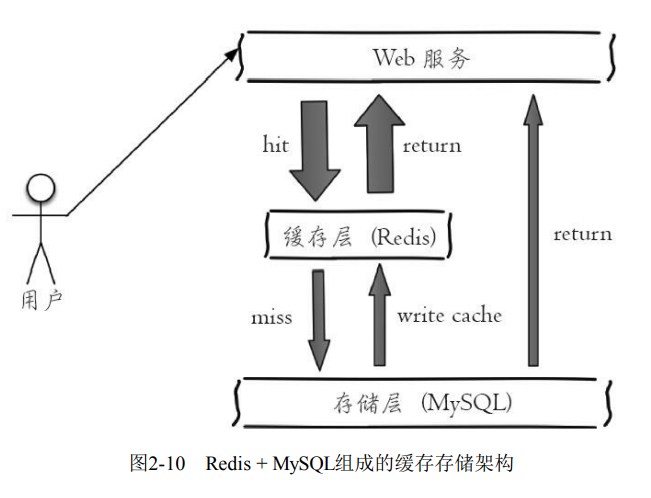
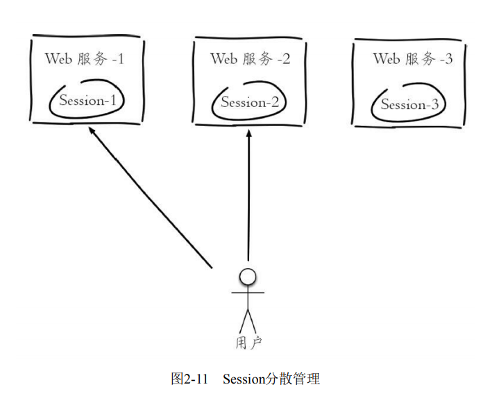
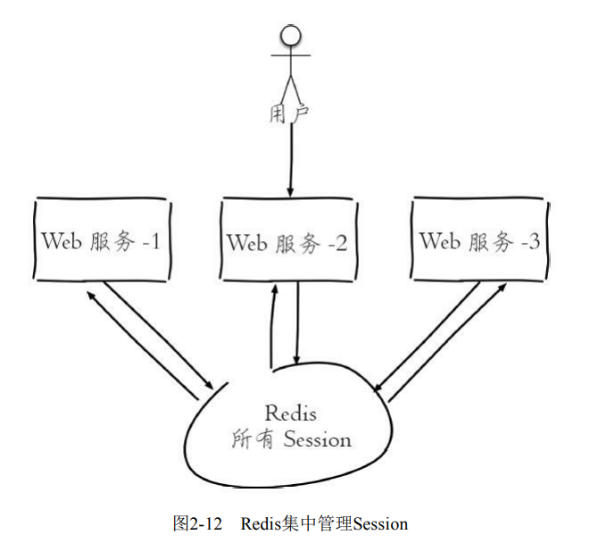
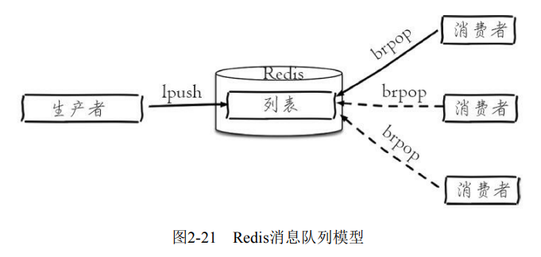

> [转自：《Redis开发与运维》]()

## Redis可以做什么

1. 缓存
缓存机制几乎在所有的大型网站都有使用，合理地使用缓存不仅可以加快数据的访问速度，而且能够有效地降低后端数据源的压力。Redis提供了
键值过期时间设置，并且也提供了灵活控制最大内存和内存溢出后的淘汰策略。可以这么说，一个合理的缓存设计能够为一个网站的稳定保驾护航。

图2-10是比较典型的缓存使用场景，其中Redis作为缓存层，MySQL作为存储层，绝大部分请求的数据都是从Redis中获取。由于Redis具有支撑高
并发的特性，所以缓存通常能起到加速读写和降低后端压力的作用。



2. 排行榜系统
排行榜系统几乎存在于所有的网站，例如按照热度排名的排行榜，按照发布时间的排行榜，按照各种复杂维度计算出的排行榜，Redis提供了列表
和有序集合数据结构，合理地使用这些数据结构可以很方便地构建各种排行榜系统。

3. 计数器应用
计数器在网站中的作用至关重要，例如视频网站有播放数、电商网站有浏览数，为了保证数据的实时性，每一次播放和浏览都要做加1的操作，如
果并发量很大对于传统关系型数据的性能是一种挑战。Redis天然支持计数功能而且计数的性能也非常好，可以说是计数器系统的重要选择。
许多应用都会使用Redis作为计数的基础工具，它可以实现快速计数、查询缓存的功能，同时数据可以异步落地到其他数据源。例如笔者所在团队
的视频播放数系统就是使用Redis作为视频播放数计数的基础组件，用户每播放一次视频，相应的视频播放数就会自增1：

```java

long incrVideoCounter(long id) {
  key = "video:playCount:" + id;
  return redis.incr(key);
}

```

4. 共享session
如图2-11所示，一个分布式Web服务将用户的Session信息（例如用户登录信息）保存在各自服务器中，这样会造成一个问题，出于负载均衡的考虑，分布式服务会将用户的访问均衡到不同服务器上，用户刷新一次访问可能会发现需要重新登录，这个问题是用户无法容忍的。



为了解决这个问题，可以使用Redis将用户的Session进行集中管理，如图2-12所示，在这种模式下只要保证Redis是高可用和扩展性的，每次用户
更新或者查询登录信息都直接从Redis中集中获取。



5. 社交网络
赞/踩、粉丝、共同好友/喜好、推送、下拉刷新等是社交网站的必备功能，由于社交网站访问量通常比较大，而且传统的关系型数据不太适合保存
这种类型的数据，Redis提供的数据结构可以相对比较容易地实现这些功能。

6. 消息队列系统
消息队列系统可以说是一个大型网站的必备基础组件，因为其具有业务解耦、非实时业务削峰等特性。Redis提供了发布订阅功能和阻塞队列的功
能，虽然和专业的消息队列比还不够足够强大，但是对于一般的消息队列功能基本可以满足。

如图2-21所示，Redis的lpush+brpop命令组合即可实现阻塞队列，生产者客户端使用lrpush从列表左侧插入元素，多个消费者客户端使用brpop命令
阻塞式的“抢”列表尾部的元素，多个客户端保证了消费的负载均衡和高可用性。



7. 限速

很多应用出于安全的考虑，会在每次进行登录时，让用户输入手机验证码，从而确定是否是用户本人。但是为了短信接口不被频繁访问，会限制用
户每分钟获取验证码的频率，例如一分钟不能超过5次，如图2-13所示。


此功能可以使用Redis来实现，下面的伪代码给出了基本实现思路：

```java
phoneNum = "138xxxxxxxx";
key = "shortMsg:limit:" + phoneNum;
// SET key value EX 60 NX
isExists = redis.set(key,1,"EX 60","NX");
if(isExists != null || redis.incr(key) <=5){
 // 通过
}else{
 // 限速
}
```
上述就是利用Redis实现了限速功能，例如一些网站限制一个IP地址不能在一秒钟之内访问超过n次也可以采用类似的思路。

+ lpush+lpop=Stack（栈）

+ lpush+rpop=Queue（队列）

+ lpsh+ltrim=Capped Collection（有限集合）

+ lpush+brpop=Message Queue（消息队列）


## Redis不可以做什么

实际上和任何一门技术一样，每个技术都有自己的应用场景和边界，也就是说Redis并不是万金油，有很多适合它解决的问题，但是也有很多不合
适它解决的问题。我们可以站在数据规模和数据冷热的角度来进行分析。站在数据规模的角度看，数据可以分为大规模数据和小规模数据，我们
知道Redis的数据是存放在内存中的，虽然现在内存已经足够便宜，但是如果数据量非常大，例如每天有几亿的用户行为数据，使用Redis来存储的
话，基本上是个无底洞，经济成本相当的高。

站在数据冷热的角度看，数据分为热数据和冷数据，热数据通常是指需要频繁操作的数据，反之为冷数据，例如对于视频网站来说，视频基本信息
基本上在各个业务线都是经常要操作的数据，而用户的观看记录不一定是经常需要访问的数据，这里暂且不讨论两者数据规模的差异，单纯站在数据冷
热的角度上看，视频信息属于热数据，用户观看记录属于冷数据。如果将这些冷数据放在Redis中，基本上是对于内存的一种浪费，但是对于一些热数
据可以放在Redis中加速读写，也可以减轻后端存储的负载，可以说是事半功倍。

所以，Redis并不是万金油，相信随着我们对Redis的逐步学习，能够清楚Redis真正的使用场景。
