> 转自：https://juejin.cn/post/7153255870447484936

今天这篇文章，很有意思，它来源于我曾经的一次真实面试里的其中一个小问题。当时是终面，面我的是那家公司的技术顾问，在面试前hr还让我看了他的履历，是一位1996年就进了麻省理工计算机系的大佬。
属实有被震惊到，什么概念？1996年，没记错的话那是个用BP机和大哥大的年代？有几个人能用上电脑？又有几个人有这种机会能出国深造。
这是哪部爽文小说的主人公剧情？
就算放到现在，这也是非常强的事情。
我这辈子是没希望了，也不知道我的儿子或者孙子辈有没有机会能做到。
也就是说，这位大佬，至少领先了我两代人。
那一天，我感受到了，那种跨越时代的碾压感。

好了，不讲骚话了，直接开始主题吧。

我们知道，如果你知道某台电脑的IP，就可以向这个IP发起连接请求，建立连接后就可以操作收发数据。

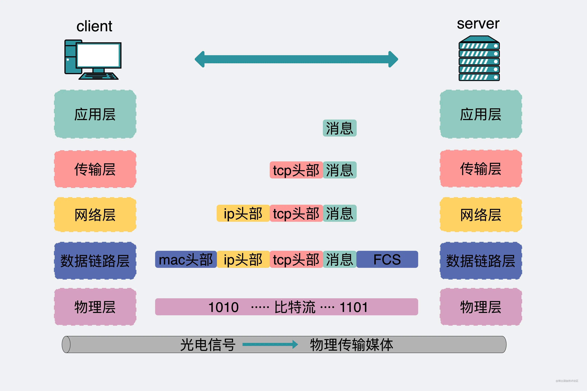

要发送的数据，会在网络层里加入IP头。

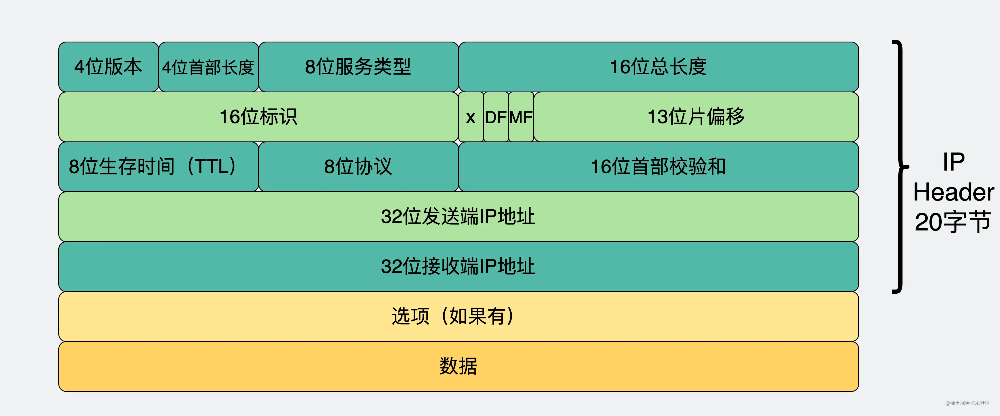

这里面最重要的是发送端和接收端的IP地址。这个IP地址就像是一个门牌号一样，有了它，数据包就能在这个纷繁复杂的网络世界里找到该由谁来接收这个数据包。
所以说上面的网络通信离不开IP。

假设我有一台新买的电脑，还没联网呢，这时候拿着新买的网线，插入网线口，网线插口亮起来了。
然后就可以开始用它上网了。

那么问题来了。
刚插上网线，电脑怎么知道自己的IP是什么？怎么就突然能上网了呢？
这个话题，我们从DHCP聊起吧。

DHCP是什么
插上网线之后，获得IP的方式主要有两种。
第一种是，自己手动在电脑里配。像下图那样，是macOS的一个截图，在选择手动配置之后，除了IP地址还需要配上子网掩码和路由器的地址。

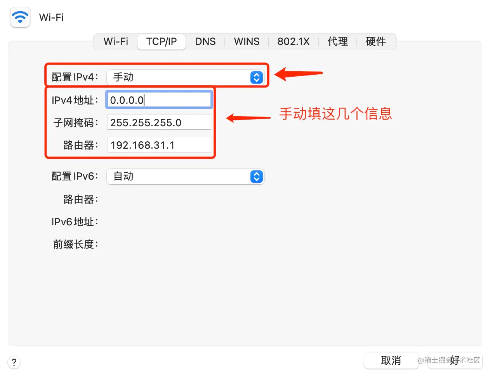

这就很不科学了，电脑又不只是卖给程序员，这几个词对于大部分普通人来说，比赋能抓手闭环这种黑话还要难理解。
大部分人没事都不应该去配这玩意。
有没有办法可以让这些IP信息自动获得？
有，这就是第二种获取IP的方式，DHCP（Dynamic Host Configuration Protocol，动态主机配置协议）。

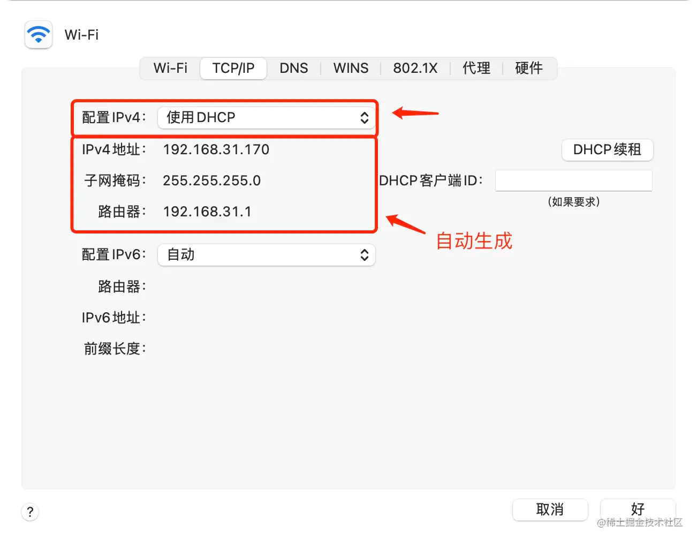

通过DHCP，在联网之后可以自动获取到本机需要的IP地址，子网掩码还有路由器地址。

DHCP的工作原理
DHCP的工作原理也非常简单。

说白了，就是向某个管IP分配的服务器，也就是DHCP服务器，申请IP地址。其实一般家里用的路由器就自带这个功能。

整个操作流程分为4个阶段。


DHCP Discover：在联网时，本机由于没有IP，也不知道DHCP服务器的IP地址是多少，所以根本不知道该向谁发起请求，于是索性选择广播，向本地网段内所有人发出消息，询问"谁能给个IP用用"。
DHCP Offer：不是DHCP服务器的机子会忽略你的广播消息，而DHCP服务器收到消息后，会在自己维护的一个IP池里拿出一个空闲IP，通过广播的形式给回你的电脑。
DHCP Request：你的电脑在拿到IP后，再次发起广播，就说"这个IP我要了"。
DHCP ACK：DHCP服务器此时再回复你一个ACK，意思是"ok的"。你就正式获得这个IP在一段时间（比如24小时）里的使用权了。后续只要IP租约不过期，就可以一直用这个IP进行通信了。

到这里，问题来了

为什么要有第三和第四阶段
大家有没有发现，在Offer阶段，其实你的机子就已经拿到了IP了，为什么还要有后面的Request和ACK呢？是不是有些多此一举？
这是因为本地网段内，可能有不止一台DHCP服务器，在你广播之后，每个DHCP服务器都有可能给你发Offer。
本着先到先得的原则，你的机子一般会对第一个到的Offer响应DHCP Request，目的是为了确认offer，在你确认Offer这段时间内，DHCP服务器确认这个IP还没被分出去，你才可以安心使用这个IP。
像不像你找工作的过程？
你海投简历（DHCP Discover），然后拿到了多个offer(DHCP Offer)。
这时候事情还没完，你一般会跟HR说："你给我两天时间，我要跟家里人商量下"。
HR也会对你说："那你尽快确认，我这边还有不少候选人等着"。
之后你考虑下来觉得不错，跟HR说要接这个Offer（DHCP Request），HR看了下这个岗位还在，才能确认让你第二天来上班（DHCP ACK）。如果这个公司的岗位已经招到其他候选人了，第四阶段的消息就会改为发DHCP NAK，意思是拒绝了你的接Offer请求。

DHCP抓包
光看原理是有些枯燥，我们可以尝试下抓包看下数据。
在命令行里执行下面的命令，可以强行让电脑的en0网卡重新走一遍DHCP流程。

```
sudo ipconfig set en0 DHCP
```
> en0可以替换成其他网卡，比如eth0啥的。

这时候就可以抓到相关的数据包。

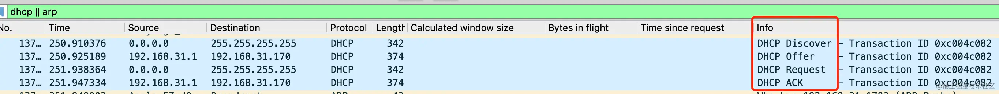

我们可以看到蓝色的四个数据包，分别对应上面提到的四个DHCP阶段。

其中第二阶段中的DHCP Offer里会返回给我们需要的IP、子网掩码、路由器地址以及DNS服务器地址。

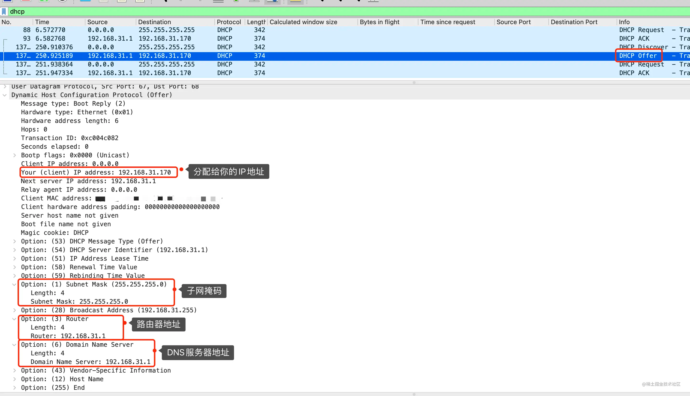

另外，通过抓包，我们可以发现DHCP是应用层的协议，基于传输层UDP协议进行数据传输。


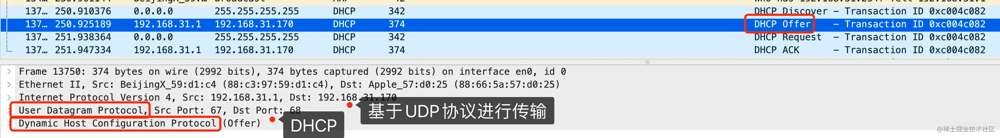

那么问题又来了。

为什么DHCP用UDP，能不能改用TCP？
按道理说，UDP能做到的，TCP一般也能做到。但这次真不行。
主要原因还是因为TCP是面向连接的，而UDP是无连接的。
所谓"连接"，他就只有一个发送端和一个接收端，就跟水管一样。
而DHCP由于一开始并不知道要跟谁建立连接，所以只能通过广播的形式发送消息，注意，小细节，广播。

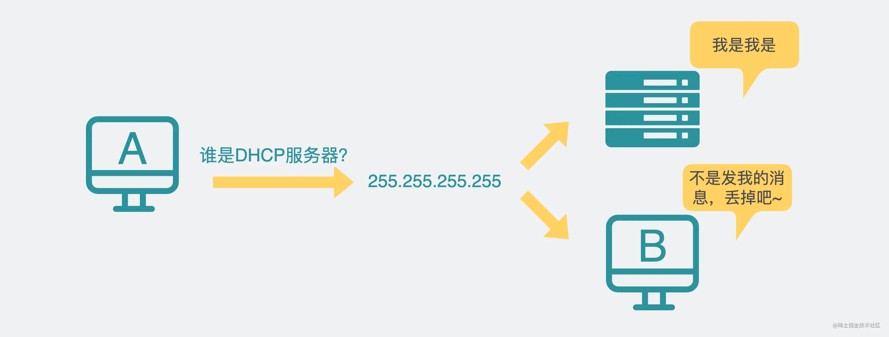

同样是在本地网段内发广播消息，UDP只需要发给255.255.255.255。它实际上并不是值某个具体的机器，而是一个特殊地址，这个地址有特殊含义，只要设了这个目的地址，就会在一定本地网段内进行广播。
而TCP却不同，它需要先建立连接，但实际上255.255.255.255对应的机器并不存在，因此也不能建立连接。如果同样要做到广播的效果，就需要先得到本地网段内所有机器的IP，然后挨个建立连接，再挨个发消息。这就很低效了。
因此DHCP选择了UDP，而不是TCP。

为什么第二阶段不是广播，而是单播。

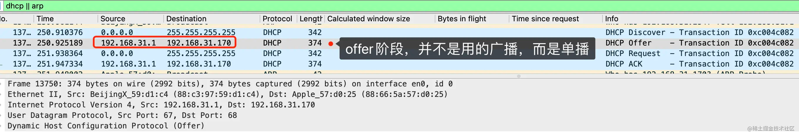

另外一个小细节不知道大家注意到没，上面在提到 DHCP Offer 阶段时，提到的是DHCP服务器会使用广播的形式回复。但抓个包下来却发现并不是广播，而是单播。
其实，这是DHCP协议的一个小优化。原则上大家在DHCP offer阶段，都用广播，那肯定是最稳的，目标机器收到后自然就会进入第三阶段DHCP Request。而非目标机器，收到后解包后发现目的机器的mac地址跟自己的不同，也会丢掉这个包。
但是问题就出在，这个非目的机器需要每次都在网卡收到包，并解完包，才发现原来这不是给它的消息，这。。。真，有被打扰到。
如果本地网段内这样的包满天飞，也浪费机器性能。
如果能用单播，那当然是最好的。但这时候目的机器其实并没有IP地址，有些系统在这种情况下能收单播包，有些则认为不能收，这个跟系统的实现有关。因此，对于能收单播包的系统，会在发DHCP Discover阶段设一个 Broadcast flag = 0 (unicast) 的标志位，告诉服务器，支持单播回复，于是服务器就会在DHCP Offer阶段以单播的形式进行回复。


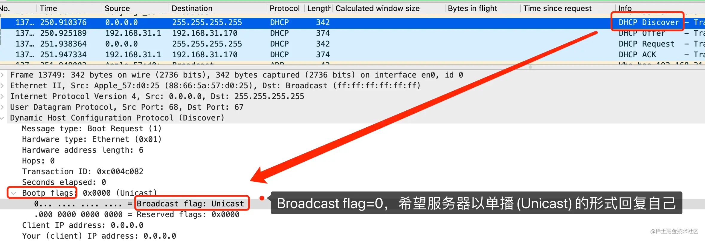

是不是每次联网都要经历DHCP四个阶段？
只要想联网，就需要IP，要用IP，就得走DHCP协议去分配。
但大家也发现了，DHCP第一阶段和第二阶段都可能会发广播消息。对于家用电脑还好，插个网线，之后就雷打不动。但像手机这样的移动设备，是要带着到处跑的，坐个地铁，进个电梯，公司里到处走走，都可能会涉及到网络切换。
这每次都要来一个完整的四阶段，各种广播消息满天飞，其实对网络环境不太友好。
于是问题叒来了，是不是每次联网都要经历DHCP四个阶段？
当然不需要。
我们会发现每次断开wifi再打开wifi时，机子会经历一个从没网到有网的过程。
这时候去抓个包，会发现。

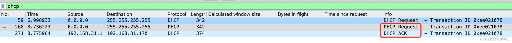

其实只发生了DHCP的第三和第四阶段。这是因为机子记录了曾经使用过 192.168.31.170这个IP，重新联网后，会优先再次请求这个IP，这样就省下了第一第二阶段的广播了。
另外需要注意的是，抓包图里DHCP Request之所以出现两次，是因为第一次Request发出后太久没得到回应，因此重发。
DHCP分配下来的IP一定不会重复吗？
一般来说DHCP服务器会在它维护的IP池里找到一个没人用的IP分配给机子，
这个IP如果重复分配了，那本地网段内就会出现两个同样的IP，这个IP下面却对应两个不同的mac地址。但其他机器上的ARP缓存中却只会记录其中一条mac地址到IP的映射关系。
于是，数据在传递的过程中就会出错。
因此本地网段内IP必须唯一。
那么DHCP分配下来的IP有没有可能跟别的IP是重复的？
都这么问了，那肯定是可能的。
有两个常见的情况会出现IP重复。

文章开头提到，IP是可以自己手动配的，自己配的IP是有可能跟其他DHCP分配下来的IP是相同的。解决方案也很简单，尽量不要手动去配IP，统一走DHCP。或者在DHCP服务器里维护的IP范围里，将这条IP剔除。
一个本地网段内，是可以有多个DHCP服务器的，而他们维护的IP地址范围是有可能重叠的，于是就有可能将相同的IP给到不同的机子。解决方案也很简单，修改两台DHCP服务器的维护的IP地址范围，让它们不重叠就行了。

不过吧，上面的解决方案，都需要有权限去修改DHCP服务器。

得到DHCP ACK之后立马就能使用这个IP了吗？
这就好像在问，拿到offer之后你是第一时间就去上班吗？
不。
你会先告诉你的同事同学朋友，甚至会发朋友圈。
你的机子也一样。
在得到DHCP ACK之后，机子不会立刻就用这个IP。
而是会先发三条ARP消息。

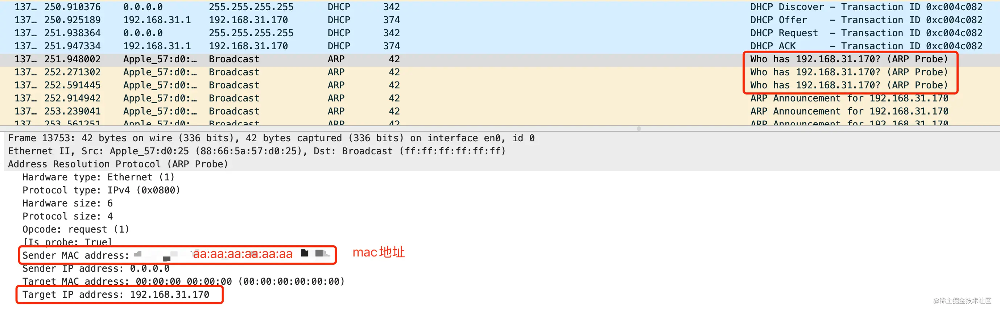

大家知道ARP消息的目的是通过IP地址去获得mac地址。所以普通的ARP消息里，是填了IP地址，不填mac地址的。
但这三条ARP协议，比较特殊，它们叫无偿ARP（Gratuitous ARP），特点是它会把IP和mac地址都填好了，而且填的还是自己的IP和mac地址。
目的有两个。

一个是为了告诉本地网段内所有机子，从现在起，xx IP地址属于xx mac地址，让大家记录在ARP缓存中。
另一个就是看下本地网段里有没有其他机子也用了这个IP，如果有冲突的话，那需要重新再走一次DHCP流程。


在三次无偿ARP消息之后，确认没有冲突了，才会开始使用这个IP地址进行通信。
这种行为，实际上就跟你拿了offer之后发了这么个朋友圈没啥区别。
而且，还连发了三条。


秀offer，offer冲突了不可怕。秀对象秀冲突了才可怕。
如果你朋友圈里有这种人，答应我，删了吧。

总结

电脑插上网线，联网后会通过DHCP协议动态申请一个IP，同时获得子网掩码，路由器地址等信息。
DHCP分为四个阶段，分别是 Discover，Offer， Request和ACK。如果曾经连过这个网，机器会记录你上次使用的IP，再次连接时优先使用原来的那个IP，因此只需要经历第三第四阶段。
DHCP是应用层协议，考虑到需要支持广播功能，底层使用的是UDP协议，而不是TCP协议。
DHCP分配下来的IP是有可能跟某台手动配置的IP地址重复的。
DHCP得到IP之后还会发3次无偿ARP通告，在确认没有冲突后开始使用这个IP。


最后给大家留个问题吧。我们上面的IP都是从DHCP服务器上申请的，在服务器返回DHCP Offer的时候，可以看到上面写了DHCP服务器的IP。比如192.168.31.1，这明显是个局域网内的IP，但这能说明，你的DHCP服务器一定在这个局域网里吗？

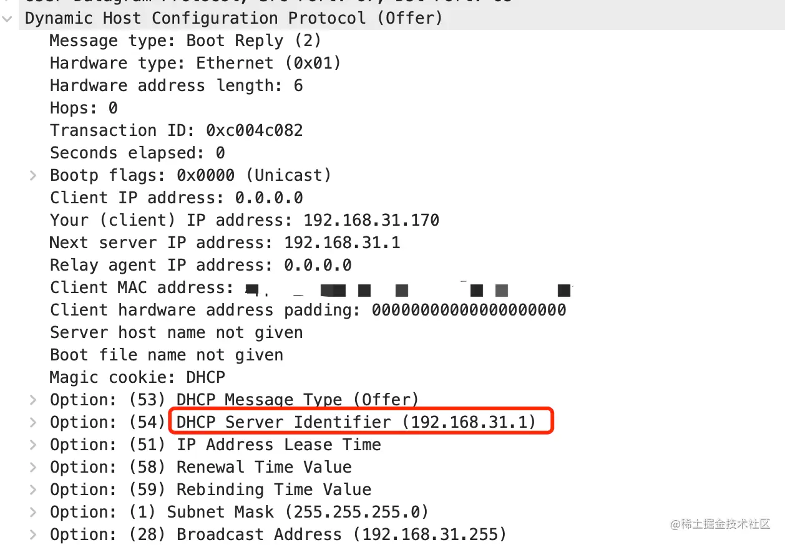

