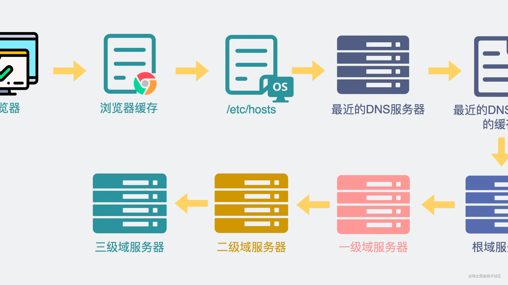

为什么要有DNS
如果我们想要访问某度，你可以在浏览器上的搜索栏里输入112.80.248.76这个IP地址，直达页面。


这样的行为，合法，但有病。
大部分人，连自己对象的电话号码都记不住，又怎么可能记得住这么一串IP地址呢。
哦，不好意思，伤害到兄弟们了，你们没对象。
但我假设你们有。
回想一下，虽然你记不住对象的电话号码，但却不影响你给她打电话。你的操作过程是不是打开通讯录，输入"富婆"，然后就弹出一个电话号码。点击即拨打。
在计算机领域，你大概率也记不住IP，所以也需要有类似的通讯录的功能。比如，你只需要输入www.baidu.com，它就能帮你找到对应的 112.80.248.76，然后进行访问。


其中www.baidu.com 是域名，通过这个域名可以获得它背后的IP是112.80.248.76。
就像一个人可以有多个电话号码一样，一个域名也可以对应有多个IP地址。
而将域名解析为IP的过程，也就是查"通讯录"的过程，其实就是DNS（Domain Name System，域名系统）协议需要做的事情。

另外需要注意的是，上面的这个IP地址，我写这篇文章的时候能访问，不代表大家看文章的时候能访问。因为这背后的IP地址是有可能变更的。可以通过使用 ping www.baidu.com获得最新的IP地址。

>另外需要注意的是，上面的这个IP地址，我写这篇文章的时候能访问，不代表大家看文章的时候能访问。因为这背后的IP地址是有可能变更的。可以通过使用 ping www.baidu.com获得最新的IP地址。
但问题就来了。

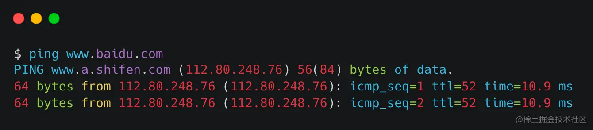

普通人的通讯录，一般有一千个电话号码就算是社交小达人了，放在通讯录里绰绰有余。
然而网站域名，却不一样，据说2015年的时候就已经超过3亿了。
如果将这3亿条记录都放在一个服务器里，会有两个问题。

超过3亿条域名数据，数据量过大，并且数据量持续增加
需要承受大量的读请求。每个网站域名都可能会有成千的访问。这加起来，四舍五入也有千亿qps了。

显然，如果将DNS做成类似手机通讯录这样的单点服务，那是不可能实现这样的能力的，必须得是分布式系统。
于是，问题就变成了，如何设计一个支持千亿+qps请求的大型分布式系统。
我知道肯定有人要说："这是服务只有10qps的人该考虑的事情吗？"

虽然我们做的服务可能只有10qps，但这并不妨碍我们学习DNS里优秀的设计。
我们就从URL的层次结构聊起。
URL的层次结构
举个例子。一个常见的域名，比如 www.baidu.com。
可以看到，这个域名中间用了两个句点。通过句点符号，可以将域名分为三部分。
其中com被称为一级域或顶级域，其他常见的顶级域还有cn，co等，baidu是二级域，www则是三级域。
除此之后，在com后面，其实还有一个被省略掉的句点号。它叫根域。


当域名多起来了之后，将它们相同的部分抽取出来，多个域名就可以变成这样的树状层级结构。

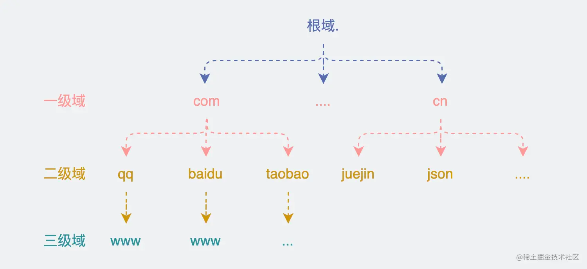

这时候我们就可以看到，这些域之间其实是一种层级关系，就像是学校，年级，班级那样。
当你想要去定位一个具体域名的时候，你就可以通过这样的层级找到对应的域名。
举个例子。大家应该还记得那句广告词，"三年级2班的李小明同学，你妈妈拿了两罐旺仔牛奶给你"，其实李小明的妈妈，就是通过，学校、年级、班级的层级形式，一层层找到人。


### DNS的原理

我们重新回来看下大佬们是怎么设计DNS。

先直接说最重要的结论。

+ 利用层级结构去拆分服务
+ 加入多级缓存

接下来展开。

### 利用URL层级结构去拆分服务

DNS承载的流量压力非常大，必须要做成分布式服务，于是问题的关键就变成了如何拆分服务。
既然URL是树状的层级结构，那保存它们的服务，也可以依据这个，非常自然的拆成树状的形式。
一台服务器维护一个或多个域的信息。于是服务就变成了下面这样的层级形式。
当我们需要访问www.baidu.com。
查询过程就跟下图一样。

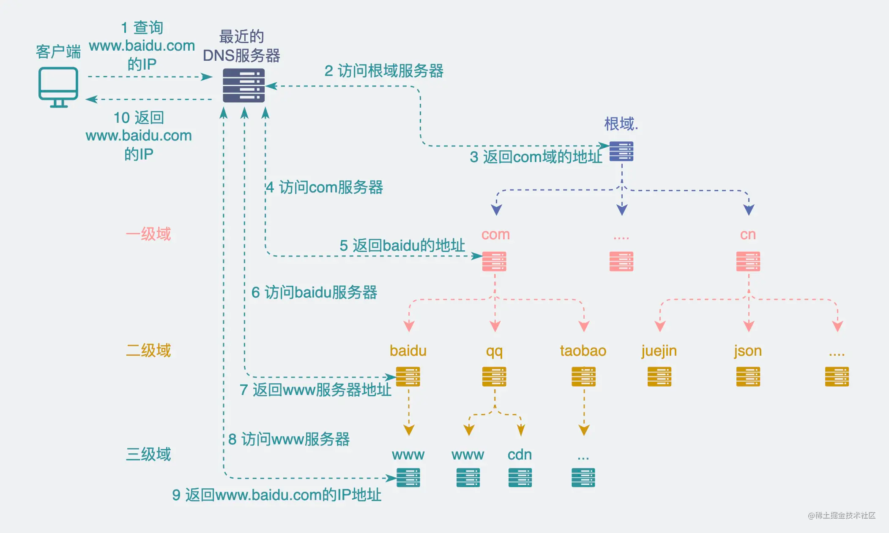

请求会先打到最近的DNS服务器（比如你家的家用路由器）中，如果在DNS服务器中找不到，则DNS服务器会直接询问根域服务器，在根域服务器中虽然没有www.baidu.com这条记录的，但它可以知道这个URL属于com域，于是就找到com域服务器的IP地址，然后访问com域服务器，重复上面的操作，再找到放了baidu域的服务器是哪个，继续往下，直到找到www.baidu.com的那条记录，最后返回对应的IP地址。
可以看到，原理比较简单，但这里涉及到两个问题。

+ 本机怎么知道最近的DNS服务器IP是什么？
+ 最近的DNS服务器怎么知道根域的IP是多少？

我们一个个来回答。

### 本机怎么知道最近的DNS服务器的IP是什么？

这个在之前写过的《刚插上网线，电脑怎么知道自己的IP是什么？》 提到过，插上网线时，机子会通过DHCP协议获得本机的IP地址，子网掩码，路由器地址，以及DNS服务器的IP地址。


下面是我的mac机子，第二阶段DHCP Offer中的抓包截图。可以看到，这里面返回的信息里包含了DNS服务器的IP。

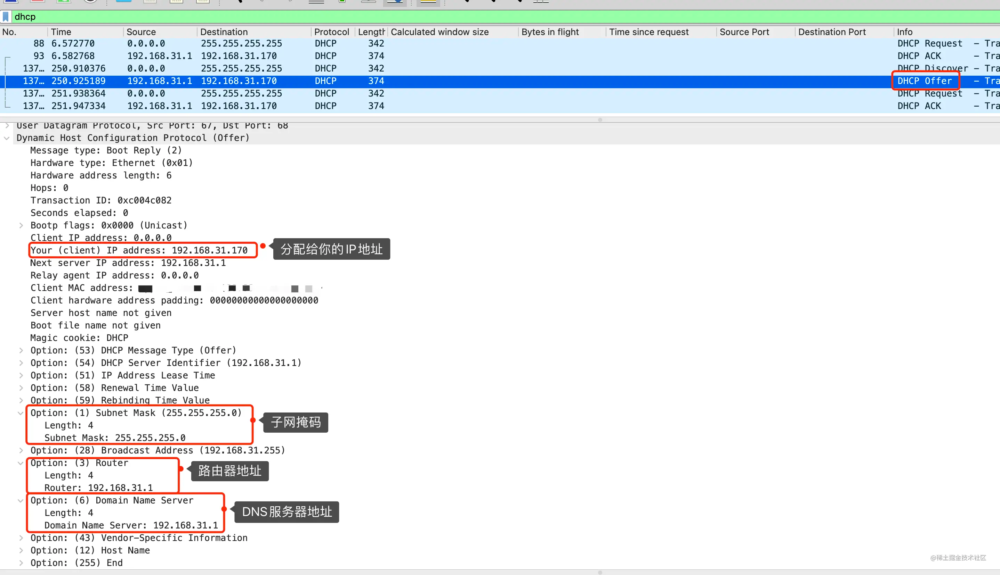

同时也可以在左上角的点左上角的苹果图标->系统表偏好设置->网络->高级->DNS中查看到DNS服务器的IP地址。

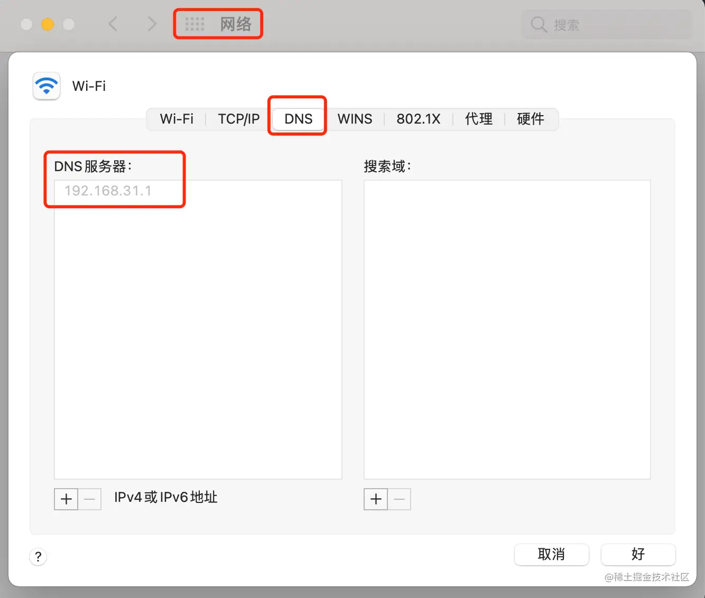

这里有个小细节，从上面的抓包图里可以看到路由器地址和DNS服务器地址，以及DHCP服务器地址，其实都是192.168.31.1，这个其实是我这边的家用路由器的IP地址，也就是说一般家用路由器自带这几个功能。
而在某里云服务器里，DNS服务器也是一样，是通过dhcp协议获得。查看DNS服务器的IP地址也很方便，执行cat /etc/resolv.conf就好了。

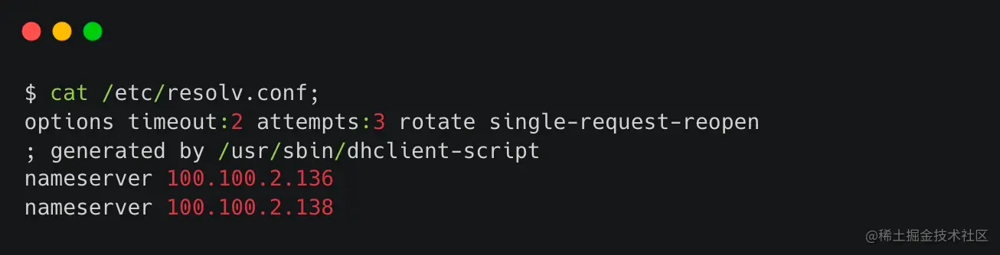

这上面的nameserver中，可以看出有两台DNS服务器，机子会按照文件中出现的顺序来发起请求，如果第一台服务器没反应，就会去请求第二台。

### 最近的DNS服务器怎么知道根域的IP是多少？

我们也知道根域，就是域名树的顶层，既然是顶层，那信息一般也就相对少一些。对应的IPV4地址只有13个，IPV6地址只有25个。

我们可以通过dig命令的+trace选项来查看一个域名的dns解析过程。

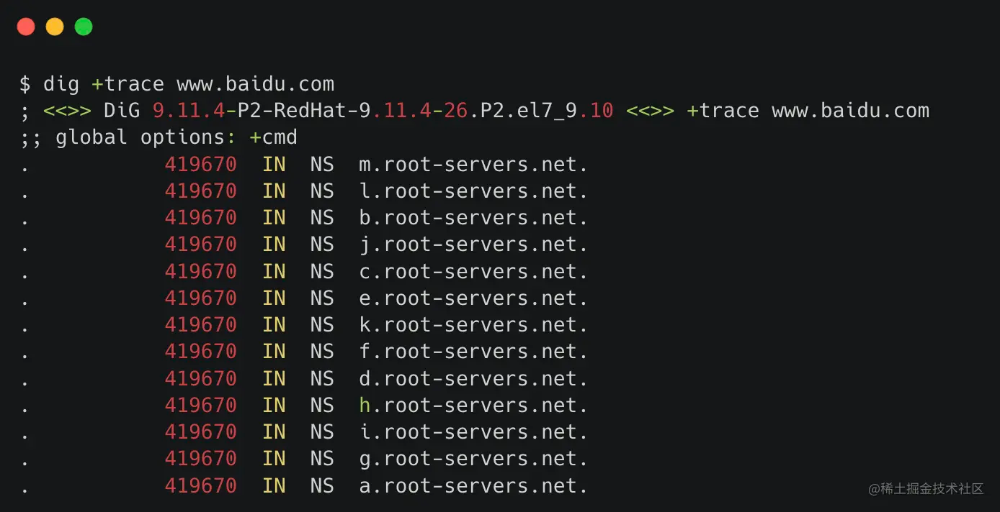

而前面提到的传说中的13个根域，从字母a-m，就都在上图中。
但这又引发了一个问题，上面看到的都是域名。
这。。。
"我本来是想通过域名去找IP的，你又让我去找其他域名的IP？"
听起来不科学，这不就死循环了吗。
是的，所以这些根域名对应的IP会以配置文件的形式，放在每个域名服务器中。
也就是说并不需要再去请求根域名对应的IP，直接在配置里能读出来就好了。
下面这个截图是域名服务器里的配置内容。
可以看到A开头的根域，它的IPV4地址是198.41.0.4。

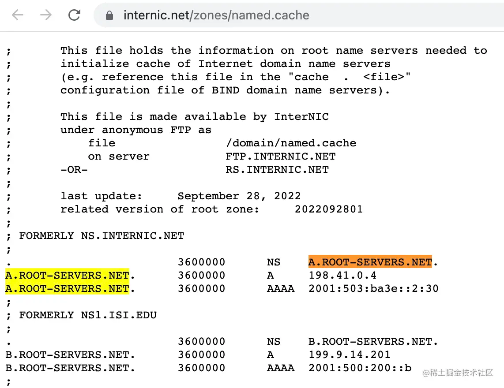

### 加入多级缓存

对于高并发读多写少的场景，加入缓存几乎就是标配。
DNS也不例外，它加了缓存，而且不止一层。
从在浏览器的搜索框中输入URL。它会先后访问 **浏览器缓存**、**操作系统** 的缓存/etc/hosts、最近的DNS服务器缓存。如果都找不到，才是到根域，顶级（一级）域，二级域等DNS服务器进行查询请求。

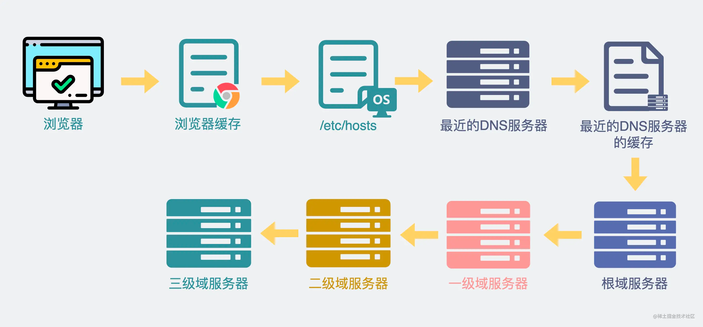

于是请求过程就成了下图这样。可以看到上面提到的好几有缓存的地方我都加了个绿色的小文件图标，优先在缓存里做查询。

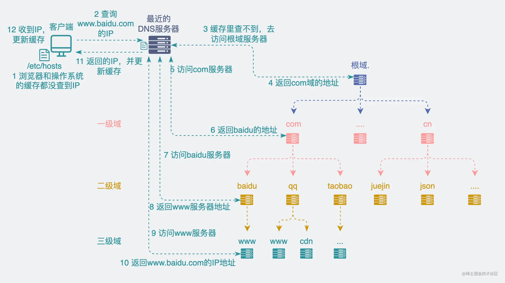

由于缓存了上面树状结构的信息，最近的DNS服务器也不再需要每次都从根域开始查起。比如在缓存里能找到baidu.com的服务器IP，就直接跳到二级域服务器上做查找就好了。
正因为多级缓存的存在，每一层实际接收到的请求都大大减少了。并且每个人日常访问的网站也就那么几个，所以大部分时候都能命中缓存直接返回IP地址。
简单小结下。
DNS的设计中，通过层次结构将服务进行拆分，流量分散到多个服务器中。
又通过加入多级缓存，让每个层级实际接收到的请求大大减少，因此大大提高了系统的性能。
这两点，是我们做业务开发的过程中可以参考的优秀设计。
但还有一点，是我们大概率学不来的，叫任播，它也为DNS实现高并发处理能力提供了重要支持，我会把它放到放到下一篇文章展开聊聊。

## 协议格式

DNS是个域名解析系统，而运行在这套系统上的协议，就叫DNS协议。

和HTTP类似，DNS协议也是个应用层协议。

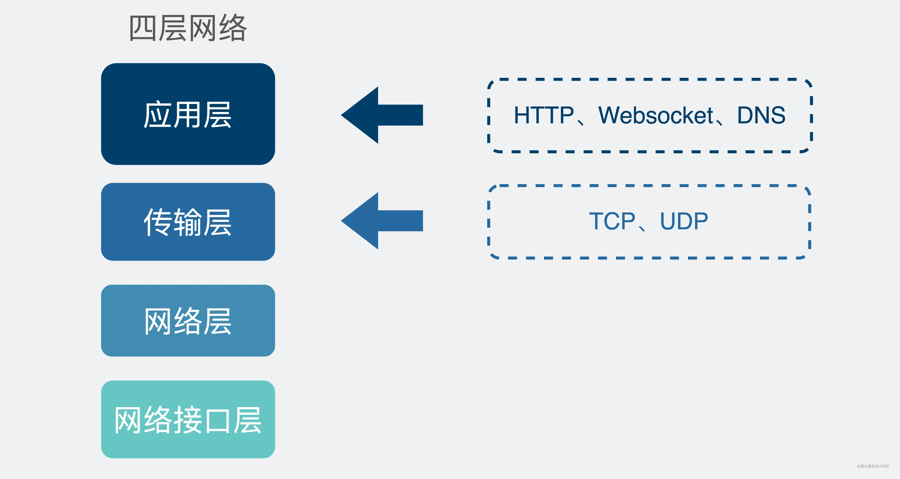

下图是它的报文格式。

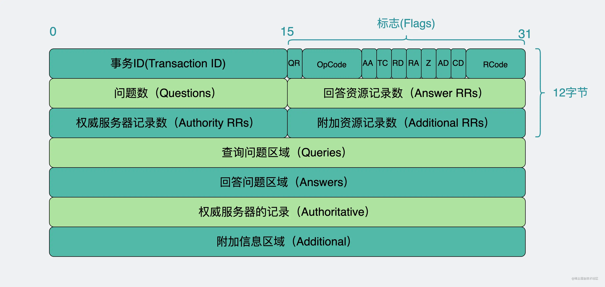

字段太多，很晕？这就对了。
我们就挑几个重点的说说。
Transsaction ID是事务ID，对于一次请求和这个请求对应的应答，他们的事务ID是一样的，类似于微服务系统中的log_id。
flag字段是指标志位，有2个Byte，16个bit，需要关注的是QR，OpCode,  RCode。

QR用来标志这是个查询还是响应报文，0是查询，1是响应。
OpCode用来标志操作码，正常查询都是0，不管是域名查ip，还是ip查域名，都属于正常查询。可以粗暴的认为我们平时只会看到0。
RCode是响应码，类似于HTTP里的404, 502 这样的status code。用来表示这次请求的结果是否正常。0是指一切正常。1是指报文格式错误，2服务域名服务器内部错误。

Queries字段，是指你实际查询的内容。这里其实包含三部分信息，Name, Type, Class。


+ Name可以放域名或者IP。比如你要查的是baidu.com这个域名对应的IP，那里面放的就是域名，反过来通过IP查对应的域名，那Name字段里放的就是IP。
+ Type是指你想查哪种信息，比如你想查这个域名对应的IP地址是什么，那就是填A（address），如果你想查这个域名有没有其他别名，就填CNAME（Canonical Name）。如果你想查 xiaobaidebug@gmail.com对应的邮箱服务器地址是什么（比如 gmail.com），那就填MX（Mail Exchanger）。除此之外还有很多类型，下面是常见的Type表格。

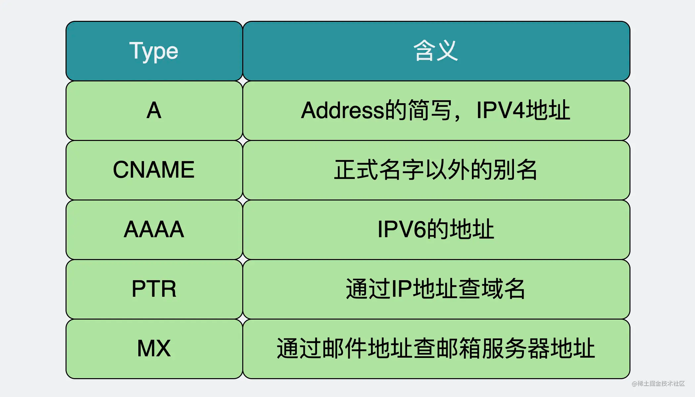

+ Class字段就比较有意思了，你可以简单的认为，我们只会看到它填IN （Internet）。其实DNS协议本来设计出来是考虑到可能会有更多的应用场景的，比如这里还能填CH，HS。大家甚至都不需要知道它们是什么含义，因为随着时间的发展，这些都已经成化石了，我们知道这个字段的唯一作用，可能就是可以在面试的时候可以随意装个x，深藏功与名。

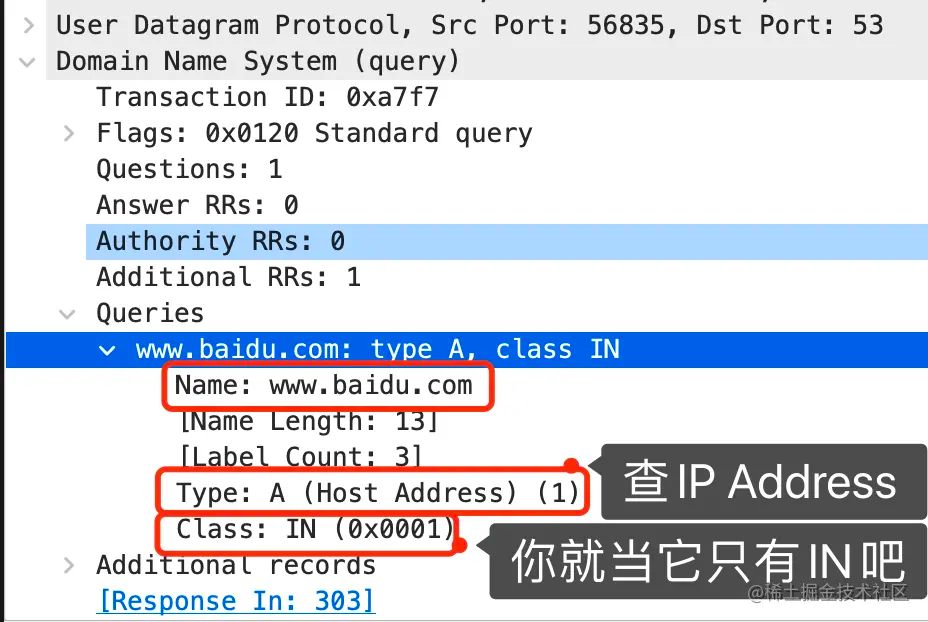

Answers字段，从名字可以看出，跟Queries对应，一问一答。作用是返回查询结果，比如通过域名查对应的IP地址，这个字段里就会放入具体的IP信息。

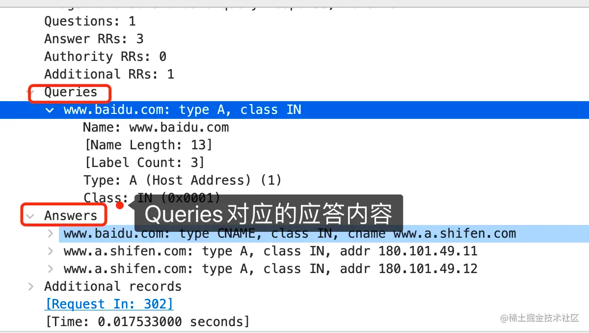


# 抓包 

原理看完了，来抓个包吧。

我们打开wireshark。然后执行

```shell
dig www.baidu.com
```
此时操作系统会发出DNS请求，查询 www.baidu.com对应的IP地址。

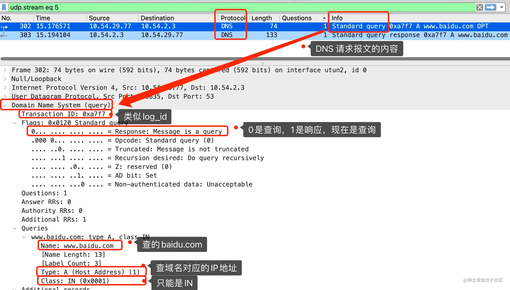

上面的图里是DNS查询（request）的内容，可以看到它是应用层的协议，传输层用的是UDP协议进行数据传输。截图里标红的部分，也就是上面提到的需要重点关注的报文字段内容。其中flag字段是按bit展示的，因此抓包里进行了分行展示。
接下来再看下响应（response）的数据包内容。

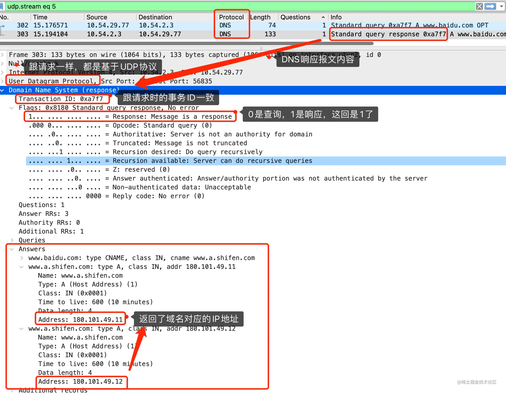

可以看到事务ID（Transaction ID）跟DNS请求报文是一致的。并且Answers字段里带有两个IP地址。试了下，两个IP地址都是可以正常访问的。


# 总结

+ DNS是非常优秀的高并发分布式系统，通过层次结构将服务进行拆分，流量分散到多个服务器中。又通过加入多级缓存，让每个层级实际接收到的缓存大大减小，因此大大提高了系统的性能。这两点在做业务开发的过程中是可以借鉴的。
+ 插上网线通网时，本机通过DHCP协议获得DNS服务器的地址。
+ 根域服务器的IP会以配置的形式加载到每一台DNS服务器当中。因此访问任意一台DNS服务器都能轻松找到根域对应的IP地址。

# 最后

最后给大家留下两个问题。

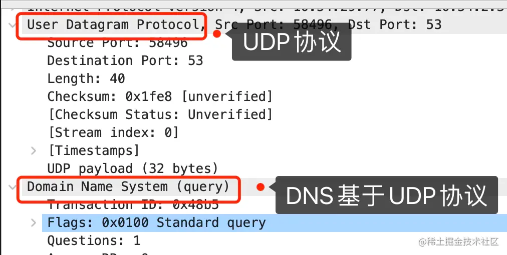

+ 从抓包可以看出，DNS在传输层上使用了UDP协议，那它只用UDP吗？ 
+ 上面提到，DNS的IPV4根域名只有13个，这里面其实有不少都部署在国外，那是不是意味着，只要他们不高兴了，切断我们的访问，我们的网络就全都不能用了呢？


