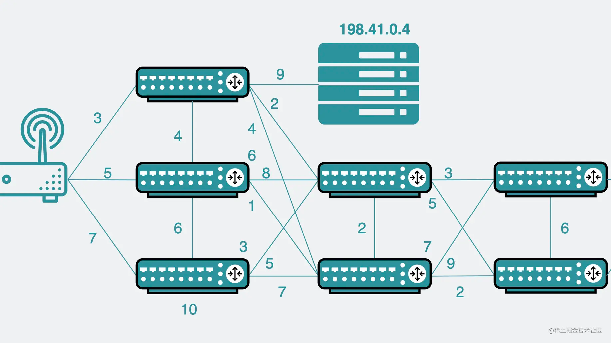

接上一篇文章《DNS中有哪些值得学习的优秀设计》 最后遗留的两个问题。

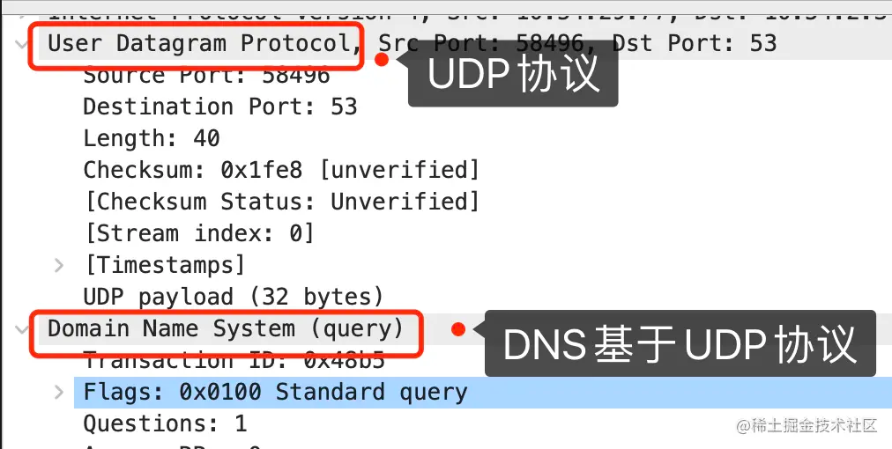

+ 从抓包可以看出，DNS在传输层上使用了UDP协议，那它只用UDP吗？
+ DNS的IPV4根域名只有13个，这里面其实有不少都部署在漂亮国，那是不是意味着，只要他们不高兴了，切断我们的访问，我们的网络就得瘫痪了呢？

# DNS是基于UDP的应用层协议吗？

当我们执行dig www.baidu.com时，操作系统会发出dns请求，去询问www.baidu.com域名对应的IP是多少。

```shell
$ dig www.baidu.com

; <<>> DiG 9.10.6 <<>> www.baidu.com
;; global options: +cmd
;; Got answer:
;; ->>HEADER<<- opcode: QUERY, status: NOERROR, id: 61559
;; flags: qr rd ra; QUERY: 1, ANSWER: 3, AUTHORITY: 0, ADDITIONAL: 1

;; OPT PSEUDOSECTION:
; EDNS: version: 0, flags:; udp: 4000
;; QUESTION SECTION:
;www.baidu.com.			IN	A

;; ANSWER SECTION:
www.baidu.com.		298	IN	CNAME	www.a.shifen.com.
www.a.shifen.com.	298	IN	A	180.101.49.12
www.a.shifen.com.	298	IN	A	180.101.49.11
```
此时，从抓包上来看，DNS作为应用层协议，在传输层确实是用了UDP协议。

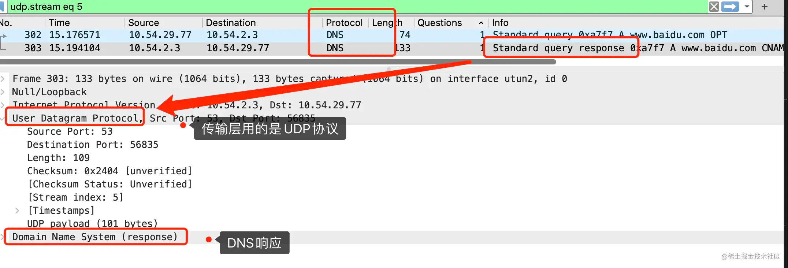

但是，其实 RFC 5966 中提到。

```shell
# https://www.rfc-editor.org/rfc/rfc5966
 This document updates the requirements for the support of TCP as a transport protocol for DNS implementations.
```
也就是说**虽然我们大部分情况下看到DNS使用UDP**，但**其实DNS也是支持TCP**的。

当我们在dig命令里加上+tcp的选项时，就可以强制DNS查询使用TCP协议进行数据传输。

```shell
$ dig +tcp www.baidu.com

; <<>> DiG 9.10.6 <<>> +tcp www.baidu.com
;; global options: +cmd
;; Got answer:
;; ->>HEADER<<- opcode: QUERY, status: NOERROR, id: 28411
;; flags: qr rd ra; QUERY: 1, ANSWER: 3, AUTHORITY: 0, ADDITIONAL: 1

;; OPT PSEUDOSECTION:
; EDNS: version: 0, flags:; udp: 4000
;; QUESTION SECTION:
;www.baidu.com.			IN	A

;; ANSWER SECTION:
www.baidu.com.		600	IN	CNAME	www.a.shifen.com.
www.a.shifen.com.	600	IN	A	180.101.49.11
www.a.shifen.com.	600	IN	A	180.101.49.12
```

此时再次抓包。

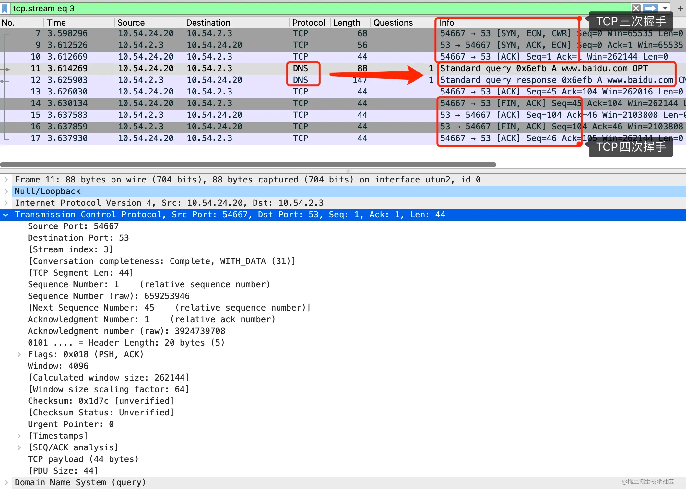

可以发现，在传输层，DNS使用了TCP协议。

那么问题就来了。

## 为什么有UDP了还要用到TCP？

我们知道网络传输就像是在某个管道里传输数据包，这个管道有一定的粗细，叫MTU。超过MTU则会在发送端的网络层进行切分，然后在接收端的网络层进行重组。而重组是需要有个缓冲区的，这个缓冲区的大小有个最小值，是576Byte。

IP层分片后传输会加大丢包的概率，且IP层本身并不具备重传的功能，因此需要尽量避免IP层分片。

如果传输过程中真的发生了分片，需要尽量确保能在接收端顺利重组，于是在最保险的情况下，将MTU设置为576。（有些过于谨慎，现在大部分场景下MTU=1500）。

基于这样的前提，这个MTU长度刨去IP头和UDP头，大约剩下512Byte。

所以才有了RFC1035中提到的，在UDP场景下，DNS报文长度不应该超过512Byte。

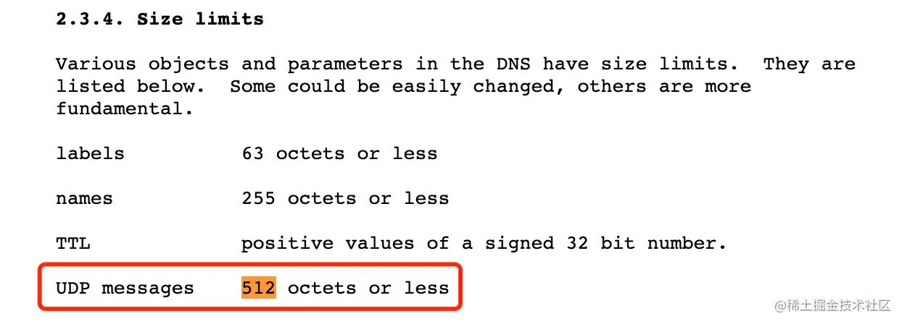

超过则会被截断。那数据包就不完整了，可能会导致下游没法正常解析数据。

但不可避免的是，总会有需要传大量数据的场景。

怎么办呢？那就改用TCP吧。

因为TCP本身会分段，分段后的长度正好小于等于MTU的长度。并且丢包后还会重传，因此可以确保数据正常传输。

所以说数据包长度大于512时，DNS就需要使用TCP协议进行传输。

## 那既然TCP那么好，为什么不全用TCP？

我们可以对比上面UDP和TCP的那两张图，会发现，除了DNS的请求和响应两个数据包，TCP场景下还多了三次握手和四次挥手这几个包。

咋一看好像也不算特别多。

我们再回去看下，通过DNS协议去查询域名对应的IP的过程。

将查询过程细分的话，是可以分为迭代查询和递归查询的。

### 迭代查询和递归查询是什么

迭代查询是指，发出DNS后，对方如果不知道这个域名的IP是什么，会告诉我有可能知道这件事的机器的IP，我自己再去问有可能知道的机器，不断重复直到问到结果。

递归查询是指，发出DNS请求后，要求对方查好后直接给出最终结果。

看起来递归查询好像很方便，但其实是将查询的过程转嫁给了其他DNS服务器。所以很多时候，这两者是同时存在的。

举个例子。

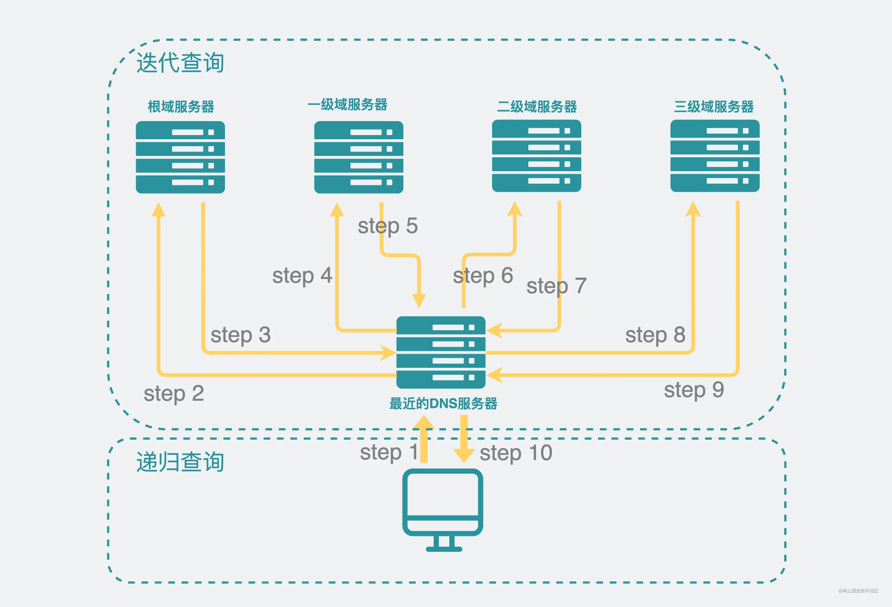

比如还是查询www.baidu.com对应的IP。

那本机在发出DNS请求时，会要求最近的DNS服务器将结果查好了再给回本机（step1），所以这时候是要求的递归查询。

本机是轻松了，然而最近的DNS服务器（有可能是你的家用路由器）却需要忙活起来了，它需要采用迭代查询的方式，最坏的情况下，它需要：

step2: 查询根域名服务器

step3: 拿到根域名服务器返回的一级域名（com）服务器IP，

step4: 再去查询一级域（com）服务器

step5: 得到二级域（baidu）服务器的IP

step6: 查询二级域（baidu）服务器

step7: 得到三级域（www）服务器的IP

step8: 查询三级域（www）服务器

step9: 得到www.baidu.com服务器的IP

此时DNS服务器在将结果放入缓存后，会将结果给回本机（step10）。

可以看到，迭代查询和递归查询在这个场景中其实是同时存在的。

### 迭代查询和递归查询的报文特征

这在DNS的报头里也有体现。

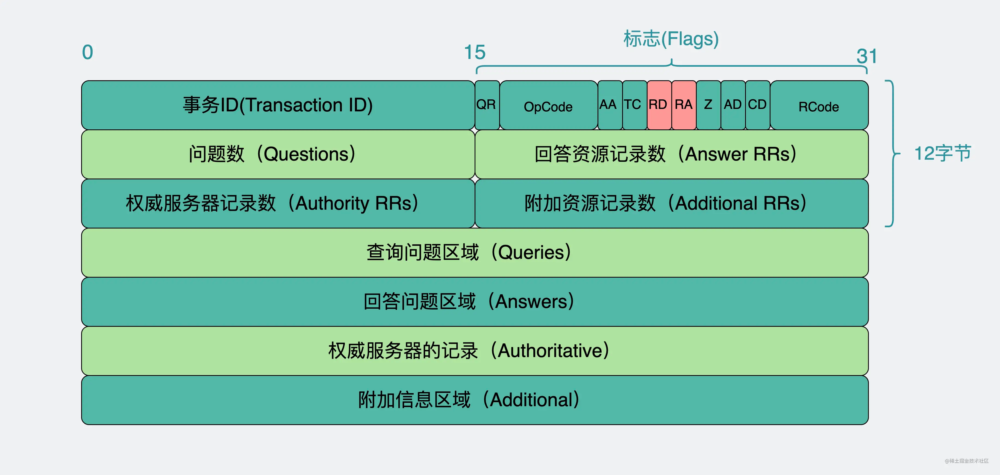

我们需要关注的是Flags字段中的RD和RA字段。

RD（Resursion Desired）是指客户端期望的查询方式。

+ 0：表示迭代查询
+ 1：表示递归查询

RA（Recursion Available）是指服务端实际采用的查询方式，它只会在响应包里出现。

+ 0：表示迭代查询
+ 1：表示递归查询

### 迭代查询和递归查询带来的影响

回到为什么DNS不全部改用TCP的问题上。
我们可以看到，DNS请求中，涉及到的服务器其实非常多。
如果都用TCP的话，那就都需要三次握手建立连接，四次挥手断开连接。
对于递归查询的那一方，其实还好，因为只会建立一次连接，发出一次请求接收一次响应就完事了。
但对于迭代查询的一方，就需要与众多服务器重复建立和断开连接。性能会有很大影响。
这时候估计大家也会想问。
那是不是不断开TCP连接，下次复用就好了？
不太好。
因为大部分URL所涉及到的域名服务器都不太相同，比如 www.baidu.com和www.xiaobaidebug.top涉及到的一、二、三级域名服务器就不一样，因此也没必要维护TCP长链接做复用。
所以相比之下，在数据量较小的场景下，使用UDP就可以省下握手挥手的消耗，因此UDP才是更优解。

# DNS的IPV4根域只有13个吗？

确实是的。

问题又来了。

## 为什么是13个IP，不能再加吗？

这个，单纯是历史原因了。上面提到基于UDP的DNS报文不应该超过512Byte，刨去DNS本身的报头信息，算下来大概能放13个IP（IPV4）。

> 具体的计算过程不太重要，我就省略了，对计算过程感兴趣的话，可以看下这篇文章最下面的参考文献。

虽然现在大部分机器MTU=1500了，但由于还可能存在MTU=576的机器，需要向前兼容，因此也不建议随意调整。

但问题叒来了。

退一万步，就算所有机器的MTU都到1500了，是不是就没这个限制了？

嗯，从这个角度来说，确实可以加，但没必要。

我们需要思考下为什么要加？

是因为觉得13个IP对应13台服务器，压力太大了吗？

还是说出于其他不可明说的因素考虑？

比如，很久以前看电视的时候，有位砖家提到"全球DNS根服务器只有13台，其中x台部署在漂亮国，只要它们切断访问，那我们的网络就会受影响balabala"。

但其实，13个IP不代表只有13台服务器。准确点来说，应该说是13组服务器，每个组都可以无限扩展服务器的个数，多个服务器共用同一个IP。

这里面其实涉及到一个叫任播的技术。

## 任播是什么

我们知道，在传输的过程中，一台机器发消息给另一台机器，这叫单播（unicast）。

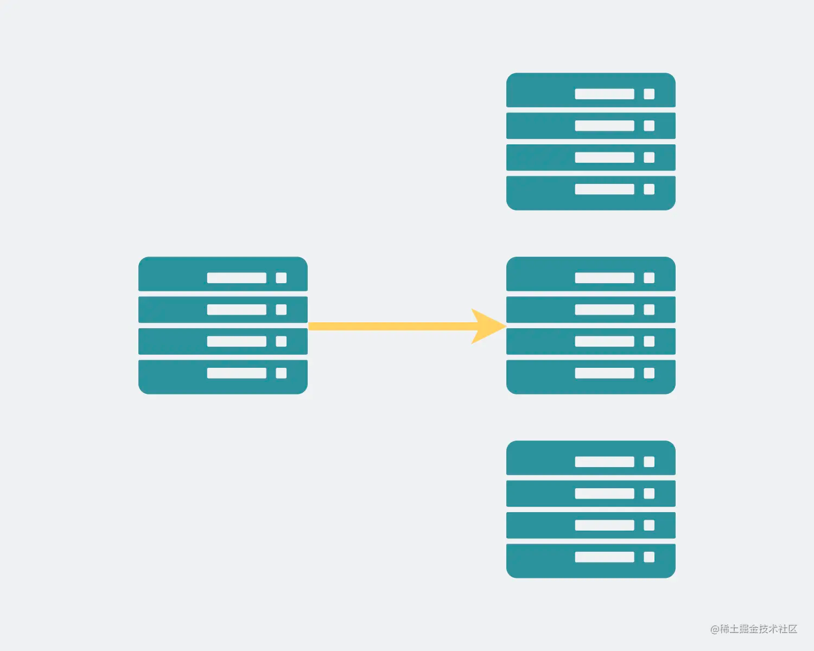

一台机器，发消息给本地网段的所有机器，那叫广播（broadcast）。

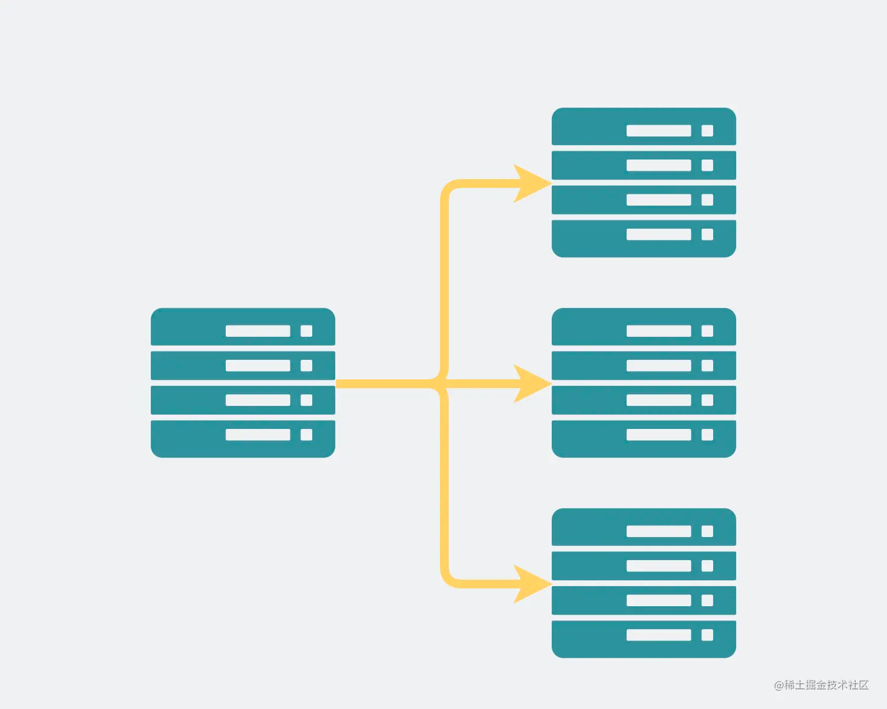

这两个都很常见，应该都没问题。

一台机器，发消息给的所有符合条件的目的机器里的其中一台，那叫任播（anycast）。

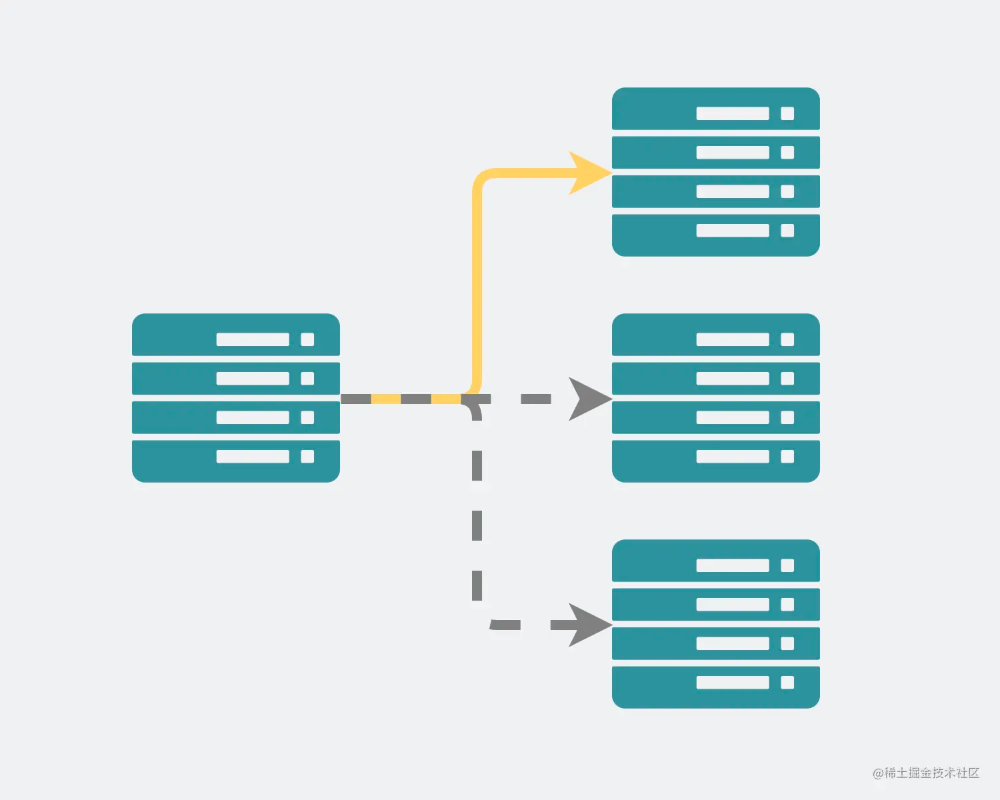

我们知道，全世界的网络设备，放在一起就形成了一个网状结构，这也是网络这个名称的由来。

我们假设有这么一个路由器，它想要访问某个IP的机器。从路由器到目的机器有非常多条路径，路由器可以通过跳数等信息来计算每条路径的成本，得到最优的路径。将最优路径汇成一张表，也就是我们常说的路由表。

比如下面的图里，绿色的线和红色的线都能到达同样的目的地，但显然，绿色的路径更短，所以路由表记录了成本更低的绿色路线。

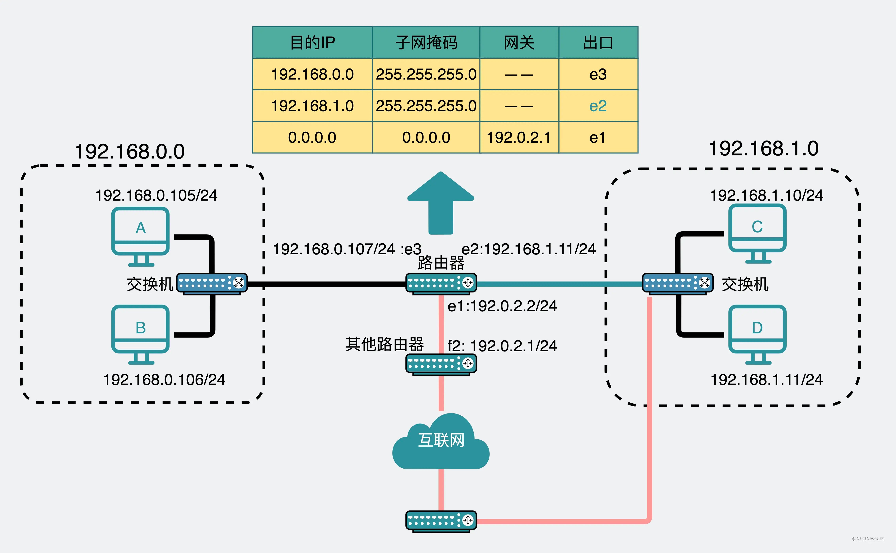

那么现在假设我们将这个网状结构里的两个点的网络IP设为一样，路由器其实不知道这是两个不同的机器，对它来说，这只是两条不同的路径，但都是通向同一个IP。

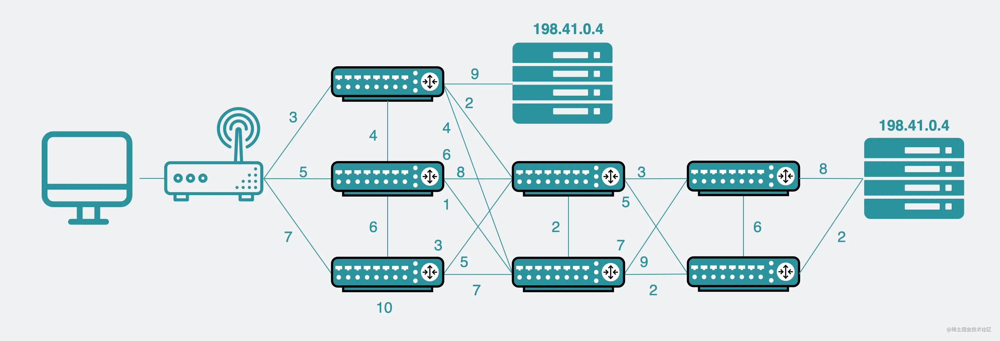

这两条路径都能到同一个IP，因此打到任意一个服务都能拿到想要的信息，从而实现了任播。

现在我们再加个条件，路由器和其中一台机器都在国内，另一台机器在国外。对路由器来说，由于国内的机器离得近，传输成本低，而国外的机器远，传输成本高，所以路由器生成的最优路线是打到国内的机器。

基于这样的思路，我们只要镜像一份国外的DNS域名服务器信息到国内机房里。我们就不再需要请求国外服务器了。

所以，就算其他国家的根域名服务器挂了，也不会对我们有什么影响，事实上国内已经有非常多的镜像服务器了，稳得很。

那稍微扩展一下，假设在上海和广东都设置了相同IP的镜像服务，那对于上海的用户来说，他们的路由器会优先将请求打到上海的镜像服务。而广东的用户则会优先打到广东的机器里，从而实现了就近访问。

上海的镜像服务挂了，那对应的上海用户路由器里的路由表，就会将路径更新为广东的镜像机器。 上海用户的请求就会打到广东的镜像服务中。从而实现高可用（或者说灾备）。

看起来，利用任播既能做到负载均衡，还能实现高可用，这跟nginx很像啊。

那么，问题就来了。

## 既然有任播技术，那为什么还要用nginx？

nginx作为常见的反向代理服务器，背后可以连N个服务端。当客户端想要请求后端时，客户端根本不需要知道是哪个服务器在为它提供服务，只管拿nginx最后返回的结果就行了。像这种，屏蔽掉具体有哪些服务器的代理方式就是所谓的反向代理。


正因为不知道背后有哪些服务器，因此可以做到无限扩展，挂了一台其他也能顶上，因此实现了负载均衡和高可用。

之前写过一篇文章《为什么有HTTP协议，还要有websocket协议？》，提到过对于网络游戏场景，需要有服务器主动推数据到客户端。由于nginx与客户端和服务端之间会建立TCP长链接，因此客户端在收到服务端的消息之后，能沿着这条连接响应服务端。

而如果这时候不用nginx，单纯使用任播，那服务器将消息主动推给客户端之后，客户端响应时，消息不保证还能给回原来的服务器。毕竟“任播”的含义就是，只要能访问任意一台服务器就行了。

因此任播并不能代替nginx。

当然这两个本来也不是一个维度的东西，拿来比较其实并不合适，我只是举了个反例来帮助大家捋一捋两者之间的差异。

# 总结

+ DNS在传输层既能使用UDP也能使用TCP协议。当传输数据量小于512Byte时会使用UDP，否则使用TCP。
+ 虽然根域只有13个IP，但不代表只有13台服务器，准确的说，应该是十三组服务器，每组服务器都共用同一个IP，国内已经有非常多的镜像服务器，利用任播技术，只要能就近访问到其中一台就行了。
+ 国内国外如果都有相同IP的目的机器，那对于路由器来说，无非就是有两条路径可以抵达相同的目的地，一个远一些，一个近一些。基于成本，会将更近的路径放到路由表中。
+ 任播技术虽然也能在一定程度上实现负载均衡和高可用，但它跟nginx并不是一个维度的东西，不能替代nginx。

# 参考资料

《Why 13 DNS root servers?》

[miek.nl/2013/novemb...](https://link.juejin.cn/?target=https%3A%2F%2Fmiek.nl%2F2013%2Fnovember%2F10%2Fwhy-13-dns-root-servers%2F)


