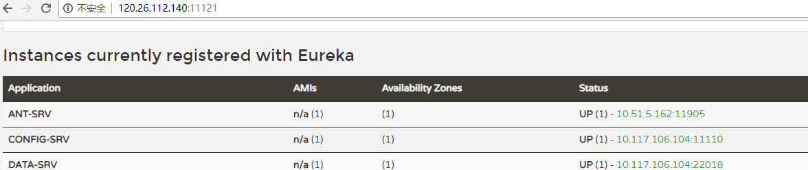
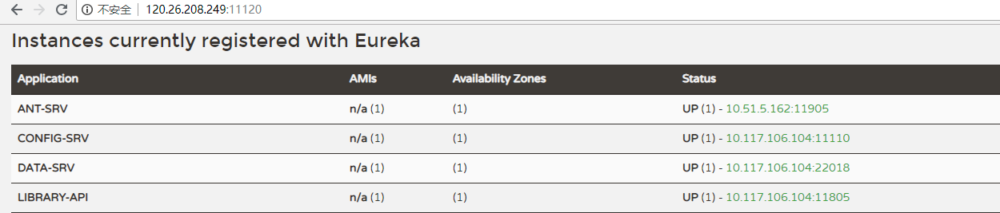

### 1、Eureka集群中，如果一共三个Eureka节点:A、B、C,三个节点项目注册。目前服务SRV-001只注册到节点A上，问节点B和节点C可以同步发现SRV-001服务吗？

可以被发现，通过查看Eureka-sever的相关源码可以看出，【PeerAwareInstanceRegistryImpl中的replicateToPeers方法中有具体逻辑】 这个方法就是在EurekaBootStrap中初始化的PeerAwareInstanceRegistryImpl类中的方法，在方法中，会获取InstanceInfo的续约时间信息，默认是90秒。然后调用父类的register方法注册，注册完后，会调用replicateToPeers方法，把这个节点的注册信息告诉其它Eureka Server节点。

注册完信息后，调用了replicateToPeers方法，向其他Eureka Server转发该注册信息，以便实现信息的同步

```java
private void replicateToPeers(PeerAwareInstanceRegistryImpl.Action action, String appName, String id, InstanceInfo info, InstanceStatus newStatus, boolean isReplication) {
      Stopwatch tracer = action.getTimer().start();

      try {
          if (isReplication) {
              this.numberOfReplicationsLastMin.increment();
          }

          if (this.peerEurekaNodes != Collections.EMPTY_LIST && !isReplication) {
              Iterator var8 = this.peerEurekaNodes.getPeerEurekaNodes().iterator();

              while(var8.hasNext()) {
                  PeerEurekaNode node = (PeerEurekaNode)var8.next();
                  if (!this.peerEurekaNodes.isThisMyUrl(node.getServiceUrl())) {
                      this.replicateInstanceActionsToPeers(action, appName, id, info, newStatus, node);
                  }
              }

              return;
          }
      } finally {
          tracer.stop();
      }

  }
```

```java

private void replicateInstanceActionsToPeers(PeerAwareInstanceRegistryImpl.Action action, String appName, String id, InstanceInfo info, InstanceStatus newStatus, PeerEurekaNode node) {
        try {
            InstanceInfo infoFromRegistry = null;
            CurrentRequestVersion.set(Version.V2);
            switch(action) {
            case Cancel:
                node.cancel(appName, id);
                break;
            case Heartbeat:
                InstanceStatus overriddenStatus = (InstanceStatus)this.overriddenInstanceStatusMap.get(id);
                infoFromRegistry = this.getInstanceByAppAndId(appName, id, false);
                node.heartbeat(appName, id, infoFromRegistry, overriddenStatus, false);
                break;
            case Register:
                node.register(info);
                break;
            case StatusUpdate:
                infoFromRegistry = this.getInstanceByAppAndId(appName, id, false);
                node.statusUpdate(appName, id, newStatus, infoFromRegistry);
                break;
            case DeleteStatusOverride:
                infoFromRegistry = this.getInstanceByAppAndId(appName, id, false);
                node.deleteStatusOverride(appName, id, infoFromRegistry);
            }
        } catch (Throwable var9) {
            logger.error("Cannot replicate information to {} for action {}", new Object[]{node.getServiceUrl(), action.name(), var9});
        }

    }

```

另外通过实测，发现确实如此。

+ Eureka 集群： http://120.26.208.249:11120/ 、 http://120.26.112.140:11121/
+ 测试服务：DATA-SRV, 且yml配置如下,**仅配置到第一个eureka节点**

```XML
eureka:
  client:
    serviceUrl:
      defaultZone: http://120.26.208.249:11120/eureka/
```

+ 启动项目后发现，eureka控制台中，两个节点都可以发现DATA-SRV,,截图如下：






### 2、还知道类似Spring-Cloud-Config的其他技术吗？有何区别？

携程开源的阿波罗（apollo）

|功能点|Apollo|Spring Cloud Config
|:--:|:--:|:--:|
|**配置页面**|统一界面管理不同环境/集群配置|无，通过git操作|
|**配置生效时间**|实时|重启生效，或者Refresh、git hook + MQ扩展|
|**版本管理**|界面上直接提供发布历史和回滚按钮|无，通过git操作|
|**灰色发布**|支持|不支持|
|**授权、审计、审核**|界面上直接操作，且支持修改和发布权限分离|需要通过git仓库设置，且不支持修改和发布权限分离|
|**实例配置监控**|可以方便看到当前哪些客户端在使用哪些配置|不支持|
|**配置获取性能**|快，通过数据库访问+缓存支持|较慢，需从git clone repo,然后本地文件读取|
|**客户端支持**|原生支持Java/.Net,提供API,支持Spring annotation|Spring应用+annotation支持|

### 3、你们公司是如何使用zuul的？

### 4、微服务中的超时配置机制？

版权归作者所有，任何形式转载请联系作者。
作者：豆瓣专家（来自豆瓣）
来源：https://www.douban.com/note/685306346/

如果是zuul（网关）的超时时间需要设置zuul、hystrix、ribbon等三部分：

#zuul超时设置
#默认1000
zuul.host.socket-timeout-millis=2000
#默认2000
zuul.host.connect-timeout-millis=4000

#熔断器启用
feign.hystrix.enabled=true
hystrix.command.default.execution.timeout.enabled=true
#断路器的超时时间,下级服务返回超出熔断器时间，即便成功，消费端消息也是TIMEOUT,所以一般断路器的超时时间需要大于ribbon的超时时间。
#服务的返回时间大于ribbon的超时时间，会触发重试
##默认=1000，太小
hystrix.command.default.execution.isolation.thread.timeoutInMilliseconds=60000

#断路器详细设置
#当在配置时间窗口内达到此数量的失败后，进行短路。默认20个）
#hystrix.command.default.circuitBreaker.requestVolumeThreshold=20
#短路多久以后开始尝试是否恢复，默认5s）
#hystrix.command.default.circuitBreaker.sleepWindowInMilliseconds=5
#出错百分比阈值，当达到此阈值后，开始短路。默认50%）
#hystrix.command.default.circuitBreaker.errorThresholdPercentage=50%
#ribbon请求连接的超时时间- 限制3秒内必须请求到服务，并不限制服务处理的返回时间
ribbon.ConnectTimeout=3000
#请求处理的超时时间 下级服务响应最大时间,超出时间消费方（路由也是消费方）返回timeout
ribbon.ReadTimeout=5000
#单独设置某个服务的超时时间，会覆盖其他的超时时间限制，服务的名称已注册中心页面显示的名称为准，超时时间不可大于断路器的超时时间
#service-a.ribbon.ReadTimeout=60000
#service-a.ribbon.ConnectTimeout=60000

#重试机制
#该参数用来开启重试机制，默认是关闭
spring.cloud.loadbalancer.retry.enabled=true
#对所有操作请求都进行重试
ribbon.OkToRetryOnAllOperations=true
#对当前实例的重试次数
ribbon.MaxAutoRetries=1
#切换实例的重试次数
ribbon.MaxAutoRetriesNextServer=1
#根据如上配置，当访问到故障请求的时候，它会再尝试访问一次当前实例（次数由MaxAutoRetries配置），
#如果不行，就换一个实例进行访问，如果还是不行，再换一次实例访问（更换次数由MaxAutoRetriesNextServer配置），
#如果依然不行，返回失败信息。
