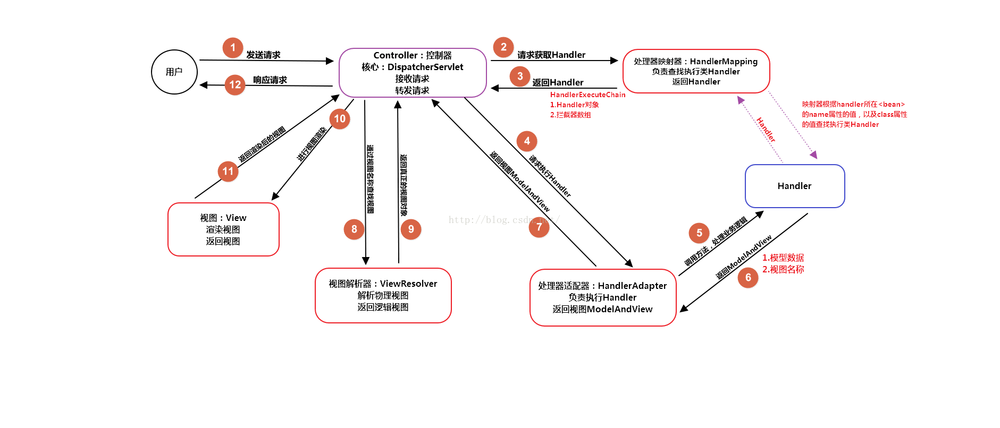

+ <a href="#1">BeanFactory 和 ApplicationContext 有什么区别</a>

+ <a href="#2">Spring Bean 的生命周期</a>

+ <a href="#3">Spring IOC 如何实现</a>

+ <a href="#4">说说 Spring AOP</a>

+ <a href="#5">Spring AOP 实现原理</a>

+ <a href="#6">动态代理（cglib 与 JDK）</a>

+ <a href="#7">Spring 事务实现方式</a>

+ <a href="#8">Spring 事务底层原理</a>

+ <a href="#10">Spring MVC 运行流程</a>

+ <a href="#11">Spring 的单例实现原理</a>

+ <a href="#12">Spring 框架中用到了哪些设计模式</a>

### <a name="1">BeanFactory 和 ApplicationContext 有什么区别</a>

1. 概念
  + Bean 工厂（com.springframework.beans.factory.BeanFactory）是Spring 框架最核心的接口，它提供了高级IoC 的配置机制

  + 应用上下文（com.springframework.context.ApplicationContext）建立在BeanFactory 基础之上。
几乎所有的应用场合我们都直接使用ApplicationContext 而非底层的BeanFactory

2. 区别
  + BeanFactory 采用的是延迟加载，第一次getBean的时候才会初始化Bean
  + ApplicationContext是对BeanFactory的扩展，提供了更多的功能


### <a name="2">Spring Bean 的生命周期</a>

1. Bean的建立

  容器寻找Bean的定义信息并将其实例化

2. 属性注入

  使用依赖注入，Spring按照Bean定义信息配置Bean所有属性

3. BeanNameAware的setBeanName()

  如果Bean类有实现org.springframework.beans.BeanNameAware接口，工厂调用Bean的setBeanName()方法传递Bean的ID

4. BeanFactoryAware的setBeanFactory()

  如果Bean类有实现org.springframework.beans.factory.BeanFactoryAware接口，工厂调用setBeanFactory()方法传入工厂自身

5. BeanPostProcessors的ProcessBeforeInitialization()

  如果有org.springframework.beans.factory.config.BeanPostProcessors和Bean关联，那么其postProcessBeforeInitialization()方法将被将被调用

6. initializingBean的afterPropertiesSet()：

  如果Bean类已实现org.springframework.beans.factory.InitializingBean接口，则执行他的afterProPertiesSet()方法

7. Bean定义文件中定义init-method：

  如果在Bean定义文件中使用"init-method"属性设定方法名称

8. BeanPostProcessors的ProcessaAfterInitialization()

  如果有任何的BeanPostProcessors实例与Bean实例关联，则执行BeanPostProcessors实例的ProcessaAfterInitialization()方法
  此时，Bean已经可以被应用系统使用，并且将保留在BeanFactory中直到它不在被使用

### <a name="3">Spring IOC 如何实现</a>
1. 概念：

IOC: Inversion of Control(控制反转)是一种设计思想，就是容器控制应用程序所需要外部资源的创建和管理，然后将其反转给应用程序。对象及其依赖对象的创建及维护都不需要在应用程序中实现，将其交给IOC容器去管理。传统的开发中，我们自己在对象内部创建依赖对象并注入当前对象，完成依赖关系的维护；对于IOC而言，它强调是将主动变为被动，由IOC容器来负责依赖对象的创建和查找，由IOC容器来进行注入组合对象，我们只需要在相关的配置文件中维护对象之间的依赖关系即可。

DI: Dependency Injection，即“依赖注入”。其实IOC和DI本就是同一个概念的两种不同的表述，应用程序依赖容器提供的外部对象，容器将其依赖的外部资源在运行期注入到应用程序中；某个对象被调用时，其所依赖的对象由容器注入。

2. 原理：

  + 资源定位，即首先要找到applicationContext.xml文件(首先资源定位最终是在Springframe下的AbstractBeanDefinitionReader类中的LoaderBeanDefinitions(String location,Set actualResources) line 98)

  + BeanDefinition的载入，把XML文件中的数据统一加载到BeanDefinition中，方便以后的处理
    + 载入和解析最终是在Springframework下的AbstractApplicationContext类的refresh()方法实现
    + 接下来Spring 就开始加载我们的配置文件了，将我们配置的信息保存在一个HashMap中，HashMap的key就是Bean 的 Id ，HasMap 的value是这个Bean

  + 向IOC容器中注入BeanDefinition数据

    + 注册最终是在Spring frame的DefaultListableBeanFactory类下的registerBeanDefinition(String beanName,BeanDefinition beanDefinition)方法中实现，line 664

  + 将BeanDefinition中的数据进行依赖注入
    + 底层实现，反射：它允许程序在运行的时候动态的生成对象、执行对象的方法、改变对象的属性，spring就是通过反射来实现注入的
    + springIOC的最终依赖注入是是通过AbstractAutowireCapableBeanFactory的doCreateBean(finale String beanName,final RootBeanDefinition mbd,final Object[] args)方法（line 480）的，这个方法里的关键方法有populateBean()和createBeanInstance()，正在实现注入是通过BeanWrapperImpl extends AbstractPropertyAccessor类的setPropertyValue()方法实现 line 911
    + 原理是：通过反射机制实现的，在实例化一个类时，它通过反射调用类中set方法将事先保存在HashMap中的类属性注入到类中


### <a name="4">说说 Spring AOP</a>

  AOP（Aspect Orient Programming），作为面向对象编程的一种补充，广泛应用于处理一些具有横切性质的系统级服务，如事务管理、安全检查、缓存、对象池管理等。AOP 实现的关键就在于 AOP 框架自动创建的 AOP 代理，AOP 代理则可分为静态代理和动态代理两大类，其中静态代理是指使用 AOP 框架提供的命令进行编译，从而在编译阶段就可生成 AOP 代理类，因此也称为编译时增强；而动态代理则在运行时借助于 JDK 动态代理、CGLIB 等在内存中“临时”生成 AOP 动态代理类，因此也被称为运行时增强。

### <a name="5">Spring AOP 实现原理</a>

  + Spring AOP 无需使用任何特殊命令对 Java 源代码进行编译，它采用运行时动态地、在内存中临时生成“代理类”的方式来生成 AOP 代理。

  + Spring 允许使用 AspectJ Annotation 用于定义方面（Aspect）、切入点（Pointcut）和增强处理（Advice），Spring 框架则可识别并根据这些 Annotation 来生成 AOP 代理。Spring 只是使用了和 AspectJ 5 一样的注解，但并没有使用 AspectJ 的编译器或者织入器（Weaver），底层依然使用的是 Spring AOP，依然是在运行时动态生成 AOP 代理，并不依赖于 AspectJ 的编译器或者织入器。

  + 代理对象的方法 = 增强处理 + 被代理对象的方法


### <a name="6">动态代理（cglib 与 JDK）</a>

1. CGLIB

  + 简单来说，就是一个代码生成类库。它可以在运行时候动态是生成某个类的子类。

  +  cglib是针对类来实现代理的，原理是对指定的业务类生成一个子类，并覆盖其中业务方法实现代理。因为采用的是继承，所以不能对final修饰的类进行代理。
2. JDK

  +  JDK动态代理所用到的代理类在程序调用到代理类对象时才由JVM真正创建，JVM根据传进来的 业务实现类对象 以及 方法名 ，动态地创建了一个代理类的class文件并被字节码引擎执行，然后通过该代理类对象进行方法调用。我们需要做的，只需指定代理类的预处理、调用后操作即可。
  + JDK动态代理的代理对象在创建时，需要使用业务实现类所实现的接口作为参数（因为在后面代理方法时需要根据接口内的方法名进行调用）。如果业务实现类是没有实现接口而是直接定义业务方法的话，就无法使用JDK动态代理了。并且，如果业务实现类中新增了接口中没有的方法，这些方法是无法被代理的（因为无法被调用）

3. 比较

  + JDK动态代理是通过接口中的方法名，在动态生成的代理类中调用业务实现类的同名方法；

  + CGlib动态代理是通过继承业务类，生成的动态代理类是业务类的子类，通过重写业务方法进行代理；


### <a name="7">Spring 事务实现方式</a>

1. 编程式事务管理（需要手动编写代码，在实际开发中很少使用）

2. 声明式事务管理

  + 基于TransactionProxyFactoryBean的方式，需要为每个进行事务管理的类做相应配置

  + 基于AspectJ的XML方式，不需要改动类，在XML文件中配置好即可

  + 基于注解的方式，配置简单，需要在业务层类中添加注解


### <a name="8">Spring 事务底层原理</a>

1. 作用

  Spring事务处理，是将事务处理的工作统一起来，并为事务处理提供通用的支持。

2. 划分处理单元——IOC(由于spring解决的问题是对单个数据库进行局部事务处理的，具体的实现首先用spring中的IOC划分了事务处理单元。并且将对事务的各种配置放到了ioc容器中（设置事务管理器，设置事务的传播特性及隔离机制）。)

3. AOP拦截需要进行事务处理的类(Spring事务处理模块是通过AOP功能来实现声明式事务处理的，具体操作（比如事务实行的配置和读取，事务对象的抽象），用TransactionProxyFactoryBean接口来使用AOP功能，生成proxy代理对象，通过TransactionInterceptor完成对代理方法的拦截，将事务处理的功能编织到拦截的方法中。
读取ioc容器事务配置属性，转化为spring事务处理需要的内部数据结构（TransactionAttributeSourceAdvisor），转化为TransactionAttribute表示的数据对象。)

4. 对事务处理实现（事务的生成、提交、回滚、挂起）

spring委托给具体的事务处理器实现。实现了一个抽象和适配。适配的具体事务处理器：DataSource数据源支持、hibernate数据源事务处理支持、JDO数据源事务处理支持，JPA、JTA数据源事务处理支持。这些支持都是通过设计PlatformTransactionManager、AbstractPlatforTransaction一系列事务处理的支持。
为常用数据源支持提供了一系列的TransactionManager。

5. 结合

  PlatformTransactionManager实现了TransactionInterception接口，让其与TransactionProxyFactoryBean结合起来，形成一个Spring声明式事务处理的设计体系。


6. 应用场景

  支持不同数据源，在底层进行封装，可以做到事务即开即用，这样的好处是：即使有其他的数据源事务处理需要，Spring也提供了一种一致的方式。

### <a name="9">Spring MVC 运行流程</a>

1. 用户发送请求到DispatchServlet

2. DispatchServlet根据请求路径查询具体的Handler

3. HandlerMapping返回一个HandlerExcutionChain给DispatchServlet

　HandlerExcutionChain：Handler和Interceptor集合

4. DispatchServlet调用HandlerAdapter适配器

5. HandlerAdapter调用具体的Handler处理业务

6. Handler处理结束返回一个具体的ModelAndView给适配器

   ModelAndView:model-->数据模型，view-->视图名称

7. 适配器将ModelAndView给DispatchServlet

8. DispatchServlet把视图名称给ViewResolver视图解析器

9. ViewResolver返回一个具体的视图给DispatchServlet

10. 渲染视图

11. 展示给用户




###  <a name="10">Spring MVC 启动流程</a>


### <a name="11">Spring 的单例实现原理</a>

  采用单例注册表的方式


```java
public abstract class AbstractBeanFactory implements ConfigurableBeanFactory{    
   /**  
    * 充当了Bean实例的缓存，实现方式和单例注册表相同  
    */    
   private final Map singletonCache=new HashMap();    
   public Object getBean(String name)throws BeansException{    
       return getBean(name,null,null);    
   }    
...    
   public Object getBean(String name,Class requiredType,Object[] args)throws BeansException{    
      //对传入的Bean name稍做处理，防止传入的Bean name名有非法字符(或则做转码)    
      String beanName=transformedBeanName(name);    
      Object bean=null;    
      //手工检测单例注册表    
      Object sharedInstance=null;    
      //使用了代码锁定同步块，原理和同步方法相似，但是这种写法效率更高    
      synchronized(this.singletonCache){    
         sharedInstance=this.singletonCache.get(beanName);    
       }    
      if(sharedInstance!=null){    
         ...    
         //返回合适的缓存Bean实例    
         bean=getObjectForSharedInstance(name,sharedInstance);    
      }else{    
        ...    
        //取得Bean的定义    
        RootBeanDefinition mergedBeanDefinition=getMergedBeanDefinition(beanName,false);    
         ...    
        //根据Bean定义判断，此判断依据通常来自于组件配置文件的单例属性开关    
        //<bean id="date" class="java.util.Date" scope="singleton"/>    
        //如果是单例，做如下处理    
        if(mergedBeanDefinition.isSingleton()){    
           synchronized(this.singletonCache){    
            //再次检测单例注册表    
             sharedInstance=this.singletonCache.get(beanName);    
             if(sharedInstance==null){    
                ...    
               try {    
                  //真正创建Bean实例    
                  sharedInstance=createBean(beanName,mergedBeanDefinition,args);    
                  //向单例注册表注册Bean实例    
                   addSingleton(beanName,sharedInstance);    
               }catch (Exception ex) {    
                  ...    
               }finally{    
                  ...    
              }    
             }    
           }    
          bean=getObjectForSharedInstance(name,sharedInstance);    
        }    
       //如果是非单例，即prototpye，每次都要新创建一个Bean实例    
       //<bean id="date" class="java.util.Date" scope="prototype"/>    
       else{    
          bean=createBean(beanName,mergedBeanDefinition,args);    
       }    
}    
...    
   return bean;    
}    
}     
```

### <a name="12">Spring 框架中用到了哪些设计模式</a>

[参考](../主流框架/Spring/Spring中用到的设计模式.md)

### 如何自定义注解实现功能
