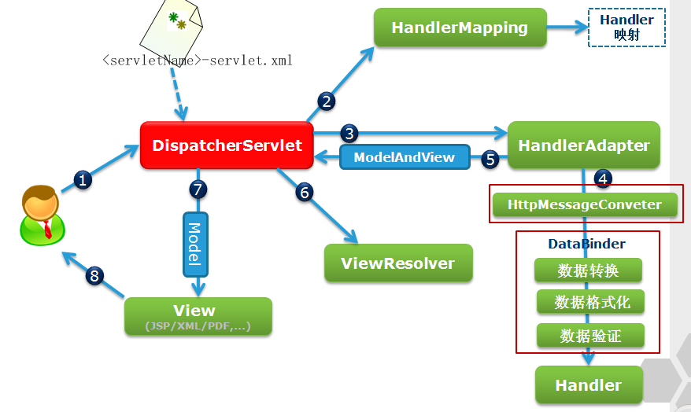
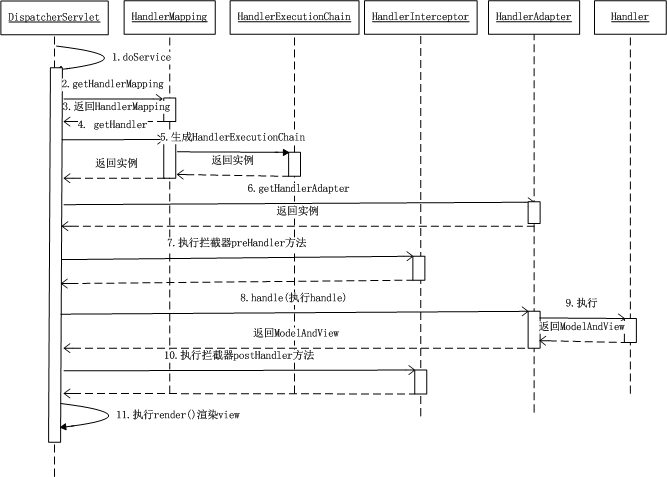

### (一) 面向对象的特征
1. 封装：就是把客观事物封装成抽象的类，并且类可以把自己的数据和方法只让可信的对象操作，对不可信进行信息隐藏。简单来说，就是一个类封装了数据以及操作这些数据的代码逻辑实体。在一个类的内部，方法或数据可以是私有的，不能被外界访问。这样做的目的是对内部数据进行了不同级别的保护，防止错误的使用了对象的私有部分。
2. 继承：它可以使用现有类的所有功能，并在原来的基础上对这些功能进行扩展。通过继承创建新类被称为“子类”或“派生类”。被继承的类称为"基类"和“父类”或“超类”。要想实现继承可以通过“继承”和“组合(聚合)”：实现方式有：实现继承和接口继承。实现继承是指直接使用基类的属性和方法而无需额外的编码的能力；接口继承是指仅使用属性和方法的名称，但子类必须提供实现的能力。
3. 多态：是指一个类实例的相同方法在不同情形有不同的表现。多态机制使具有不同内部的结构的对象可以共享的外部接口。虽然针对不同对象的具体操作不同，但通过一个公共的类，他们可以通过相同的方法予以 调用。

### （二）面向对象五大原则
1. 单一职责原则(Single-Resposiblity-Principle):一个类应该仅有一个引起它变化的原因
2. 开放封闭原则(Open-Closed-Principle):对扩展开放，对更改时封闭的
3. 里氏替换原则(Liskov-Substituion Principle):子类可以替换父类，并且出现在父类能够出现的任何地方。GOF倡导面向接口编程
4. 接口隔离原则(Interface-Segregation Principle)：使用多个接口比使用单个接口要好的多。
5. 依赖倒置原则(Dependecy-Invarsion Principle):让高层模块不要依赖低层模块。

### （三）final, finally, finalize 的区别
1. final修饰符(关键字)，用于控制成员、方法、或者是一个类是否可以被重写或者继承功能。
2. finally(用于异常处理)，提供finally块来执行任何的清楚操作，try{}catch{}finally{}.finally结构使代码块总会执行，不管有无异常发生。使得finally可以维护对象的内部状态，并可以清理非内存资源。用于关闭文件的读写操作或者关闭数据库连接操作。
3. finalize(用于垃圾回收)，这个是方法名。在Java中，允许使用finalize()方法在垃圾收集器将对象从内存中清理出去之前做必要的清理工作。这个方法是由垃圾收集器在确定这个对象没有被引用时对这个对象调用的。它是Object中定义的。因此，所有类都继承了它，finalize方法是在垃圾收集器删除对象之前对这个对象调用的。

### （四） int 和 Integer 有什么区别
1. Integer是int的包装类；int是基本数据类型；
2. Integer变量必须实例化后才能使用；int变量不需要；
3. Integer实际是对象的引用，指向此new的Integer对象；int是直接存储数据值 ；
4. Integer的默认值是null；int的默认值是0。
5. 由于Integer变量实际上是对一个Integer对象的引用，所以两个通过new生成的Integer变量永远是不相等的（因为new生成的是两个对象，其内存地址不同）。
6. Integer变量和int变量比较时，只要两个变量的值是向等的，则结果为true（因为包装类Integer和基本数据类型int比较时，java会自动拆包装为int，然后进行比较，实际上就变为两个int变量的比较）
7. 非new生成的Integer变量和new Integer()生成的变量比较时，结果为false。（因为非new生成的Integer变量指向的是java常量池中的对象，而new Integer()生成的变量指向堆中新建的对象，两者在内存中的地址不同）
8. 对于两个非new生成的Integer对象，进行比较时，如果两个变量的值在区间-128到127之间，则比较结果为true，如果两个变量的值不在此区间，则比较结果为false

### （五）重载和重写的区别
英文：Overloading、Overiding
1. 定义：重载是方法名称相同，参数类型或者个数不同；重写是方法名称、参数类型、返回值类型全部相同
2. 权限：重载是对权限没有要求；重写是被重写的方法不能拥有更严格的权限。
3. 范围：重载是发生在一个类中；重写是发生在继承中。

### （六）抽象类和接口有什么区别

|分类|抽象类|接口|
|---|---|---|
|默认的方法实现|可以有|不存在
|实现|子类使用extends关键字来继承抽象类，如果子类不是抽象类，需要实现抽象类中所有的方法；|子类使用implements关键字来实现接口，需要实现接口中所有的方法；
|构造器|可以有|不存在
|与正常类的区别|除了不能实例化抽象类外，无区别；|接口是完全不同的类型
|访问修饰符|public、protected、default这些修饰符 ；|只能是public
|main方法|可以有，且可运行；|没有main方法
|继承性|可以继承一个类和实现多个接口；|接口可以继承一个或者多个其他接口
|速度|快|抽象类比接口速度要快，因为接口需要时间去寻找在类中实现的方法|
|添加新方法|如果往抽象类中添加新的方法，可以给它提供默认的实现，因此不需要改变现有代码；|而接口中添加方法，需要改变实现该接口类的代码。
|jdk8中已经开始向接口中引入默认方法和静态方法，以此来减少抽象类和接口之间的差异|&nbsp;|&nbsp;

### （七）说说反射的用途及实现

Java反射机制是一个非常强大的功能，在很多的项目比如Spring，Mybatis都都可以看到反射的身影。通过反射机制，我们可以在运行期间获取对象的类型信息。利用这一点我们可以实现工厂模式和代理模式等设计模式，同时也可以解决java泛型擦除等令人苦恼的问题。

获取一个对象对应的反射类，在Java中有三种方法可以获取一个对象的反射类，
1. 通过getClass()方法
2. 通过Class.forName()方法；
3. 使用类.class
4. 通过类加载器实现，getClassLoader()

### （八）说说自定义注解的场景及实现

跟踪代码的依赖性，实现代替配置文件的功能。比较常见的是Spring等框架中的基于注解配置。
还可以生成文档常见的@See@param@return等。如@override放在方法签名，如果这个方法 并不是覆盖了超类方法，则编译时就能检查出。
使用@interface自定义注解时，自动继承了java.lang.annotation.Annotation接口，由编译程序自动完成其他细节，在定义注解时，不能继承其他注解或接口。

### （九）HTTP 请求的 GET 与 POST 方式的区别

|对比项|Get请求|Post请求|
|---|---|---|
|缓存|可被缓存|不能缓存|
|编码类型|application/x-www-form-urlencoded|application/x-www-form-urlencoded 或 multipart/form-data。为二进制数据使用多重编码。|
|对数据长度的限制|是的。当发送数据时，GET 方法向 URL 添加数据；URL 的长度是受限制的（URL 的最大长度是 2048 个字符）|无限制。|
|对数据类型的限制|只允许 ASCII 字符|没有限制。也允许二进制数据。|
|安全性|与 POST 相比，GET 的安全性较差，因为所发送的数据是 URL 的一部分。在发送密码或其他敏感信息时绝不要使用 GET|POST 比 GET 更安全，因为参数不会被保存在浏览器历史或 web 服务器日志中。|
|可见性|数据在 URL 中对所有人都是可见的。|数据不会显示在 URL 中。|

其他 HTTP 请求方法
+ HEAD 与 GET 相同，但只返回 HTTP 报头，不返回文档主体。
+ PUT 上传指定的 URI 表示
+ DELETE 删除指定资源。
+ OPTIONS 返回服务器支持的 HTTP 方法
+ CONNECT 把请求连接转换到透明的 TCP/IP 通道

### （十）session 与 cookie 区别
+ cookie数据存放在客户的浏览器上，session数据放在服务器上。
+ cookie不是很安全，别人可以分析存放在本地的COOKIE并进行COOKIE欺骗考虑到安全应当使用session
+ session会在一定时间内保存在服务器上。当访问增多，会比较占用你服务器的性能考虑到减轻服务器性能方面，应当使用COOKIE
+ 单个cookie保存的数据不能超过4K，很多浏览器都限制一个站点最多保存20个cookie

### （十一）session 分布式处理

+ 粘性session： 粘性Session是指将用户锁定到某一个服务器上，比如上面说的例子，用户第一次请求时，负载均衡器将用户的请求转发到了A服务器上，如果负载均衡器设置了粘性Session的话，那么用户以后的每次请求都会转发到A服务器上，相当于把用户和A服务器粘到了一块，这就是粘性Session机制

+ 服务器session复制：原理：任何一个服务器上的session发生改变（增删改），该节点会把这个 session的所有内容序列化，然后广播给所有其它节点，不管其他服务器需不需要session，以此来保证Session同步。

+ session共享机制：使用分布式缓存方案比如memcached、Redis，但是要求Memcached或Redis必须是集群。
原理：不同的 tomcat指定访问不同的主memcached。多个Memcached之间信息是同步的，能主从备份和高可用。用户访问时首先在tomcat中创建session，然后将session复制一份放到它对应的memcahed上

+ session持久化到数据库：原理：就不用多说了吧，拿出一个数据库，专门用来存储session信息。保证session的持久化。 优点：服务器出现问题，session不会丢失 缺点：如果网站的访问量很大，把session存储到数据库中，会对数据库造成很大压力，还需要增加额外的开销维护数据库。

+ terracotta实现session复制：原理：就不用多说了吧，拿出一个数据库，专门用来存储session信息。保证session的持久化。 优点：服务器出现问题，session不会丢失 缺点：如果网站的访问量很大，把session存储到数据库中，会对数据库造成很大压力，还需要增加额外的开销维护数据库


### （十二）JDBC 流程

+ 向DriverManager类注册驱动数据库驱动程序
```
  Class.forName( "com.somejdbcvendor.TheirJdbcDriver" );
```
+ 调用DriverManager.getConnection方法， 通过JDBC URL，用户名，密码取得数据库连接的Connection对象。
```
Connection conn = DriverManager.getConnection(
    "jdbc:somejdbcvendor:other data needed by some jdbc vendor", //URL
     "myLogin", // 用户名
    "myPassword" ); // 密码
  ```  
+ 获取Connection后， 便可以通过createStatement创建Statement用以执行SQL语句。下面是一个插入（INSERT）的例子

```
Statement stmt = conn.createStatement();
 stmt.executeUpdate( "INSERT INTO MyTable( name ) VALUES ( 'my name' ) " );
 ```

+ 有时候会得到查询结果，比如select，得到查询结果，查询（SELECT）的结果存放于结果集（ResultSet）中

```
ResultSet rs = stmt.executeQuery( "SELECT * FROM MyTable" );
```

+ 关闭数据库语句，关闭数据库连接

```
rs.close();
stmt.close();
```

### （十三）MVC 设计思想

1. 概念

每当用户在Web浏览器中点击链接或提交表单的时候，请求就开始工作了。请求是一个十分繁忙的家伙，从离开浏览器开始到获取响应返回，它会经历很多站，在每站都会留下一些信息，同时也会带上一些信息。

2. 工作流程

  + (1) 用户向服务器发送请求，请求被Spring 前端控制Servelt DispatcherServlet捕获
  + (2) DispatcherServlet对请求URL进行解析，得到请求资源标识符（URI）。然后根据该URI，调用HandlerMapping获得该Handler配置的所有相关的对象（包括Handler对象以及Handler对象对应的拦截器），最后以HandlerExecutionChain对象的形式返回；
  + (3) DispatcherServlet 根据获得的Handler，选择一个合适的HandlerAdapter。（附注：如果成功获得HandlerAdapter后，此时将开始执行拦截器的preHandler(...)方法）
  + (4) 提取Request中的模型数据，填充Handler入参，开始执行Handler（Controller)。 在填充Handler的入参过程中，根据你的配置，Spring将帮你做一些额外的工作
  + (5) Handler执行完成后，向DispatcherServlet 返回一个ModelAndView对象
  + (6) 根据返回的ModelAndView，选择一个适合的ViewResolver（必须是已经注册到Spring容器中的ViewResolver)返回给DispatcherServlet
  + (7) ViewResolver 结合Model和View，来渲染视图
  + (8) 将渲染结果返回给客户端

3. 工作流程图





4. 进阶

  + (1) 请求旅程的第一站是Spring的DispatcherServlet。与大多数基于Java的Web框架一样，Spring MVC所有的请求都会通过一个前端控制器(front contrller)Servlet.前端控制器是常用Web应用程序模式。在这里一个单实例的Servlet将请求委托给应用的其他组件来执行实际的处理。在Spring MVC中，DisPatcherServlet就是前端控制器。

  + (2) DisPactcher的任务是将请求发送Spring MVC控制器(controller).控制器是一个用于处理请求的Spring组件。在典型的应用中可能会有多个控制器，DispatcherServlet需要知道应该将请求发送给那个哪个控制器。所以Dispactcher以会查询一个或 多个处理器映射(Handler mapping),来确定请求的下一站在哪里。处理映射器根据请求携带的 URL信息来进行决策。

  + (3) 一旦选择了合适的控制器，DispatcherServlet会将请求发送给选中的控制器。到了控制器，请求会卸下其负载(用户提交的信息)并耐心等待控制器处理这些信息。(实际上，设计良好的控制器 本身只是处理很少，甚至不处理工作，而是将业务逻辑委托给一个或多个服务器对象进行处理)

  + (4) 控制器在完成处理逻辑后，通常会产生一些信息。这些 信息需要返回给 用户，并在浏览器上显示。这些信息被称为模型(Model),不过仅仅给用户返回原始的信息是不够的----这些信息需要以用户友好的方式进行格式化，一般会是HTML。所以，信息需要发送一个视图(View),通常会是JSP。

  + (5) 控制器做的最后一件事就是将模型打包，并且表示出用于渲染输出的视图名。它接下来会将请求连同模型和视图发送回DispatcherServlet。

  + (6) 这样，控制器就不会与特定的视图相耦合*传递给控制器的视图名并不直接表示某个特定的jsp。实际上，它甚至并不能确定视图就是JSP。相反，它仅仅传递了一个逻辑名称，这个名字将会用来查找产生结果的真正视图。DispatcherServlet将会使用视图解析器(View resolver),来将逻辑视图名称匹配为一个特定的视图实现，他可能也可能不是JSP

  + (7) 虽然DispatcherServlet已经知道了哪个驶入渲染结果、那请求的任务基本上也就完成了，它的最后一站是试图的实现。在这里它交付给模型数据。请求的任务就结束了。视图将使用模型数据渲染输出。这个输出通过响应对象传递给客户端(不会像听上去那样硬编码)


### （十五）equals 与 == 的区别

1. 使用==比较原生类型如：boolean、int、char等等，使用equals()比较对象

2. ==返回true如果两个引用指向相同的对象，equals()的返回结果依赖于具体业务实现    

3. 字符串的对比使用equals()代替==操作符

4. 其主要的不同是一个是操作符一个是方法，==用于对比原生类型而equals()方法比较对象的相等性
