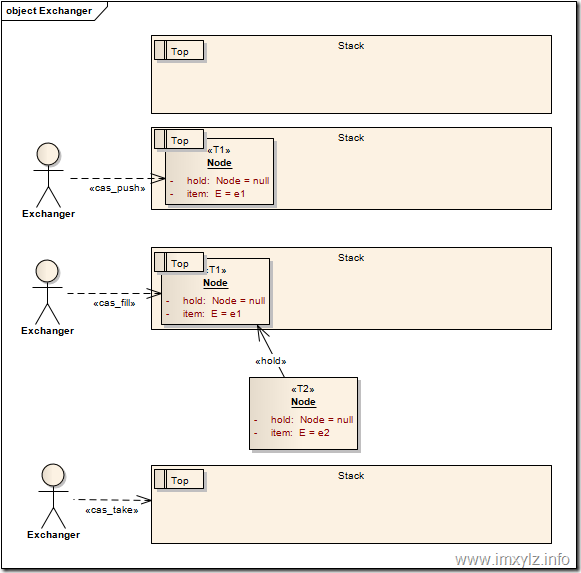

### （一）创建线程的方式及实现

1. 继承Thread类创建线程类

  ```java
  package com.thread;    

  public class FirstThreadTest extends Thread{    
      int i = 0;    
      //重写run方法，run方法的方法体就是线程执行体    
      public void run()    
      {    
          for(;i<100;i++){    
          System.out.println(getName()+"  "+i);    

          }    
      }    
      public static void main(String[] args)    
      {    
          for(int i = 0;i< 100;i++)    
          {    
              System.out.println(Thread.currentThread().getName()+"  : "+i);    
              if(i==20)    
              {    
                  new FirstThreadTest().run();    
                  new FirstThreadTest().run();    
              }    
          }    
      }    

  }    
  ```
2. 通过Runable接口创建线程类

```java
package com.thread;    

public class RunnableThreadTest implements Runnable    
{    

    private int i;    
    public void run()    
    {    
        for(i = 0;i <100;i++)    
        {    
            System.out.println(Thread.currentThread().getName()+" "+i);    
        }    
    }    
    public static void main(String[] args)    
    {    
        for(int i = 0;i < 100;i++)    
        {    
            System.out.println(Thread.currentThread().getName()+" "+i);    
            if(i==20)    
            {    
                RunnableThreadTest rtt = new RunnableThreadTest();    
                new Thread(rtt,"新线程1").start();    
                new Thread(rtt,"新线程2").start();    
            }    
        }    

    }    

}    
```
3. 通过Callable和FutureTask创建线程

  + 创建Callable接口的实现类，并实现call()方法；
  + 创建Callable实现类的实例，使用FutureTask类来包装Callable对象，该FutureTask对象封装了该Callback对象的call()方法的返回值；
  + 使用FutureTask对象作为Thread对象的target创建并启动新线程；
  + 调用FutureTask对象的get()方法来获得子线程执行结束后的返回值。

```java
package com.demo;  

import java.util.concurrent.Callable;    
import java.util.concurrent.ExecutionException;    
import java.util.concurrent.FutureTask;    

public class CallableThreadTest implements Callable<Integer>    
{    

    public static void main(String[] args)    
    {    
        CallableThreadTest ctt = new CallableThreadTest();    
        FutureTask<Integer> ft = new FutureTask<Integer>(ctt);    
//        Thread thread = new Thread(ft,"有返回值的线程");  
//        thread.start();  
        for(int i = 0;i < 100;i++)    
        {    
            System.out.println(Thread.currentThread().getName()+" 的循环变量i的值"+i);    
            if(i==20)    
            {    
                new Thread(ft,"有返回值的线程").start();    
            }    
        }    
        try    
        {    
            System.out.println("子线程的返回值："+ft.get());    
        } catch (InterruptedException e)    
        {    
            e.printStackTrace();    
        } catch (ExecutionException e)    
        {    
            e.printStackTrace();    
        }    

    }    

    @Override    
    public Integer call() throws Exception    
    {    
        int i = 0;    
        for(;i<100;i++)    
        {    
            System.out.println(Thread.currentThread().getName()+" "+i);    
        }    
        return i;    
    }    

}    
```

### （二）sleep() 、wait()、join（）、yield（）有什么区别

1. sleep()方法需要指定等待的时间，它可以让当前正在执行的线程在指定的时间内暂停执行，进入阻塞状态，该方法既可以让其他同优先级或者高优先级的线程得到执行的机会，也可以让低优先级的线程得到执行机会。但是sleep()方法不会释放“锁标志”，也就是说如果有synchronized同步块，其他线程仍然不能访问共享数据。

2. wait()方法需要和notify()及notifyAll()两个方法一起介绍，这三个方法用于协调多个线程对共享数据的存取，所以必须在synchronized语句块内使用，也就是说，调用wait()，notify()和notifyAll()的任务在调用这些方法前必须拥有对象的锁。注意，它们都是Object类的方法，而不是Thread类的方法。


　+ **wait()方法与sleep()方法的不同之处在于，wait()方法会释放对象的“锁标志”**。当调用某一对象的wait()方法后，会使当前线程暂停执行，并将当前线程放入对象等待池中，直到调用了notify()方法后，将从对象等待池中移出任意一个线程并放入锁标志等待池中，只有锁标志等待池中的线程可以获取锁标志，它们随时准备争夺锁的拥有权。


  + 当调用了某个对象的notifyAll()方法，会将对象等待池中的所有线程都移动到该对象的锁标志等待池。


　+ 除了使用notify()和notifyAll()方法，还可以使用带毫秒参数的wait(long timeout)方法，效果是在延迟timeout毫秒后，被暂停的线程将被恢复到锁标志等待池。


　+ 此外，wait()，notify()及notifyAll()只能在synchronized语句中使用，但是如果使用的是ReenTrantLock实现同步，该如何达到这三个方法的效果呢？解决方法是使用ReenTrantLock.newCondition()获取一个Condition类对象，然后Condition的await()，signal()以及signalAll()分别对应上面的三个方法。


3. yield()方法和sleep()方法类似，也不会释放“锁标志”，区别在于，它没有参数，即yield()方法只是使当前线程重新回到可执行状态，所以执行yield()的线程有可能在进入到可执行状态后马上又被执行，另外**yield()方法只能使同优先级或者高优先级的线程得到执行机会，这也和sleep()方法不同**。

4. join()方法会使当前线程等待调用join()方法的线程结束后才能继续执行


### （三）说说 CountDownLatch（倒计数门闸锁） 原理

1. CountDownLatch是一个同步类，他允许一个或多个线程一直等待，直到其他线程的操作执行完成后再去执行
2. CountDownLatch实现使用一个计数器，计数器的初始值为线程的数量。每当一个线程完成了自己的任务后，计数器的值就会减1.当计数器值到达0时，它表示所有的线程已经完成了任务，然后再闭锁上等待的线程就可以恢复执行任务
3. 常用API解析
  + await()方法

    该方法用来式当前线程处于阻塞状态，知道闭锁中计数的值递减到0，或者线程被中断

  + await(long timeout, TimeUnit unit)

    该方法同await()方法，多出的两个参数定义了等待时间，把阻塞线程恢复的条件变为了三个。计数值递减到0、线程中断、到达超时时间

  + countDown()方法

    该方法用来递减闭锁中计数器的值，当值到达0时所有等待的线程将恢复执行

  + getCount()方法

    该方法获取当前计数器的值

4. 使用场景

  + 实现最大的并行性：有时我们想同时启动多个线程，实现最大程度的并行性。例如，我们想测试一个单例类。如果我们创建一个初始计数为1的CountDownLatch,并让所有线程都在这个锁上等待，那么我们可以很轻松的完成测试。我们只需要顶用一次countDown()方法就可以让所有的等待线程同时恢复执行

  + 开始执行前等待n个线程完成各自任务：例如应用程序启动类要确保在处理用户请求前，所有N个外部系统已经启动和运行了。

  + 死锁检测：一个非常方便的使用场景是，你可以使用n个线程访问共享资源，在每次测试阶段的线程数目是不同的，并尝试产生死锁


### （四）说说 CyclicBarrier（可重用栅栏） 原理

1. CyclicBarrier 的字面意思是可循环（Cyclic）使用的屏障（Barrier）。它要做的事情是，让一组线程到达一个屏障（也可以叫同步点）时被阻塞，直到最后一个线程到达屏障时，屏障才会开门，所有被屏障拦截的线程才会继续干活。线程进入屏障通过CyclicBarrier的await()方法

2. CyclicBarrier默认的构造方法是CyclicBarrier(int parties)，其参数表示屏障拦截的线程数量，每个线程调用await方法告诉CyclicBarrier我已经到达了屏障，然后当前线程被阻塞。

3. CyclicBarrier还提供一个更高级的构造函数CyclicBarrier(int parties, Runnable barrierAction)，用于在线程到达屏障时，优先执行barrierAction这个Runnable对象，方便处理更复杂的业务场景

4. 实现原理

  在CyclicBarrier的内部定义了一个Lock对象，每当一个线程调用CyclicBarrier的await方法时，将剩余拦截的线程数减1，然后判断剩余拦截数是否为0，如果不是，进入Lock对象的条件队列等待。如果是，执行barrierAction对象的Runnable方法，然后将锁的条件队列中的所有线程放入锁等待队列中，这些线程会依次的获取锁、释放锁，接着先从await方法返回，再从CyclicBarrier的await方法中返回


### （五）说说 Semaphore（信号量） 原理

Semaphore（信号量）是用来控制同时访问特定资源的线程数量，它通过协调各个线程，保证合理的使用公共资源。
线程可以通过acquire()方法来获取信号量的许可，当信号量中没有可用的许可的时候，线程阻塞，直到有可用的许可为止。线程可以通过release()方法释放它持有的信号量的许可

### （六）说说 Exchanger 原理

1. 概述

  + 一般用于两个工作线程之间交换数据
  + 当一个线程到达exchange调用点时，如果它的伙伴线程此前已经调用了此方法，那么它的伙伴会被调度唤醒并与之进行对象交换，然后各自返回。如果它的伙伴还没到达交换点，那么当前线程将会被挂起，直至伙伴线程到达——完成交换正常返回；或者当前线程被中断——抛出中断异常；又或者是等候超时——抛出超时异常

2. 原理

  

  + JDK5 : 在上面的模型中，我们假定一个空的栈（Stack），栈顶（Top）当然是没有元素的。同时我们假定一个数据结构Node，包含一个要交换的元素E和一个要填充的“洞”Node。这时线程T1携带节点node1进入栈（cas_push)，当然这是CAS操作，这样栈顶就不为空了。线程T2携带节点node2进入栈，发现栈里面已经有元素了node1，同时发现node1的hold（Node）为空，于是将自己（node2）填充到node1的hold中（cas_fill）。然后将元素node1从栈中弹出（cas_take）。这样线程T1就得到了node1.hold.item也就是node2的元素e2，线程T2就得到了node1.item也就是e1，从而达到了交换的目的

  + JDK 6以后为了支持多线程多对象同时Exchanger了就进行了改造（为了支持更好的并发），采用ConcurrentHashMap的思想，将Stack分割成很多的片段（或者说插槽Slot），线程Id（Thread.getId()）hash相同的落在同一个Slot上，这样在默认32个Slot上就有很好的吞吐量


3. 应用场景

  + 可以用于遗传算法，遗传算法里需要选出两个人作为交配对象，这时候会交换两人的数据，并使用交叉规则得出2个交配结果

  + 也可以用于校对工作。比如我们需要将纸制银流通过人工的方式录入成电子银行流水，为了避免错误，采用AB岗两人进行录入，录入到Excel之后，系统需要加载这两个Excel，并对这两个Excel数据进行校对，看看是否录入的一致


### （七）说说 CountDownLatch 与 CyclicBarrier 区别

|CountDownLatch|CyclicBarrier|
|---|---|
|减计数方式|加计数方式|
|计算为0时释放所有等待的线程|计数达到指定值时释放所有等待线程|
|计数为0时，无法重置|计数达到指定值时，计数置为0重新开始|
|调用countDown()方法计数减一，调用await()方法只进行阻塞，对计数没任何影响|调用await()方法计数加一，若加1后的值不等于构造方法的值，则线程阻塞|
|不可重复利用|可重复利用|

1. CountDownLatch是一个同步的辅助类，允许一个或多个线程，等待其他一组线程完成操作，再继续执行

2. CyclicBarrier是一个同步的辅助类，允许一组线程相互之间等待，达到一个共同点，再继续执行

3. CountDownLatch:我把他理解成倒计时锁

  + 场景还原：一年级期末考试要开始了，监考老师发下去试卷，然后坐在讲台旁边玩着手机等待着学生答题，有的学生提前交了试卷，并约起打球了，等到最后一个学生交卷了，老师开始整理试卷，贴封条，下班，陪老婆孩子去了。

4. CyclicBarrier:可看成是个障碍，所有的线程必须到齐后才能一起通过这个障碍

  + 场景还原：以前公司组织户外拓展活动，帮助团队建设，其中最重要一个项目就是全体员工（包括女同事，BOSS）在完成其他项目时，到达一个高达四米的高墙没有任何抓点，要求所有人，一个不能少的越过高墙，才能继续进行其他项目。


### （八）ThreadLocal 原理分析

1. 概述

  ThreadLocal，很多地方叫做线程本地变量，也有些地方叫做线程本地存储，其实意思差不多。可能很多朋友都知道ThreadLocal为变量在每个线程中都创建了一个副本，那么每个线程可以访问自己内部的副本变量。

2. 深入解析

  + 实际的通过ThreadLocal创建的副本是存储在每个线程自己的threadLocals中的

  + 为何threadLocals的类型ThreadLocalMap的键值为ThreadLocal对象，因为每个线程中可有多个threadLocal变量，就像上面代码中的longLocal和stringLocal

  + 在进行get之前，必须先set，否则会报空指针异常

3. 应用场景

  + 数据库连接

  ```java
  private static ThreadLocal<Connection> connectionHolder  = new ThreadLocal<Connection>() {
    public Connection initialValue() {
     return DriverManager.getConnection(DB_URL);
    }
  };

  public static Connection getConnection() {
    return connectionHolder.get();
  }
  ```

  + Session管理

  ```java
  private static final ThreadLocal threadSession = new ThreadLocal();

  public static Session getSession() throws InfrastructureException {
    Session s = (Session) threadSession.get();
   try {
     if (s == null) {
     s = getSessionFactory().openSession();
     threadSession.set(s);
     }
   } catch (HibernateException ex) {
     throw new InfrastructureException(ex);
   }
   return s;
  }

  ```


### （九）讲讲线程池的实现原理

[](../Java基础\线程\深入分析java线程池的实现原理.md)

### （十）线程池的几种方式

1. newFixedThreadPool
  + 创建一个指定工作线程数量的线程池。每当提交一个任务就创建一个工作线程，如果工作线程数量达到线程池初始的最大数，则将提交的任务存入到池队列中。

  + FixedThreadPool是一个典型且优秀的线程池，它具有线程池提高程序效率和节省创建线程时所耗的开销的优点。但是，在线程池空闲时，即线程池中没有可运行任务时，它不会释放工作线程，还会占用一定的系统资源


```java
package test;
import java.util.concurrent.ExecutorService;
import java.util.concurrent.Executors;
public class ThreadPoolExecutorTest {
 public static void main(String[] args) {
  ExecutorService fixedThreadPool = Executors.newFixedThreadPool(3);
  for (int i = 0; i < 10; i++) {
   final int index = i;
   fixedThreadPool.execute(new Runnable() {
    public void run() {
     try {
      System.out.println(index);
      Thread.sleep(2000);
     } catch (InterruptedException e) {
      e.printStackTrace();
     }
    }
   });
  }
 }
}
```
2. newCachedThreadPool

创建一个可缓存线程池，如果线程池长度超过处理需要，可灵活回收空闲线程，若无可回收，则新建线程。

这种类型的线程池特点是：

工作线程的创建数量几乎没有限制(其实也有限制的,数目为Interger. MAX_VALUE), 这样可灵活的往线程池中添加线程。
如果长时间没有往线程池中提交任务，即如果工作线程空闲了指定的时间(默认为1分钟)，则该工作线程将自动终止。终止后，如果你又提交了新的任务，则线程池重新创建一个工作线程。
在使用CachedThreadPool时，一定要注意控制任务的数量，否则，由于大量线程同时运行，很有会造成系统瘫痪。

```java
package test;
import java.util.concurrent.ExecutorService;
import java.util.concurrent.Executors;
public class ThreadPoolExecutorTest {
 public static void main(String[] args) {
  ExecutorService cachedThreadPool = Executors.newCachedThreadPool();
  for (int i = 0; i < 10; i++) {
   final int index = i;
   try {
    Thread.sleep(index * 1000);
   } catch (InterruptedException e) {
    e.printStackTrace();
   }
   cachedThreadPool.execute(new Runnable() {
    public void run() {
     System.out.println(index);
    }
   });
  }
 }
}
```

+ 初始化一个可以缓存线程的线程池，默认缓存60s，线程池的线程数可达到Integer.MAX_VALUE，即2147483647，内部使用SynchronousQueue作为阻塞队列；
+ 和newFixedThreadPool创建的线程池不同，newCachedThreadPool在没有任务执行时，当线程的空闲时间超过keepAliveTime，会自动释放线程资源，当提交新任务时，如果没有空闲线程，则创建新线程执行任务，会导致一定的系统开销；
+ 所以，使用该线程池时，一定要注意控制并发的任务数，否则创建大量的线程可能导致严重的性能问题。

3. newSingleThreadExecutor

  创建一个单线程化的Executor，即只创建唯一的工作者线程来执行任务，它只会用唯一的工作线程来执行任务，保证所有任务按照指定顺序(FIFO, LIFO, 优先级)执行。如果这个线程异常结束，会有另一个取代它，保证顺序执行。单工作线程最大的特点是可保证顺序地执行各个任务，并且在任意给定的时间不会有多个线程是活动的。

  ```java

  package test;
import java.util.concurrent.ExecutorService;
import java.util.concurrent.Executors;
public class ThreadPoolExecutorTest {
 public static void main(String[] args) {
  ExecutorService singleThreadExecutor = Executors.newSingleThreadExecutor();
  for (int i = 0; i < 10; i++) {
   final int index = i;
   singleThreadExecutor.execute(new Runnable() {
    public void run() {
     try {
      System.out.println(index);
      Thread.sleep(2000);
     } catch (InterruptedException e) {
      e.printStackTrace();
     }
    }
   });
  }
 }
}


  ```

  初始化的线程池中只有一个线程，如果该线程异常结束，会重新创建一个新的线程继续执行任务，唯一的线程可以保证所提交任务的顺序执行，内部使用LinkedBlockingQueue作为阻塞队列。

4. newScheduleThreadPool

  + 创建一个定长的线程池，而且支持定时的以及周期性的任务执行，支持定时及周期性任务执行

  + 初始化的线程池可以在指定的时间内周期性的执行所提交的任务，在实际的业务场景中可以使用该线程池定期的同步数据。

  ```java

  package test;
  import java.util.concurrent.Executors;
  import java.util.concurrent.ScheduledExecutorService;
  import java.util.concurrent.TimeUnit;
  public class ThreadPoolExecutorTest {
   public static void main(String[] args) {
    ScheduledExecutorService scheduledThreadPool = Executors.newScheduledThreadPool(5);
    scheduledThreadPool.schedule(new Runnable() {
     public void run() {
      System.out.println("delay 3 seconds");
     }
    }, 3, TimeUnit.SECONDS);
   }
  }

  ```

### （十一）线程的生命周期

1. 新建（new Thread）

当创建Thread类的一个实例（对象）时，此线程进入新建状态（未被启动）。
例如：Thread  t1=new Thread();


2. 就绪（runnable）

线程已经被启动，正在等待被分配给CPU时间片，也就是说此时线程正在就绪队列中排队等候得到CPU资源。例如：t1.start();

3. 运行（running）

线程获得CPU资源正在执行任务（run()方法），此时除非此线程自动放弃CPU资源或者有优先级更高的线程进入，线程将一直运行到结束。

4. 死亡（dead）

当线程执行完毕或被其它线程杀死，线程就进入死亡状态，这时线程不可能再进入就绪状态等待执行。
自然终止：正常运行run()方法后终止
异常终止：调用stop()方法让一个线程终止运行

5. 堵塞（blocked）

由于某种原因导致正在运行的线程让出CPU并暂停自己的执行，即进入堵塞状态。
正在睡眠：用sleep(long t) 方法可使线程进入睡眠方式。一个睡眠着的线程在指定的时间过去可进入就绪状态。
正在等待：调用wait()方法。（调用motify()方法回到就绪状态）
被另一个线程所阻塞：调用suspend()方法。（调用resume()方法恢复
