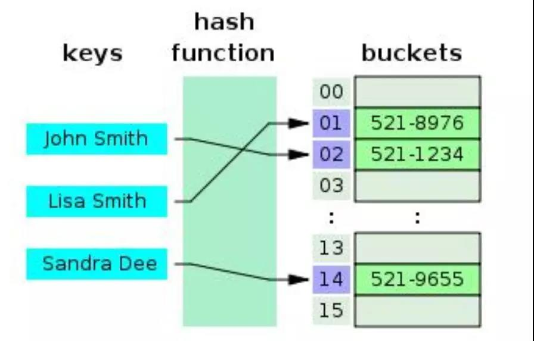
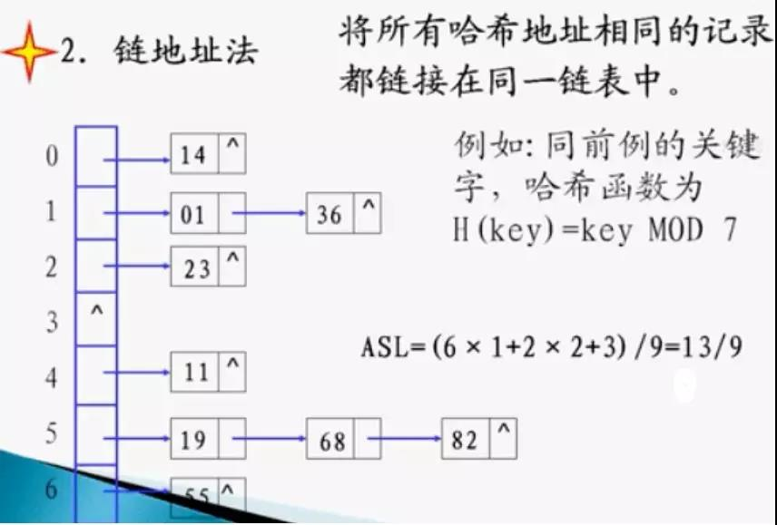

### （一） List 和 Set 和 Map 区别
1. List,Set都是继承自Collection接口，Map则不是
2. List特点：元素有序，可重复 ，Set特点：无序，不可重复，（注意：元素虽然无放入顺序，但是元素在set中的位置是有该元素的HashCode决定的，其位置其实是固定的，加入Set 的Object必须定义equals()方法 ，另外list支持for循环，也就是通过下标来遍历，也可以用迭代器，但是set只能用迭代，因为无序，无法用下标来取得想要的值。）
3. Set：检索元素效率低下，删除和插入效率高，插入和删除不会引起元素位置改变。
4. List：和数组类似，List可以动态增长，查找元素效率高，插入删除元素效率低，因为会引起其他元素位置改变。
5. Map适合储存键值对的数据
6. LinkedList、ArrayList、HashSet是非线程安全的，Vector是线程安全的;
7. HashMap是非线程安全的，HashTable是线程安全的
8. StringBuilder是非线程安全的，StringBuffer是线程安全的

### （二） Arraylist 与 LinkedList 区别

1. Arraylist

  + 优点：ArrayList是实现了基于动态数组的数据结构,因为地址连续，一旦数据存储好了，查询操作效率会比较高（在内存里是连着放的）。

  + 缺点：因为地址连续， ArrayList要移动数据,所以插入和删除操作效率比较低。

2. LinkedList
  + 优点：LinkedList基于链表的数据结构,地址是任意的，所以在开辟内存空间的时候不需要等一个连续的地址，对于新增和删除操作add和remove，LinedList比较占优势。LinkedList 适用于要头尾操作或插入指定位置的场景

  + 缺点：因为LinkedList要移动指针,所以查询操作性能比较低。

3. 适用场景分析

  当需要对数据进行对此访问的情况下选用ArrayList，当需要对数据进行多次增加删除修改时采用LinkedList。

### （三） ArrayList 与 Vector 区别
1. 构造方法

  + ArrayList有三个构造方法：
    + public ArrayList(int initialCapacity)//构造一个具有指定初始容量的空列表。   
    + public ArrayList()//构造一个初始容量为10的空列表
    + public ArrayList(Collection<? extends E> c)//构造一个包含指定 collection 的元素的列表
  + Vector有四个构造方法
    + public Vector()//使用指定的初始容量和等于零的容量增量构造一个空向量。
    + public Vector(int initialCapacity)//构造一个空向量，使其内部数据数组的大小，其标准容量增量为零
    + public Vector(Collection<? extends E> c)//构造一个包含指定 collection 中的元素的向量  
    + public Vector(int initialCapacity,int capacityIncrement)//使用指定的初始容量和容量增量构造一个空的向量

2. ArrayList和Vector都是用数组实现的，主要有这么三个区别

  + Vector是多线程安全的，线程安全就是说多线程访问同一代码，不会产生不确定的结果。而ArrayList不是，这个可以从源码中看出，Vector类中的方法很多有synchronized进行修饰，这样就导致了Vector在效率上无法与ArrayList相比；
  + 两个都是采用的线性连续空间存储元素，但是当空间不足的时候，两个类的增加方式是不同
  + Vector可以设置增长因子，而ArrayList不可以
  + Vector是一种老的动态数组，是线程同步的，效率很低，一般不赞成使用

3. 适用场景分析

  + Vector是线程同步的，所以它也是线程安全的，而ArrayList是线程异步的，是不安全的。如果不考虑到线程的安全因素，一般用ArrayList效率比较高

  + 如果集合中的元素的数目大于目前集合数组的长度时，在集合中使用数据量比较大的数据，用Vector有一定的优势

### （四） HashMap 和 TreeMap 、Hashtable 的区别

1. HashMap 非线程安全，HashMap：基于哈希表实现。使用HashMap要求添加的键类明确定义了hashCode()和equals()[可以重写hashCode()和equals()]，为了优化HashMap空间的使用，您可以调优初始容量和负载因子

2. TreeMap：非线程安全基于红黑树实现。TreeMap没有调优选项，因为该树总处于平衡状态

3. 适用场景分析

  + HashMap和HashTable:HashMap去掉了HashTable的contains方法，但是加上了containsValue()和containsKey()方法。HashTable同步的，而HashMap是非同步的，效率上比HashTable要高。HashMap允许空键值，而HashTable不允许。

  + HashMap：适用于Map中插入、删除和定位元素。

  + Treemap：适用于按自然顺序或自定义顺序遍历键(key)

### （五） HashSet 和 TreeSet 区别

1. TreeSet 是二差树（红黑树的树据结构）实现的,Treeset中的数据是自动排好序的，不允许放入null值

2. HashSet 是哈希表实现的,HashSet中的数据是无序的，可以放入null，但只能放入一个null，两者中的值都不能重复，就如数据库中唯一约束

3. HashSet要求放入的对象必须实现HashCode()方法，放入的对象，是以hashcode码作为标识的，而具有相同内容的String对象，hashcode是一样，所以放入的内容不能重复。但是同一个类的对象可以放入不同的实例

4. 适用场景分析:HashSet是基于Hash算法实现的，其性能通常都优于TreeSet。为快速查找而设计的Set，我们通常都应该使用HashSet，在我们需要排序的功能时，我们才使用TreeSet。

### （六） HashMap 和 ConcurrentHashMap 的区别

1. HashMap本质是数组加链表。根据key取得hash值，然后计算出数组下标，如果多个key对应到同一个下标，就用链表串起来，新插入的在前面(1.8新加入的在后面)。
如果想要线程安全的HashMap，可以通过Collections类的静态方法synchronizedMap获得线程安全的HashMap。

2. 在hashMap的基础上，ConcurrentHashMap将数据分为多个segment，默认16个（concurrency level），然后每次操作对一个segment加锁，避免多线程锁的几率，提高并发效率

3. 从ConcurrentHashMap代码中可以看出，它引入了一个“分段锁”的概念，具体可以理解为把一个大的Map拆分成N个小的HashTable，根据key.hashCode()来决定把key放到哪个HashTable中

4. 在ConcurrentHashMap中，就是把Map分成了N个Segment，put和get的时候，都是现根据key.hashCode()算出放到哪个Segment中

5. 装填因子：默认为0.75，如果表中75%的位置已经填入元素，这个表就会用双倍的桶数自动地进行再散列

6. 好处是:冲突的机会减小了,但空间浪费多了.冲突的机会越大,则查找的成本越高.反之,查找的成本越小.因而,查找时间就越小

7. 默认初始容量为16，默认加载因子为0.75

8. 当我们往hashmap中put元素的时候，先根据key的hash值得到这个元素在数组中的位置（即下标），然后就可以把这个元素放到对应的位置中了。如果这个元素所在的位子上已经存放有其他元素了，那么在同一个位子上的元素将以链表的形式存放，新加入的放在链头，最先加入的放在链尾。从hashmap中get元素时，首先计算key的hashcode，找到数组中对应位置的某一元素，然后通过key的equals方法在对应位置的链表中找到需要的元素。

### （七） HashMap、ConcurrentHashMap 的工作原理及代码实现

[参考](https://github.com/hongjiaoliu/learning-record/blob/master/Java%E5%9F%BA%E7%A1%80/%E9%9B%86%E5%90%88/Java7%E3%80%818%20%E4%B8%AD%E7%9A%84%20HashMap%20%E5%92%8C%20ConcurrentHashMap%20%E5%85%A8%E8%A7%A3%E6%9E%90.md)

### (八) 解决hash冲突的几种方式？

通过构造性能良好的哈希函数，可以减少冲突，但一般不可能完全避免冲突，因此解决冲突是哈希法的另一个关键问题。

创建哈希表和查找哈希表都会遇到冲突，两种情况下解决冲突的方法应该一致。

下面以创建哈希表为例，说明解决冲突的方法。常用的解决冲突方法有以下四种：

#### 开放定址法
这种方法也称再散列法，其基本思想是：当关键字key的哈希地址p=H（key）出现冲突时，以p为基础，产生另一个哈希地址p1，如果p1仍然冲突，再以p为基础，产生另一个哈希地址p2，…，直到找出一个不冲突的哈希地址pi ，将相应元素存入其中。

这种方法有一个通用的再散列函数形式：

> Hi=（H（key）+di）% m   i=1，2，…，n

其中H（key）为哈希函数，m 为表长，di称为增量序列。增量序列的取值方式不同，相应的再散列方式也不同。主要有以下三种：

**（1）线性探测再散列**

> dii=1，2，3，…，m-1

这种方法的特点是：冲突发生时，顺序查看表中下一单元，直到找出一个空单元或查遍全表。

**（2）二次探测再散列**

> di=12，-12，22，-22，…，k2，-k2    ( k<=m/2 )

这种方法的特点是：冲突发生时，在表的左右进行跳跃式探测，比较灵活。

**（3）伪随机探测再散列，di=伪随机数序列。**

具体实现时，应建立一个伪随机数发生器，（如i=(i+p) % m），并给定一个随机数做起点。

例如，已知哈希表长度m=11，哈希函数为：H（key）= key  %  11，则H（47）=3，H（26）=4，H（60）=5，假设下一个关键字为69，则H（69）=3，与47冲突。

如果用线性探测再散列处理冲突，下一个哈希地址为H1=（3 + 1）% 11 = 4，仍然冲突，再找下一个哈希地址为H2=（3 + 2）% 11 = 5，还是冲突，继续找下一个哈希地址为H3=（3 + 3）% 11 = 6，此时不再冲突，将69填入5号单元。

如果用二次探测再散列处理冲突，下一个哈希地址为H1=（3 + 12）% 11 = 4，仍然冲突，再找下一个哈希地址为H2=（3 - 12）% 11 = 2，此时不再冲突，将69填入2号单元。

如果用伪随机探测再散列处理冲突，且伪随机数序列为：2，5，9，……..，则下一个哈希地址为H1=（3 + 2）% 11 = 5，仍然冲突，再找下一个哈希地址为H2=（3 + 5）% 11 = 8，此时不再冲突，将69填入8号单元。

#### 再哈希法

这种方法是同时构造多个不同的哈希函数：

> Hi=RH1（key）  i=1，2，…，k

当哈希地址Hi=RH1（key）发生冲突时，再计算Hi=RH2（key）……，直到冲突不再产生。这种方法不易产生聚集，但增加了计算时间。

#### 链地址法

这种方法的基本思想是将所有哈希地址为i的元素构成一个称为同义词链的单链表，并将单链表的头指针存在哈希表的第i个单元中，因而查找、插入和删除主要在同义词链中进行。链地址法适用于经常进行插入和删除的情况。

#### 建立公共溢出区
这种方法的基本思想是：将哈希表分为基本表和溢出表两部分，凡是和基本表发生冲突的元素，一律填入溢出表。

#### 优缺点

** 1. 开放散列（open hashing）/ 拉链法（针对桶链结构）**

**1）优点：**
①对于记录总数频繁可变的情况，处理的比较好（也就是避免了动态调整的开销）

②由于记录存储在结点中，而结点是动态分配，不会造成内存的浪费，所以尤其适合那种记录本身尺寸（size）很大的情况，因为此时指针的开销可以忽略不计了

③删除记录时，比较方便，直接通过指针操作即可

**2）缺点：**
①存储的记录是随机分布在内存中的，这样在查询记录时，相比结构紧凑的数据类型（比如数组），哈希表的跳转访问会带来额外的时间开销

②如果所有的 key-value 对是可以提前预知，并之后不会发生变化时（即不允许插入和删除），可以人为创建一个不会产生冲突的完美哈希函数（perfect hash function），此时封闭散列的性能将远高于开放散列

③由于使用指针，记录不容易进行序列化（serialize）操作

** 2. 封闭散列（closed hashing）/ 开放定址法**

**1）优点：**
①记录更容易进行序列化（serialize）操作

②如果记录总数可以预知，可以创建完美哈希函数，此时处理数据的效率是非常高的

**2）缺点：**
①存储记录的数目不能超过桶数组的长度，如果超过就需要扩容，而扩容会导致某次操作的时间成本飙升，这在实时或者交互式应用中可能会是一个严重的缺陷

②使用探测序列，有可能其计算的时间成本过高，导致哈希表的处理性能降低

③由于记录是存放在桶数组中的，而桶数组必然存在空槽，所以当记录本身尺寸（size）很大并且记录总数规模很大时，空槽占用的空间会导致明显的内存浪费

④删除记录时，比较麻烦。比如需要删除记录a，记录b是在a之后插入桶数组的，但是和记录a有冲突，是通过探测序列再次跳转找到的地址，所以如果直接删除a，a的位置变为空槽，而空槽是查询记录失败的终止条件，这样会导致记录b在a的位置重新插入数据前不可见，所以不能直接删除a，而是设置删除标记。这就需要额外的空间和操作。

> 作者：且听风吟-wuchao
> 出处：https://www.cnblogs.com/wuchaodzxx/p/7396599.html
